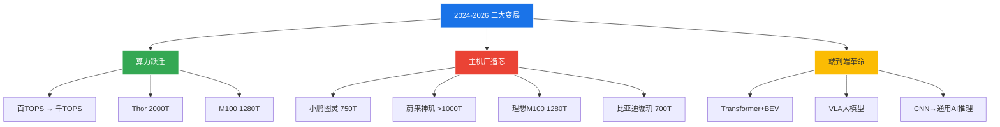
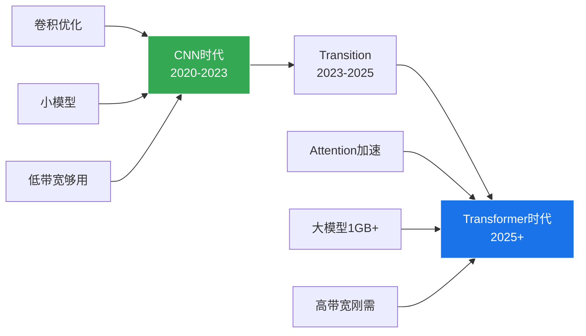

# 第1章：引言与研究背景

>  本章概述智驾芯片行业的三大核心变局，为后续深入分析奠定基础。

---

## 1.1 研究背景

2024-2026 年，智能驾驶芯片行业经历了前所未有的变革。本报告基于 V4/V5/V6 三轮迭代研究，对 11+ 主流芯片厂商进行了深度剖析。

### 三大核心变局

---

## 1.2 变局一：算力跃迁

**从百TOPS时代进入千TOPS时代**

2024年，NVIDIA Orin X 以 254 TOPS 算力被视为行业标杆。短短两年内：
- NVIDIA Thor X 推出 **2000 TOPS**（稀疏）
- 理想 M100 达到 **1280 TOPS**（稠密）
- 小鹏图灵实现 **750 TOPS**（稠密）

### 算力演进时间线

| 年份 | 标杆芯片 | 算力 | 里程碑 |
|------|---------|------|--------|
| 2020 | Tesla HW3 | 144 TOPS | 自研NPU元年 |
| 2022 | NVIDIA Orin | 254 TOPS | GPU中心架构巅峰 |
| 2023 | 地平线 J6P | 560 TOPS | BPU专用架构突破 |
| 2024 | Tesla HW5 | ~1000 TOPS | 自研架构升级 |
| 2025 | 理想 M100 | 1280 TOPS | 主机厂造芯上量 |
| 2026 | NVIDIA Thor X | 2000 TOPS | 千TOPS时代开启 |

---

## 1.3 变局二：主机厂造芯

**主机厂不再满足于"买芯片"**

2025-2026年，中国四大车企同时推出自研芯片，这一现象在汽车行业史无前例。

### 四大主机厂自研芯片

| 主机厂 | 芯片名称 | 制程 | 算力 | 状态 | 特色 |
|--------|---------|------|------|------|------|
| 🚗 小鹏 | 图灵 | 5nm | 750T | ✅ 已量产 | 对外供货+大众合作 |
| 🚙 蔚来 | 神玑 NX9031 | 5nm | >1000T | 🔶 流片成功 | 独立神玑公司 |
| 🚐 理想 | M100 | 5nm | 1280T | 🔶 流片成功 | 2026年量产 |
| 🚘 比亚迪 | 璇玑 A3 | 4nm | 700T | 🔶 2026H2上量 | 规模优势 |

---

## 1.4 变局三：端到端革命

**Transformer+BEV+VLA 大模型驱动芯片架构从 CNN 优化转向通用 AI 推理**

这一变革对芯片设计的影响是深远的：
- **Attention 加速**成为比卷积更关键的能力
- **内存带宽**取代纯算力成为瓶颈
- **模型大小**从 10MB 级跃升至 1GB+ 级

### CNN → Transformer 架构演进

---

## 1.5 报告价值与读者对象

本报告面向以下读者：

| 读者类型 | 关注章节 | 核心收益 |
|---------|---------|---------|
| **芯片选型决策者** | 第4-8章 | 全景对比11+芯片，辅助选型 |
| **自动驾驶工程师** | 第15-22章 | NPU微架构、Transformer加速技术 |
| **投资分析师** | 第8、26-32章 | 市场份额、ROI、竞争态势 |
| **产品经理** | 第1-9章 | 行业趋势、产品定位 |
| **学术研究者** | 第16-24章 | 技术原理、论文引用 |

---

---

## 2. 研究方法论

### 数据来源可信度分层

| 标注 | 含义 | 可信度 |
|------|------|--------|
| [GWP] | 厂商白皮书/HotChips/ISSCC论文 | ★★★★★ |
| [GS] | GTC/AI Day等官方发布会 | ★★★★☆ |
| [GO] | 厂商官网公开信息 | ★★★★☆ |
| [GR] | 行业分析报告(佐思/高工) | ★★★★☆ |
| [INT] | 国际媒体交叉验证 | ★★★☆☆ |
| [INF] | 综合公开信息推断 | ★★★☆☆ |

---

