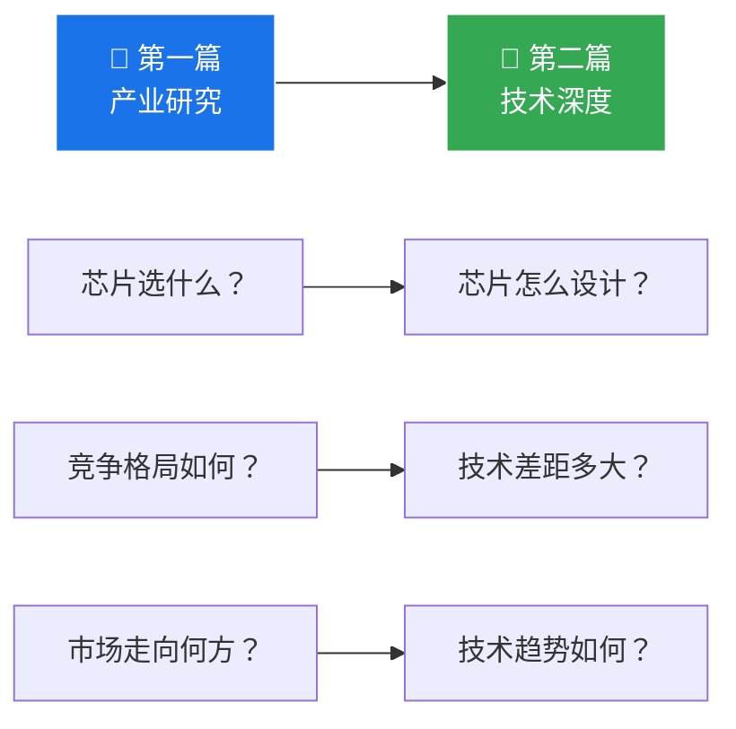

# 第10章：战略建议与第一篇总结

>  基于产业研究核心发现，提出面向芯片从业者的战略建议，并衔接后续篇章。

---

## 10.1 五大竞争格局研判

### 格局一：三层市场结构形成

```
┌──────────────────────────────────────────┐
│  高端市场 (>1000 TOPS)                    │
│  NVIDIA Thor X · 理想M100 · 蔚来神玑       │
│  竞争焦点：算力极限 + 大模型支持            │
├──────────────────────────────────────────┤
│  中端市场 (200-560 TOPS)                   │
│  地平线J6P · Orin X · SA8775 · 璇玑A3     │
│  竞争焦点：能效比 + 生态 + 成本             │
├──────────────────────────────────────────┤
│  入门市场 (50-200 TOPS)                    │
│  J6E/M · A1000 · EyeQ6 · 国产替代         │
│  竞争焦点：价格 + 量产能力                  │
└──────────────────────────────────────────┘
```

### 格局二：芯片厂商四大阵营

| 阵营 | 代表 | 策略 | 优势 | 风险 |
|------|------|------|------|------|
| 🟢 **全栈自研** | Tesla, 华为 | 芯片+算法+车一体 | 效率最高 | 封闭生态，规模受限 |
| 🔵 **主机厂自研** | 小鹏, 蔚来, 理想, 比亚迪 | 自研芯片+自主算法 | 软硬协同 | ROI压力大，团队规模有限 |
| 🟡 **独立供应商** | NVIDIA, 地平线, 黑芝麻 | 对外供货+生态建设 | 规模效应 | 被主机厂替代风险 |
| 🔴 **黑盒方案** | Mobileye | 芯片+算法打包 | 即插即用 | 与行业趋势相悖 |

### 格局三：市场份额预测 (2026-2028)

| 厂商 | 2024份额 | 2026份额(预测) | 2028份额(预测) | 趋势 |
|------|---------|---------------|---------------|------|
| NVIDIA | 35% | 28% | 22% | 📉 缓降 |
| 地平线 | 30% | 32% | 28% | ➡️ 稳定 |
| 主机厂自研 | 5% | 15% | 27% | 📈 暴涨 |
| 黑芝麻 | 8% | 7% | 5% | 📉 承压 |
| 华为 | 12% | 11% | 10% | ➡️ 稳定 |
| 其他 | 10% | 7% | 8% | — |

---

## 10.2 核心战略建议

<div class="callout callout-insight">

**面向芯片从业者的核心建议**

1. **编译器和工具链是最后护城河** — NVIDIA凭CUDA生态仍是"最好用"的平台
2. **能效比(TOPS/W)比峰值算力更关键** — 主机厂自研芯片凭算法-硬件深度协同全面领先
3. **端到端大模型正在重塑架构需求** — 从CNN转向Transformer，Attention加速和内存带宽成为新竞争焦点
4. **"自研"不等于"全部替代"** — 多数主机厂采用"自研+外购"双供应商策略，独立芯片厂商仍有广阔市场

</div>

---

## 10.3 第一篇到第二篇的衔接



第一篇从产业角度回答了"**智驾芯片行业发生了什么**"。第二篇将从微架构角度回答"**这些芯片内部是怎么设计的**"，包括：

- **NPU 微架构设计原理** — 数据流、MAC阵列、SRAM管理
- **Roofline 性能模型** — 算力上限 vs 内存带宽上限
- **Transformer 硬件加速** — Attention机制如何映射到硬件
- **功能安全与车规** — ISO 26262 对芯片设计的影响
- **Chiplet 与未来** — 芯片封装技术如何改变竞争格局

---

>  **本章小结**：智驾芯片行业正经历从"独立供应商主导"到"主机厂自研+独立供应商并存"的结构性转变。编译器和工具链是独立芯片厂商的最后护城河，能效比和端到端大模型支持将成为下一代芯片的核心竞争维度。接下来进入第二篇，从技术层面深入理解这些芯片的设计哲学。