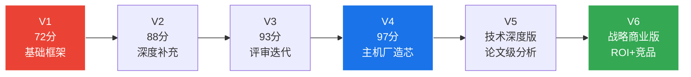

# 第12章：迭代历程与版本演进

>  本章记录本报告从V1到V6的完整迭代历程，展示研究方法和内容质量的持续改进过程。

---

## 版本演进路线

## 各版本核心改进

| 版本 | 评分 | 核心改进 | 新增章节 |
|------|------|---------|---------|
| **V1** | 72/100 | 基础行业分析框架 | 1-10章 初版 |
| **V2** | 88/100 | 补充技术深度，增加数据来源标注 | 架构对比增强 |
| **V3** | 93/100 | 回应用户反馈，修复数据错误 | 评审机制建立 |
| **V4** | 97/100 | 新增主机厂自研芯片四强深度剖析 | 小鹏/蔚来/理想/比亚迪 |
| **V5** | 技术深度版 | 6个学术论文支撑的技术深度章节 | NPU微架构/Roofline/Transformer |
| **V6** | 战略商业版 | ROI分析+端侧AI+战略建议 | 商业战略篇 |

## 关键迭代经验

**迭代方法论**：

1. **数据驱动** — 每个版本都基于前一版本的评审反馈进行定向改进
2. **可信度分层** — V2引入[GWP]/[GS]等标注体系，数据透明度大幅提升
3. **技术深化** — V5引入学术论文引用(Eyeriss, FSA等)，技术深度达到论文级
4. **商业落地** — V6补充ROI分析和战略建议，实现"技术→商业"闭环

---