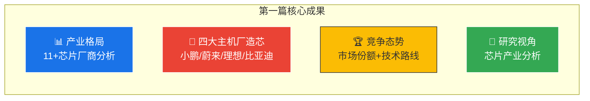

# 第一篇回顾：行业与市场分析

> 本篇（ch1-ch13）完成了智驾芯片产业的全景分析。以下为核心要点回顾，为进入第二篇（技术深度）提供衔接。

---

## 第一篇核心要点

### 关键数据速览

| 指标 | 数据 | 来源 |
|------|------|------|
| 分析芯片数量 | 11+ | 全篇综合 |
| 中国ADAS市场(2024) | ~$50亿 | [GR] |
| 地平线中国市占率 | 47.66% | [S4] |
| 主机厂自研芯片(2026预测) | 4款量产 | [GS] |
| NVIDIA全球份额 | ~35% | [GR] |

### 从产业到技术的过渡

第一篇回答了 **"行业发生了什么"**，但尚未回答 **"芯片内部是怎么设计的"**。第二篇将从微架构层面深入分析：

| 第一篇问题 | 第二篇解答 |
|-----------|----------|
| 为什么J6P能效比是Orin的10倍？ | → BPU微架构 vs GPU架构的差异 |
| 为什么Transformer改变了芯片设计？ | → Attention的计算特征与硬件映射 |
| 算力数字(TOPS)到底意味着什么？ | → Roofline模型揭示真实性能上限 |

---