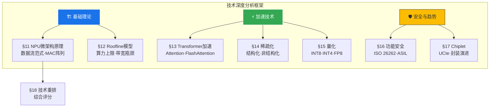

# 第二篇导言：技术深度分析

> 本篇（ch16-ch24）从微架构层面深入分析智驾芯片的核心技术。所有分析均基于学术论文、厂商白皮书和体系结构原理。

---

## 第二篇内容架构

## 学术引用体系

本篇引入 **21篇学术论文** 作为技术分析的支撑，按主题分布：

| 主题 | 引用数量 | 代表论文 |
|------|---------|---------|
| NPU 数据流架构 | 5篇 | Eyeriss (ISCA 2016), Eyeriss v2 (JSSC 2019) |
| 内存与性能模型 | 3篇 | Roofline Model (CACM 2009) |
| Attention加速 | 4篇 | FlashAttention (NeurIPS 2022), FSA (arxiv 2025) |
| 稀疏化与量化 | 5篇 | Lottery Ticket Hypothesis (ICLR 2019) |
| 功能安全与Chiplet | 4篇 | UCIe Spec, ISO 26262 |

## 阅读建议

| 读者类型 | 推荐章节 | 理由 |
|---------|---------|------|
| 芯片工程师 | §11, §13, §17 | NPU微架构+Transformer+Chiplet |
| 算法工程师 | §13, §14, §15 | Transformer加速+稀疏化+量化 |
| 产品经理 | §12, §18 | Roofline模型+技术排名 |
| 投资人 | §12, §17 | 性能瓶颈判断+技术趋势 |

---