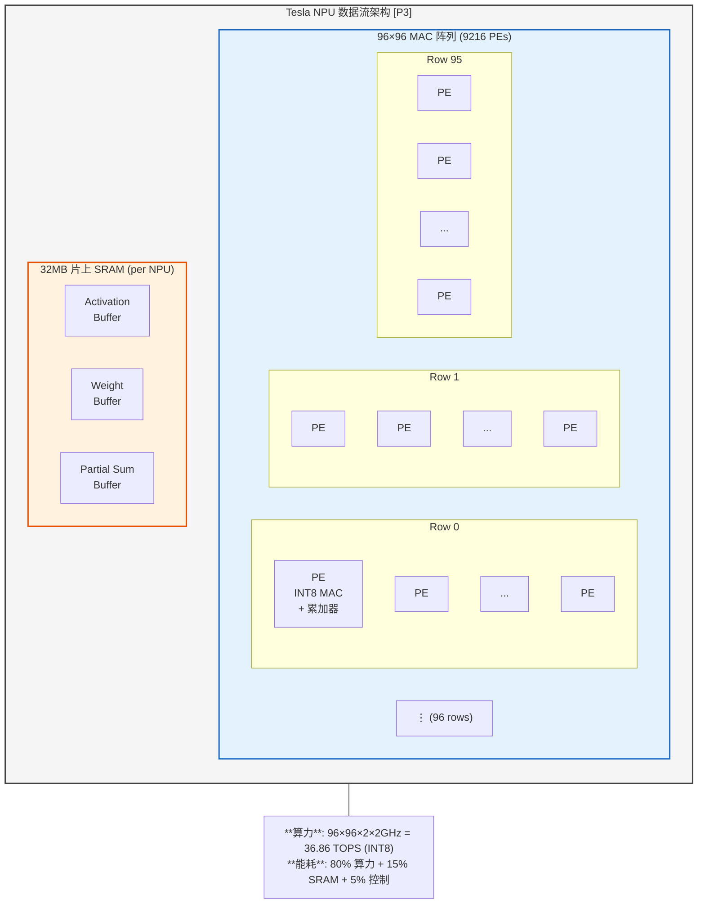
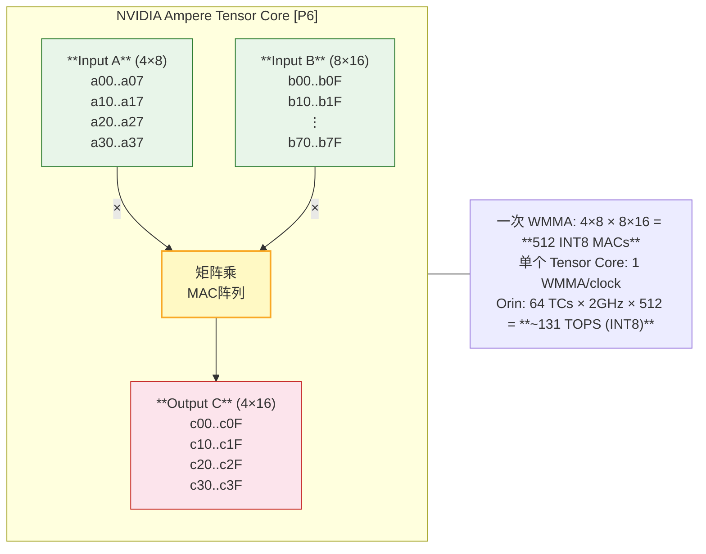
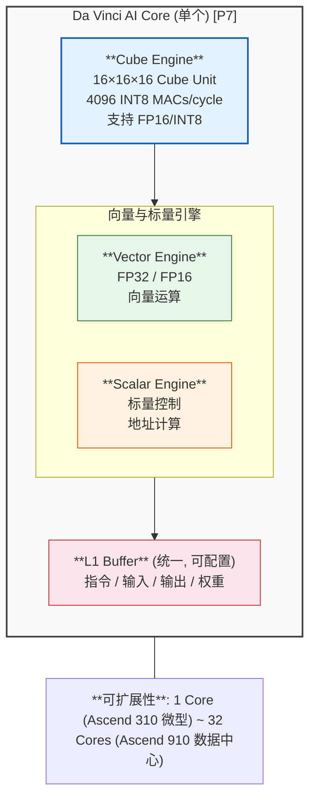
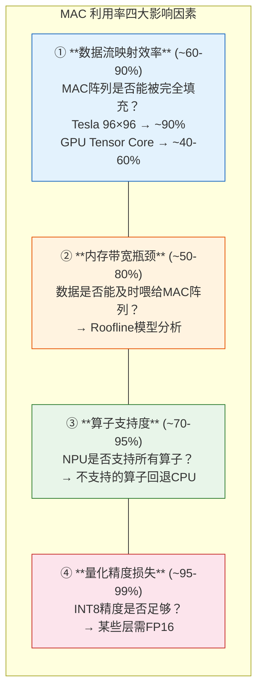

## 11. NPU 微架构设计原理 [新增]

### 11.1 三大NPU设计范式

神经网络加速器的核心是**数据流调度策略**——决定操作数(MAC的A、B、C矩阵)如何在计算阵列中流动。根据 Chen et al. (Eyeriss, ISCA 2016) [P1] 的经典分类：

| 范式 | 代表 | 数据流策略 | 优势 | 劣势 |
|------|------|-----------|------|------|
| **Weight Stationary (WS)** | NVIDIA Tensor Core, TPU | 权重固定在PE中，输入/输出流动 | 权重复用最大化，减少权重带宽 | 灵活性低 |
| **Output Stationary (OS)** | Tesla NPU | 部分和固定在PE中累加 | 减少部分和写回带宽 | 输入需广播 |
| **Row Stationary (RS)** | Eyeriss | 按行映射，最大化所有数据复用 | 能效最优 | 控制复杂 |
| **Dataflow (DF)** | Tesla NPU, 理想M100 | 编译时确定数据流动路径 | 算力利用率最高 | 通用性差 |

> **参考文献 [P1]**: Chen, Y.-H., et al. "Eyeriss: A Spatial Architecture for Energy-Efficient Dataflow for Convolutional Neural Networks." ISCA 2016.

> **参考文献 [P2]**: Chen, Y.-H., et al. "Eyeriss v2: A Flexible Accelerator for Emerging Deep Neural Networks on Mobile Devices." IEEE JSSC 2019.

### 11.2 Tesla NPU 微架构深度解析

Tesla FSD 的 NPU 是**数据流架构**的典范。根据 HotChips 31 (Talpes & Gorti, 2019) [P3] 披露的架构细节：

**关键设计决策分析**:

1. **96×96 MAC阵列尺寸选择**: 9216个PE，远大于典型设计(16×16~64×64)
   - **原因**: Tesla的网络架构(rows=96)与硬件精确匹配——**算法-硬件协同设计**的极致体现
   - **代价**: 灵活性差，非匹配网络利用率骤降
   - [P3] Talpes & Gorti, "Compute Solution for Tesla's Full Self-Driving Computer." HotChips 31, 2019.

2. **32MB SRAM**: 巨大的片上存储是Tesla能效优势的关键
   - 典型CNN的权重(~10MB for ResNet-50)可全部驻留在SRAM中
   - 避免了DRAM访问（能耗差100×: SRAM ~1pJ/bit vs DRAM ~100pJ/bit）[P4]
   - [P4] Horowitz, M. "Computing's Energy Problem (and what we can do about it)." ISSCC 2014.

3. **INT8 专用**: 不支持FP16/FP32，极致简化
   - CNN推理INT8精度损失<1%（量化感知训练后）[P5]
   - MAC面积减少~4× vs FP32，功耗减少~6× [P4]

### 11.3 NVIDIA Tensor Core 微架构

NVIDIA 的 Tensor Core 采用 **WMMA (Warp-level Matrix Multiply-Accumulate)** 指令:

**与Tesla NPU的核心差异**:

| 维度 | Tesla NPU | NVIDIA Tensor Core |
|------|-----------|-------------------|
| 阵列尺寸 | 96×96 (固定) | 4×8×16 (可编程) |
| 数据流 | 编译时确定 | 运行时可配置 |
| 精度 | INT8 only | INT8/FP16/TF32/FP8 |
| 片上SRAM | 32MB | 共享L2缓存(4MB) |
| 通用性 | ★ | ★★★★★ |
| CNN利用率 | ~90% | ~60% |
| Transformer利用率 | ~10% | ~70% |

> **参考文献 [P6]**: NVIDIA, "NVIDIA Ampere GA102 GPU Architecture." Whitepaper, 2020.

### 11.4 华为 Da Vinci AI Core 微架构

华为 Da Vinci 是**三维可扩展**的AI加速架构。根据华为公开论文 [P7]:

**Da Vinci 独特设计**:
- **Cube + Vector + Scalar 三引擎**: 矩阵运算(Cube) + 向量运算(Vector) + 标量控制(Scalar)，覆盖ML所有算子类型
- **16×16×16 Cube**: 4096 MACs/cycle，是TPU v2(256×256)的1/16，但灵活性更高
- **可扩展架构**: 同一Da Vinci Core从IoT(Ascend 310)到数据中心(Ascend 910)复用

> **参考文献 [P7]**: Xu, Z., et al. "DaVinci: A Scalable Architecture for Neural Network Computing." Huawei Technologies, HPCA 2019.

### 11.5 地平线 BPU 架构演进

地平线BPU经历了四代架构演进:

| 代际 | 架构名 | 特点 | 代表产品 |
|------|--------|------|---------|
| BPU 1.0 | **高斯** | 基础CNN加速，权重压缩 | J1 (征途2) |
| BPU 2.0 | **伯努利** | 多核并行，增强CNN | J2 (征途3) |
| BPU 3.0 | **贝叶斯** | 双核BPU，算力提升 | J5 (征途5) |
| BPU 4.0 | **纳什** | **稀疏化+Attention+大特征缓存** | J6系列 |

**BPU "纳什" 的三大创新** [GS]:

1. **稀疏化引擎**: 50%结构化稀疏，等效算力翻倍
   - 原理: N:M稀疏(如2:4)，硬件跳过零值MAC
   - 稠密560TOPS → 稀疏等效1120TOPS
   
2. **Attention加速**: 专用硬件处理Q·K^T和Softmax·V
   - 解决Transformer在CNN-optimized NPU上的效率问题
   - 推测: 采用tiled注意力计算，SRAM缓存Q/K/V

3. **大容量特征缓存**: 增大on-chip buffer
   - BEV感知的feature map远大于传统CNN
   - 减少DDR访问，降低延迟和功耗

### 11.6 MAC利用率分析：为什么TOPS ≠ 实际性能

**理论TOPS vs 实际TOPS 的差距可达2-5倍**:

**MAC 利用率公式**: `实际MAC次数 / 峰值MAC次数 × 100%`

> **参考文献 [P8]**: Wu, C.-J., et al. "Machine Learning at Facebook: Understanding Inference at the Edge." HPCA 2019.

---

### 深入阅读：NPU 微架构深度系列

> 本章介绍了 NPU 的"黑盒级"架构设计。如果你需要了解 NPU **内部** 的微观机制，请继续阅读以下深度章节：

| 章节 | 主题 | 核心内容 |
|------|------|---------|
| [**PE 级微架构深度设计**](docs/ch46.md) | 单个 PE 内部结构 | MAC 单元、寄存器文件、累加器、流水线设计 |
| [**片上互联与数据路由**](docs/ch47.md) | 数据如何在 NPU 内流动 | 脉动阵列互联、NoC 拓扑、DDR 仲裁 |
| [**编译器后端与计算映射**](docs/ch48.md) | 算法如何映射到硬件 | Tiling 数学、im2col、FlashAttention 映射 |
| [**存储子系统微观设计**](docs/ch49.md) | 权重/激活的存储管理 | 权重排布格式、DMA 引擎、双缓冲策略 |
| [**功耗时序与物理设计**](docs/ch50.md) | 从 RTL 到硅片 | 关键路径、时钟树、功耗分解、散热约束 |
| [**验证测试与 NPU-SoC 接口**](docs/ch51.md) | 验证与集成 | DFT、AXI 总线、地址空间、Bring-up 流程 |

---

