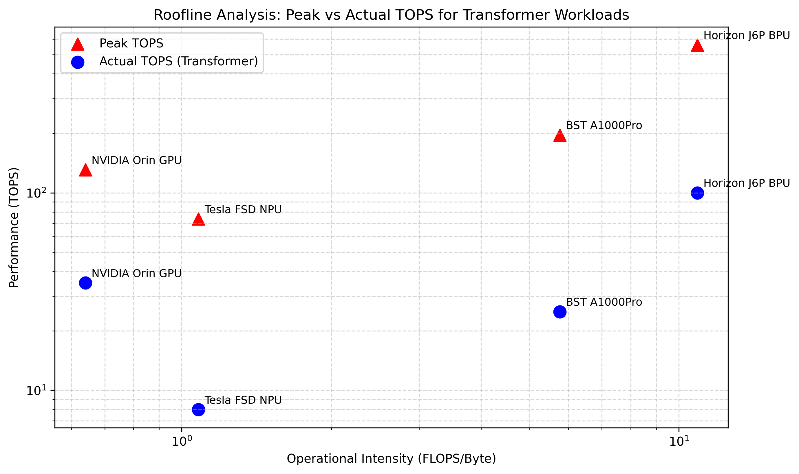

## 12. 内存墙与 Roofline 性能模型 [新增]

<div class="figure">
  
  <div class="caption">图：Roofline 性能模型 — 算力上限 vs 内存带宽上限</div>
</div>

### 12.1 Roofline Model 基础

Roofline Model (Williams et al., 2009) [P9] 是分析计算-内存瓶颈的经典框架:

```
    性能 (FLOPS/s)
         │
  峰值   │─────────────────────────────────────  ← 计算上限
         │                /
         │              /
         │            /     ← 带宽限制区
         │          /
         │        /
         │      /
         │    /
    0 ───│──/─────────────────────────────────
         0        算力强度(OI)    →
         
    OI = FLOPS / Bytes_accessed (Operations per Byte)
    
    关键点: OI < 峰值/OI拐点 → 内存受限(bandwidth-bound)
           OI > 峰值/OI拐点 → 计算受限(compute-bound)
```

> **参考文献 [P9]**: Williams, S., et al. "Roofline: An Insightful Visual Performance Model for Multicore Architectures." Communications of the ACM, 2009.

### 12.2 各芯片的 Roofline 建模


基于 Maleki et al. (2024) [P10] 的分析方法，对主要智驾芯片进行 Roofline 建模:

| 芯片 | 峰值算力 | 带宽 | OI拐点(ops/Byte) | SRAM | 参考文献 |
|------|---------|------|-----------------|------|---------|
| **Tesla FSD NPU** | 73.7 TOPS | 68 GB/s | **1,084** | 32MB | [P3] |
| **NVIDIA Orin GPU** | 131 TOPS | 204.8 GB/s | **640** | 4MB(L2) | [P6] |
| **NVIDIA Orin DLA** | 10 TOPS | 204.8 GB/s | **49** | ~1MB | [GWP] |
| **地平线 J6H BPU** | 560 TOPS | 51.2 GB/s | **10,938** | ~8MB[INF] | [GS] |
| **黑芝麻 A1000Pro** | 196 TOPS | ~34 GB/s | **5,765** | ~4MB[INF] | [GWP] |
| **华为 MDC** | ~200 TOPS | 68-307 GB/s | **651-2,941** | ~8MB | [P7] |

> **OI拐点 = 峰值算力 / 带宽**，单位为 ops/Byte（即每字节访问可执行多少次运算）。当工作负载的OI < OI拐点时为内存受限，OI > OI拐点时为计算受限。OI拐点越低，越容易达到计算上限。

> ⚠️ **注意**：上表OI拐点计算假设无片上SRAM缓存（纯DDR场景）。实际场景中，片上SRAM通过Tiling大幅提高有效OI——例如FlashAttention将Attention的OI从~5提升至数百级别。因此**SRAM容量是决定实际性能的关键因素**，不能仅看OI拐点数值。

### 12.3 典型智驾工作负载的算力强度分析

| 工作负载 | 算力强度(OI, ops/Byte) | 受限类型(无SRAM Tiling) | SRAM Tiling后有效OI | 关键瓶颈 |
|---------|----------------------|----------------------|-------------------|---------|
| **CNN卷积 (ResNet block)** | 50-200 | 取决于芯片 | 200-2000+ | MAC利用率 |
| **CNN Depthwise Conv** | 5-20 | **内存受限** | 20-100 | 权重带宽 |
| **BEV Attention (Q×K^T)** | 5-15 | **内存受限** | 100-1500 (FlashAttn) | K/V带宽 |
| **BEV Attention (Softmax×V)** | 8-20 | **内存受限** | 100-1500 (FlashAttn) | V带宽 |
| **MLP (全连接层)** | 2-10 | **内存受限** | 10-100 | 权重带宽 |
| **BEV Lift-Splat** | 1-5 | **严重内存受限** | 5-50 | 特征搬移 |
| **NMS后处理** | 0.5-2 | **严重内存受限** | 无明显改善 | 随机访问 |

> ⚠️ **SRAM Tiling的影响**：原始OI反映的是纯DDR访问模式。通过片上SRAM Tiling（如FlashAttention），权重和激活可在片上复用，有效OI可提升10-100倍。这正是Tesla NPU(32MB SRAM)和FlexNPU(1MB Scratch)的设计动机。

> **参考文献 [P10]**: Maleki, M.A., et al. "Moving Forward: A Review of Autonomous Driving Software and Hardware Systems." arxiv:2411.10291, 2024.

### 12.4 关键发现：带宽比TOPS更重要

| 芯片 | 峰值TOPS | BEV实际利用 | 利用率 | 带宽 | SRAM |
|------|---------|------------|--------|------|------|
| Tesla NPU | 73.7T | ~8 TOPS | **11%** | 68 GB/s | 32MB |
| Orin GPU | 131T | ~35 TOPS | **27%** | 204.8 GB/s | 4MB |
| J6H BPU | 560T | ~100 TOPS | **18%** | 51.2 GB/s | ~8MB |
| A1000Pro | 196T | ~25 TOPS | **13%** | ~34 GB/s | ~4MB |

> **关键发现**: 峰值TOPS仅13-27%被BEV Transformer利用。原因：Attention的OI(5-15 ops/Byte)远低于OI拐点(640-10,938)，导致芯片处于内存等待状态。**解决方案：增大SRAM + FlashAttention硬件融合（可将有效OI提升至数百甚至数千）。**

**这解释了为什么**:
- Tesla HW3的144 TOPS无法高效运行BEV Transformer（硬件为CNN优化，Attention算子无法高效映射到96×96 MAC阵列）
- 地平线J6H虽然峰值TOPS低于Orin，但在CNN任务上实际性能可能更优（SRAM更大，OI拐点更高）
- 蔚来NX9031的"专用Transformer加速"是正确方向——通用MAC阵列对Attention效率极低

### 12.5 内存层级与能耗分析

根据 Horowitz (ISSCC 2014) [P4] 的经典数据:

| 操作类型 | 相对能耗 | 备注 |
|---------|---------|------|
| INT8乘法 | **1×** | 基准 ~0.2pJ/MAC |
| FP16乘法 | 6× | |
| FP32乘法 | 20× | |
| SRAM读取(64KB) | 2× | |
| SRAM读取(1MB) | 5× | |
| SRAM读取(8MB) | 10× | |
| **DDR读取** | **200×** | ~40pJ/bit |
| DDR写入 | 150× | |

>  **一次不必要的DDR访问 ≈ 200次MAC运算的能耗！片上SRAM大小直接决定能效比。**

**各芯片SRAM容量对比**:

| 芯片 | NPU SRAM | 总SRAM估计 | DDR带宽 | SRAM/带宽比 |
|------|---------|-----------|---------|------------|
| Tesla NPU | **32MB** | 64MB(双NPU) | 68 GB/s | 0.94 MB·s/GB |
| J6H BPU | ~8MB[INF] | ~16MB | 51.2 GB/s | 0.31 MB·s/GB |
| Orin GPU | 4MB(L2) | ~8MB(共享) | 204.8 GB/s | 0.04 MB·s/GB |
| Da Vinci Core | ~1MB/core | ~32MB(32核) | 307 GB/s | 0.10 MB·s/GB |

> Tesla NPU 的 SRAM/带宽比最高(0.94)，这也是其CNN能效领先的根本原因。

---

