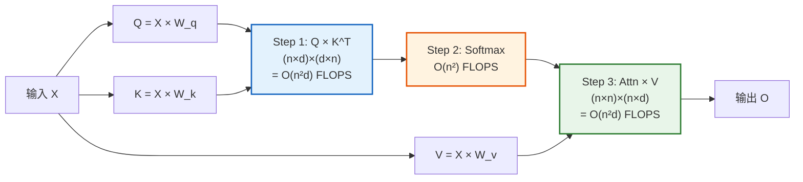
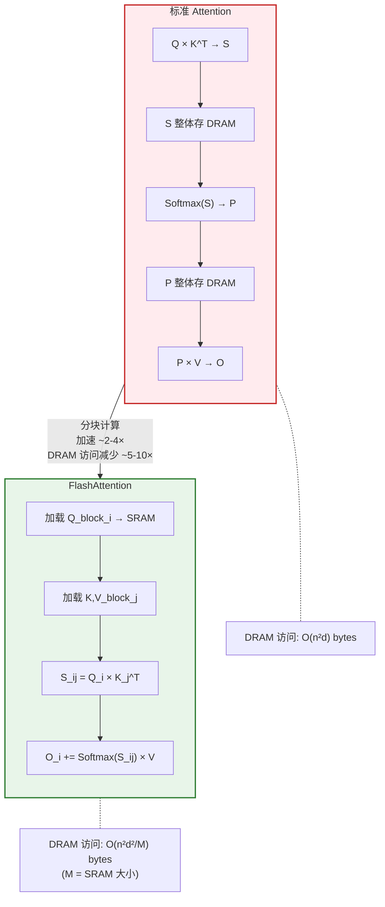
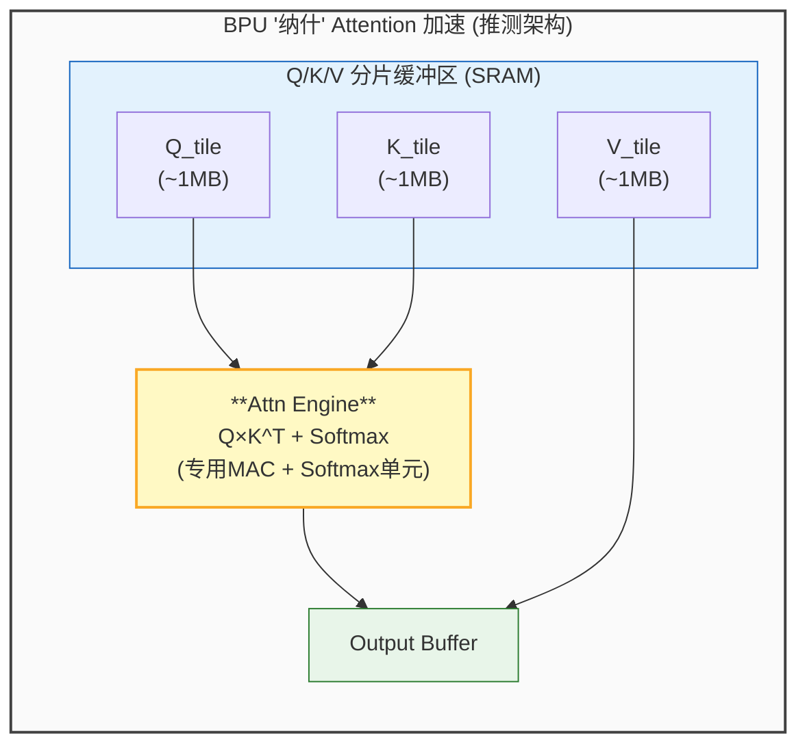
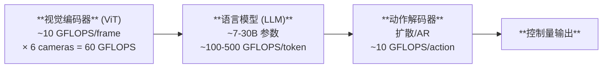

## 13. Transformer 硬件加速 [新增]

### 13.1 Transformer 推理的计算特征

> **BEV 场景**: n=20000 tokens, d=256 (head_dim)
> - Q×K^T: ~25.6 GFLOPS → 内存: 20000×20000×4B = **1.6GB**!
> - K/V Cache: 20000×256×2×4B = **40MB** (单层单头)

**核心问题**: Attention 的 O(n²) 复杂度导致:
1. **计算量**: Q×K^T 是 n² 级矩阵乘法，但矩阵很大
2. **内存**: Attention Map (n×n) 占用巨大，超出SRAM容量
3. **带宽**: K/V Cache 需要反复从DRAM加载

### 13.2 FlashAttention: 算法-硬件协同优化

FlashAttention (Dao et al., 2022) [P11] 通过**分块计算(tiling)**解决SRAM不足问题:

> **参考文献 [P11]**: Dao, T., et al. "FlashAttention: Fast and Memory-Efficient Exact Attention with IO-Awareness." NeurIPS 2022.

**FlashAttention 对芯片设计的启示**:

1. **SRAM大小是关键**: 更大的SRAM → 更大的tile → 更少的DRAM访问
2. **需要在线Softmax**: 在SRAM中完成Softmax而不写回DRAM
3. **融合内核**: Q×K^T + Softmax + ×V 在单次kernel中完成

### 13.3 BEV感知的Attention模式

BEV (Bird's Eye View) 感知引入了独特的Attention模式:

| BEV方法 | Attention类型 | 序列长度(n) | OI | 硬件需求 |
|---------|-------------|------------|-----|---------|
| BEVFormer | Deformable Attn | ~200K tokens | 3-8 | 专用采样硬件 |
| BEVFormer-v2 | Sparse Attn | ~50K | 5-15 | 稀疏加速 |
| BEVDet | 无Attention(CNN) | — | 50-100 | 标准NPU即可 |
| UniAD | Cross-Attn | ~20K | 5-12 | FlashAttn硬件 |

> **参考文献 [P12]**: Li, Z., et al. "BEVFormer: Learning Bird's-Eye-View Representation from Multi-Camera Images via Spatiotemporal Transformers." ECCV 2022.

### 13.4 专用Transformer加速硬件分析

**NVIDIA Transformer Engine (Thor/H100)**:
- 专用Tensor Core用于Attention: FP8/FP4精度
- 动态量化: 自动选择FP8/FP16混合精度
- Tensor Memory Accelerator (TMA): 异步数据搬运

**地平线 BPU "纳什" Attention加速(推测)**:

**蔚来NX9031 Transformer加速(推测)**:
- 三级调度(Sub-graph → Kernel → Block)暗示细粒度注意力计算
- "高效图像融合引擎"可能是BEV特征融合专用硬件
- 众核异构: 可能包含独立的Attention Core + CNN Core

### 13.5 VLA模型的硬件挑战

Vision-Language-Action (VLA) 模型是端到端智驾的最新范式 [P13]:

> **VLA 计算量总计**: 需要 **~200+ TOPS** 实时算力 (稠密)
> **内存**: LLM权重 ~14-60GB (INT8), 需要 **~100-500 GB/s** 带宽

> **参考文献 [P13]**: Jiang, S., et al. "A Survey on Vision-Language-Action Models for Autonomous Driving." ICCV Workshop 2025.

**VLA对芯片的特殊要求**:

| 需求 | 原因 | 挑战 |
|------|------|------|
| **超大SRAM** | LLM权重驻留 | 30B参数INT8=30GB，远超片上SRAM |
| **高带宽** | LLM推理内存受限 | 需要273+ GB/s |
| **混合精度** | LLM需要FP16/FP8，视觉可用INT8 | 动态精度切换 |
| **KV Cache管理** | 自回归生成需要缓存 | KV Cache可达数GB |
| **低延迟** | 实时控制<100ms | 端到端流水线优化 |

---

