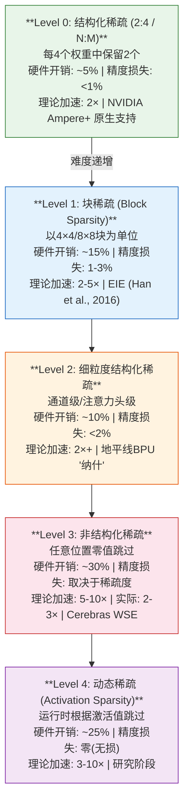
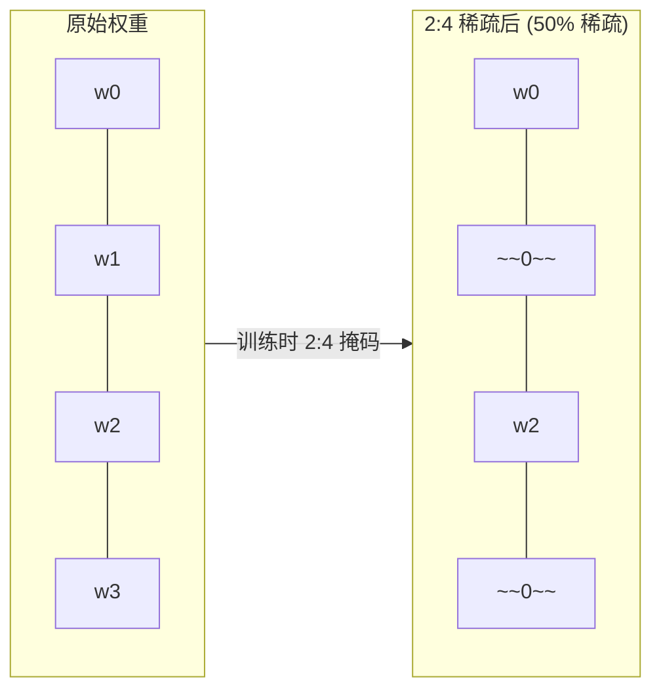
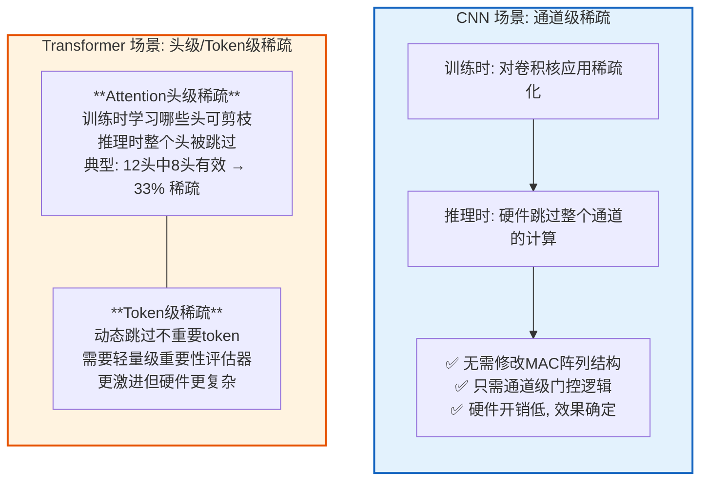
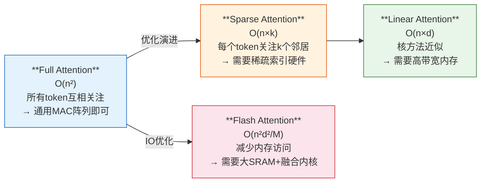

## 14. 稀疏化与剪枝的硬件实现 [新增]

### 14.1 稀疏化类型体系

> **参考文献 [P14]**: Han, S., et al. "EIE: Efficient Inference Engine on Compressed Deep Neural Network." ISCA 2016.

### 14.2 NVIDIA 2:4 结构化稀疏

NVIDIA Ampere/Blackwell 架构原生支持 2:4 稀疏:

> **稀疏 Tensor Core 加速原理**:
> - 正常: 4×8 × 8×16 = 512 MACs
> - 稀疏: 权重50%为零 → 只需256 MACs → **2× 吞吐量**
> - 条件: 训练时使用2:4稀疏掩码，推理时硬件自动跳过零值
> - 精度: ResNet-50 <0.1%, BERT <0.3% [P15]

> **参考文献 [P15]**: Mishra, A., et al. "Accelerating Sparse Deep Neural Networks." arxiv:2104.08478, 2021.

### 14.3 地平线 50% 稀疏化引擎分析

地平线 BPU "纳什" 宣称 50% 稀疏化加速 [GS]。推测实现方式:

### 14.4 Attention 稀疏化：前沿方向

> **趋势**: 智驾芯片需要同时支持 Full 和 Sparse Attention → **通用MAC阵列 + 稀疏调度器** 是趋势

---

