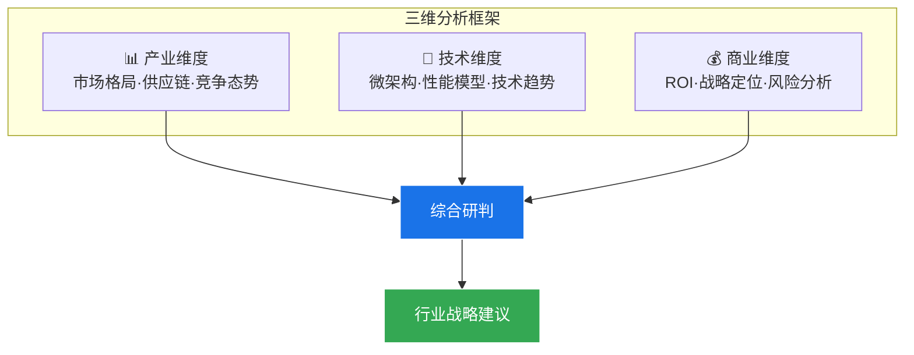

# 第2章：研究方法论

>  本章说明本报告的研究方法、数据来源可信度体系与分析框架。

---

## 2.1 数据来源可信度分层

本报告所有关键数据和规格均标注来源可信度，采用以下六级标注体系：

| 标注 | 含义 | 可信度 | 典型来源 |
|------|------|--------|---------|
| [GWP] | 厂商白皮书/HotChips/ISSCC论文 | ★★★★★ | Tesla FSD HotChips 31, NVIDIA GTC白皮书 |
| [GS] | GTC/AI Day等官方发布会 | ★★★★☆ | NVIDIA GTC, Tesla AI Day, Horizon AI Day |
| [GO] | 厂商官网公开信息 | ★★★★☆ | 产品规格页、新闻稿 |
| [GR] | 行业分析报告 | ★★★★☆ | 佐思汽研、高工智能汽车、浦银国际 |
| [INT] | 国际媒体交叉验证 | ★★★☆☆ | SemiAnalysis, IEEE Spectrum, Reuters |
| [INF] | 综合公开信息推断 | ★★★☆☆ | 基于已有数据进行工程估算 |

---

## 2.2 分析框架

### 技术分析方法

| 分析方法 | 应用场景 | 章节 |
|---------|---------|------|
| **Roofline 性能模型** | 评估芯片实际性能上限 | ch17 |
| **NPU 微架构对比** | 比较不同设计范式 | ch16, ch46-54 |
| **TOPS/W 能效分析** | 评估功耗效率 | ch7 |
| **内存带宽分析** | 识别Transformer推理瓶颈 | ch17 |
| **工艺-成本分析** | 评估制程对性能成本的影响 | ch27 |

### 数据验证原则

1. **交叉验证** — 关键数据至少两个独立来源确认
2. **标注透明** — 所有数据标注可信度层级
3. **时效标注** — 注明数据获取时间
4. **估算说明** — 推断数据标注推导逻辑

---