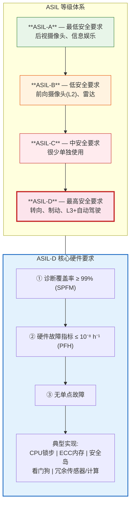
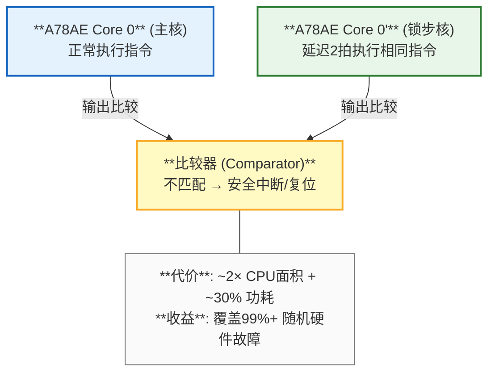
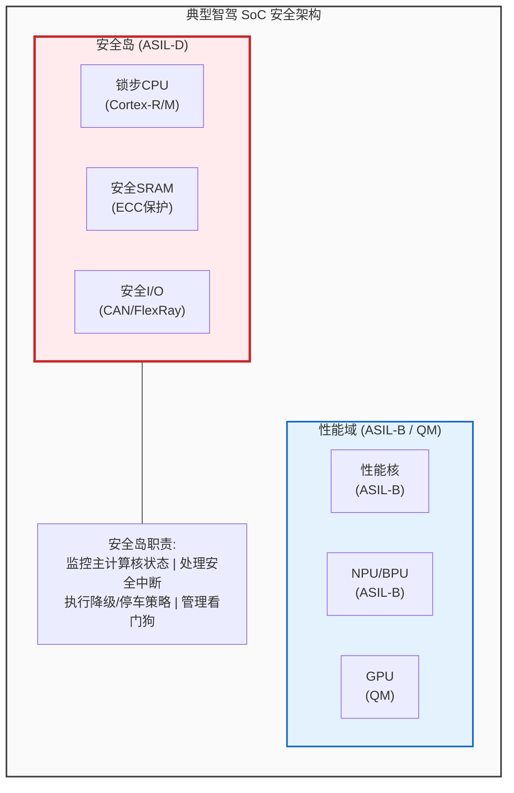

## 16. 功能安全与车规架构设计 [新增]

### 16.1 ISO 26262 功能安全等级

### 16.2 CPU锁步架构

> **实际配置**: NVIDIA Orin: 12×A78AE (6对锁步+6独立) | 地平线 J6: 8×A78AE (4对锁步+4独立)

### 16.3 安全岛 (Safety Island) 设计

### 16.4 各芯片的安全架构对比

| 芯片 | CPU安全 | NPU安全 | 内存保护 | 安全岛 | ASIL等级 |
|------|---------|---------|---------|--------|---------|
| **NVIDIA Orin** | A78AE锁步 | DLA ECC | 全总线ECC | 专用安全岛 | **ASIL-D** |
| **Tesla FSD** | A72无锁步 | NPU无保护 | 无ECC | ❌ 无 | QM(板级冗余) |
| **地平线 J6H** | A78AE锁步 | BPU ECC | 关键路径ECC | 专用安全岛 | **ASIL-D** |
| **黑芝麻 A1000** | Arm锁步 | NPU基本保护 | 部分ECC | 安全岛 | ASIL-B/D |
| **高通 SA8775** | Kryo安全核 | Hexagon保护 | 全ECC | 高通安全岛 | **ASIL-D** |
| **比亚迪璇玑A3** | — | — | — | — | L3/L4 |

> **Tesla的策略不同**: 不依赖单芯片ASIL-D，而是通过**双SoC板级冗余**实现安全。两个FSD芯片独立运行，结果交叉验证。

---

