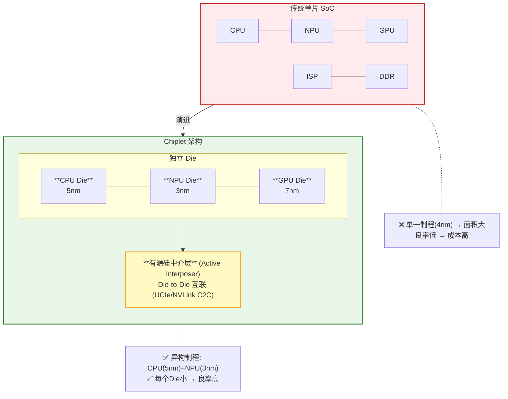
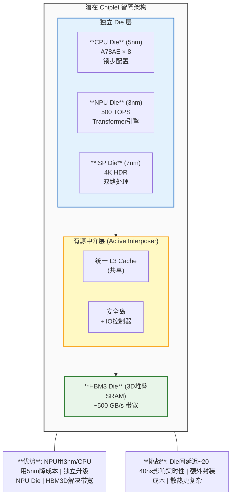

## 17. Chiplet 与未来架构趋势 [新增]

### 17.1 Chiplet 技术原理

### 17.2 Die-to-Die 互联技术

| 互联技术 | 带宽 | 延迟 | 能耗/bit | 来源 |
|---------|------|------|---------|------|
| **NVLink C2C** | 900 GB/s | ~40ns | ~0.5 pJ | NVIDIA [GWP] |
| **UCIe** | 4Tbps/mm | ~20ns | ~0.5 pJ | Intel [P20] |
| **EMIB** | ~400 GB/s | ~50ns | ~1 pJ | Intel [P20] |
| **Infinity Fabric** | ~400 GB/s | ~60ns | ~1.5 pJ | AMD |
| **传统DDR** | ~50 GB/s | ~100ns | ~100 pJ | — |

> **参考文献 [P20]**: UCIe Consortium, "Universal Chiplet Interconnect Express (UCIe) Specification." 2022.

### 17.3 Chiplet 对智驾芯片的影响

> **参考文献 [P21]**: Maleki, M.A., et al. "Performance Implications of Multi-Chiplet Neural Processing Units for Vehicular AI Perception." arxiv:2411.16007, 2024.

### 17.4 NVIDIA Thor 的 Chiplet 策略

NVIDIA Thor 采用 NVLink C2C 互联，支持多Die封装:
- **Grace CPU Die** (Neoverse V2, 16核) + **Blackwell GPU Die**
- 通过 NVLink C2C 实现一致性互联 (900+ GB/s)
- 这是Chiplet在智驾领域的**首个大规模商用案例**

### 17.5 未来架构预测

| 时间 | 架构演进 | 关键技术 |
|------|---------|---------|
| 2025-2026 | 大单片SoC | 5nm/4nm, 千TOPS |
| 2027-2028 | 2.5D Chiplet | UCIe/NVLink C2C, 异构Die |
| 2029-2030 | 3D集成 | HBM3D堆叠, 背面供电 |
| 2030+ | 存算一体 | SRAM-CIM, 数字CIM |

---

