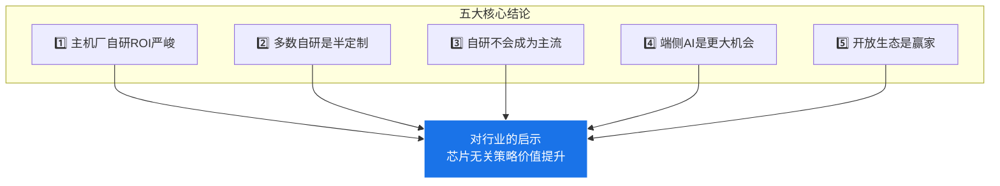

# 第26章：商业战略篇 — 执行摘要

>  本篇（第三篇）从商业和战略角度分析智驾芯片行业，聚焦 ROI、竞争态势和未来趋势。本章概述五大核心结论。

---

## 五大核心结论

### 结论详解

| # | 结论 | 关键论据 | 对行业的影响 |
|---|------|---------|-------------|
| 1 | **主机厂自研芯片ROI严峻** | 仅年销量50万辆+的车企具备经济可行性，多数需4-6年回本 | 主机厂不会全部自研，外购仍为主流 |
| 2 | **"自研"多数是半定制** | 主机厂200-300人 vs 独立芯片公司1000-2000人 | 半定制方案需要中间件做适配 |
| 3 | **自研不会成为主流** | 未来格局为"3家深度自研 + 5家半定制 + N家全部外购" | 中间件在混合芯片生态中价值最大 |
| 4 | **端侧AI是更大机会** | 端侧推理市场规模2030年可达500亿美元 | 行业可从智驾扩展到通用边缘AI |
| 5 | **开放生态最终胜出** | 小鹏对外供货策略 vs 理想/比亚迪封闭 | 开放平台有更多合作机会 |

### 第三篇章节导航

| 章节 | 主题 | 核心问题 |
|------|------|---------|
| ch27 | 💰 自研芯片ROI深度分析 | 造一颗芯片到底要花多少钱？ |
| ch28 | 📱 自研芯片会是主流吗？ | 手机SoC的历史能给我们什么启示？ |
| ch29 | 🏢 黑芝麻竞争态势分析 | 黑芝麻在夹缝中的生存空间有多大？ |
| ch30 | 🤖 端侧AI推理市场 | 智驾之外，还有多大的蛋糕？ |
| ch31 | 📋 战略建议 | 各方应如何应对变局？ |
| ch32 | ⚠️ 风险提示 | 有哪些被忽视的风险？ |
| ch33 | 📚 数据来源 | 本篇数据的出处 |

---