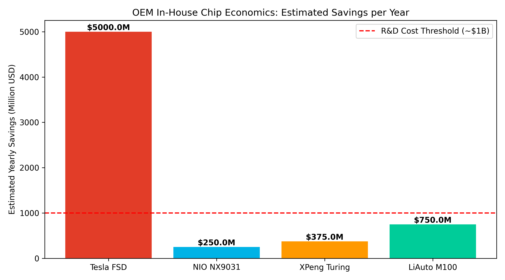

## 第一章：主机厂自研芯片的ROI深度分析

<div class="figure">
  
  <div class="caption">图：主机厂自研芯片投资回报分析</div>
</div>

### 1.1 智驾SoC研发的真实成本拆解

一颗5nm车规级智驾SoC的完整研发成本：

| 成本项 | 7nm工艺 | 5nm工艺 | 备注 |
|--------|---------|---------|------|
| 人力成本（架构+设计+验证） | $1.5-2亿 | $2-3亿 | 需要200-500人·年 |
| IP授权（CPU/GPU/NPU/ISP） | $5000万-1亿 | $5000万-1亿 | ARM CPU + Imagination/自研GPU |
| 流片费用（Mask） | $3000-5000万 | $5000-8000万 | 一次成功概率~60% |
| 二次流片（概率40%） | $1200-2000万 | $2000-3200万 | 修改+重流 |
| 车规认证（AEC-Q100） | $1000-2000万 | $1000-2000万 | 温度/寿命/缺陷率 |
| 功能安全（ISO 26262 ASIL-D） | $1000-3000万 | $1000-3000万 | FMEDA + 安全架构 |
| 工具链+SDK+编译器 | $5000万-1亿 | $5000万-1亿 | 这是最大隐性成本 |
| 算法参考模型 | $2000-5000万 | $2000-5000万 | 参考感知/规划算法 |
| **总投入** | **$3.5-5亿** | **$5-7亿** | **约25-50亿人民币** |

**关键发现**：工具链+SDK的成本与芯片设计本身相当，这也是黑芝麻1000+人做了好几年的核心原因——芯片只是冰山一角。

### 1.2 主机厂投入规模对比

| 公司 | 芯片相关团队 | 年研发总投入 | 芯片投入（估） | 投入年限 | 成果 |
|------|-------------|-------------|---------------|---------|------|
| **Tesla** | ~1000人 | 全栈自研 | $10亿+ | 2016起(8年) | FSD HW3/HW4 |
| **比亚迪** | 数千人(含半导体) | 580亿元 | 30-50亿元 | 2020起 | 璇玑A3/A5 |
| **华为** | 数千人(海思) | 不公开 | $20亿+ | 2018起 | MDC610/810 |
| **蔚来** | ~300人 | 130亿元 | 5-10亿元 | 2020起 | NX9031(流片) |
| **小鹏** | 200-300人 | 100亿元 | 3-5亿元 | 2020起 | 图灵AI芯片 |
| **理想** | ~200人 | 110亿元 | 3-5亿元 | 2022起 | M100(传闻) |
| **黑芝麻** | **1000+人** | **专注芯片** | **全部收入+融资** | 2016起(8年) | A1000/A2000 |
| **地平线** | **2000+人** | **专注芯片** | **全部收入+融资** | 2015起(9年) | J2-J6全系列 |

**核心矛盾**：主机厂200-300人的团队 vs 独立芯片公司1000-2000人，**投入差距3-5倍**，但主机厂宣称"自研成功"——背后是大量的IP采购和合作伙伴贡献。

### 1.3 ROI量化分析

以蔚来神玑NX9031为例：

```
研发成本（估）：30-40亿元人民币
├── 芯片设计+流片：15-20亿
├── 工具链+SDK：5-8亿
├── 车规认证：3-5亿
└── 算法适配：5-7亿

收益测算：
├── 外购替代成本：Orin ~$3000-4000/颗 ≈ 22000-29000元
├── 自研芯片成本：~$800-1200/颗 ≈ 6000-8500元（含良率摊销）
├── 单颗节省：~15000-20000元
├── 2025上半年装机：2.8万颗
├── 预计全年：6-8万颗
└── 年节省：9-16亿元

回本周期：30-40亿 / 12亿(年均) = 2.5-3.5年（乐观）
          30-40亿 / 6亿(保守) = 5-7年（保守）

关键前提：年出货量需持续 >10万颗
```

**对比Tesla的ROI**：

```
Tesla FSD HW3：
├── 研发成本（估）：$10-15亿
├── 年出货量：~200万辆
├── 单颗节省：~$2000-3000
├── 年节省：$40-60亿
└── 回本周期：1-2年 ✅ 非常划算
```

>  **关键洞察**：自研芯片的ROI存在一个**临界点——年出货量50万辆**。超过这个量，ROI在2-3年可回本；低于这个量，5-7年才可能回本，期间面临技术和市场双重风险。

### 1.4 主机厂"自研"的真相

| 自研层级 | 定义 | 投入 | 代表 |
|---------|------|------|------|
| **L1 全栈自研** | 架构+设计+工具链全部自研 | 1000+人, $10亿+ | Tesla FSD NPU |
| **L2 核心自研** | NPU自研+CPU/GPU买IP | 500-1000人 | 华为MDC(达芬奇NPU) |
| **L3 半定制** | 基于供应商参考设计定制 | 200-300人 | 蔚来NX9031(推测) |
| **L4 联合定义** | 与芯片公司深度合作 | 100-200人 | 小鹏图灵(推测) |
| **L5 贴牌** | 换壳/轻微修改 | <100人 | — |

**大多数主机厂的"自研"实际处于L3-L4层级**，这意味着：
- 核心NPU架构可能来自合作伙伴
- CPU/GPU/ISP几乎全部外购IP
- 工具链可能基于开源框架定制
- 实际自研比例约30-50%

---

