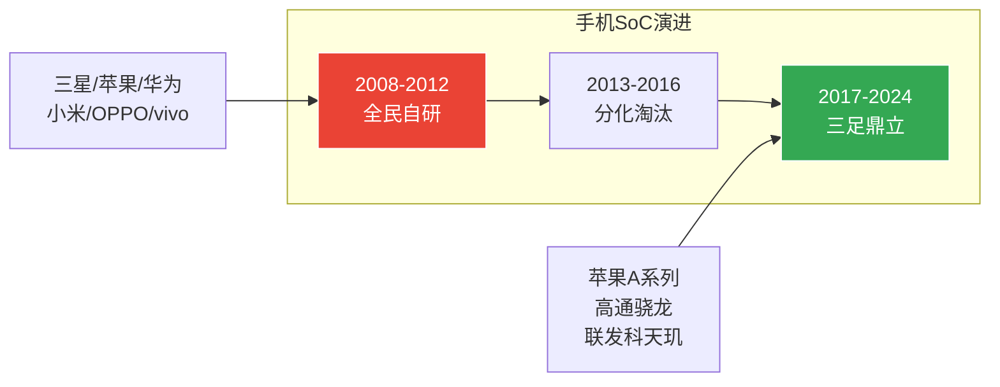

# 第二章：自研芯片会是主流吗？— 手机SoC的历史启示

>  本章通过手机SoC产业演进的历史类比，分析智驾芯片自研趋势的终局形态。

---

## 2.1 历史类比：手机SoC的启示

手机SoC产业经历了 **"自研热潮 → 分化整合 → 三足鼎立"** 的完整周期，为智驾芯片提供了极有价值的历史参照。



### 手机SoC演进时间线

| 阶段 | 时间 | 特征 | 自研厂商 | 最终结局 |
|------|------|------|---------|---------|
| **全民自研** | 2008-2012 | 智能手机爆发，所有人都想做芯片 | 三星、苹果、华为、小米、OPPO、LG | — |
| **分化淘汰** | 2013-2016 | 小玩家退出，门槛显现 | 小米松果失败、OPPO暂停、LG退出 | 多数失败 |
| **三足鼎立** | 2017-2024 | 苹果自研+高通/联发科供应商 | 仅苹果持续投入 | 稳定格局 |

### 关键启示

<div class="callout callout-insight">

**手机SoC给智驾芯片的三个启示**：

1. **自研门槛极高** — 小米投入数十亿做松果，最终放弃。年出货量低于5000万片的厂商很难支撑自研芯片的ROI
2. **苹果是特例而非规律** — 苹果能持续自研是因为其高端定位、超高利润率和封闭生态，多数厂商无法复制
3. **供应商模式仍是主流** — 高通+联发科服务了全球80%+的安卓手机厂商

</div>

---

## 2.2 智驾SoC vs 手机SoC：关键差异

虽然历史有参考价值，但智驾SoC有其独特性：

| 维度 | 手机SoC | 智驾SoC | 对自研的影响 |
|------|---------|---------|-------------|
| **安全等级** | 消费级 | 车规级(ASIL-D) | 认证门槛更高，自研更难 |
| **算法迭代** | 应用层（不涉及芯片） | 芯片级（NPU设计依赖算法） | 软硬协同需求驱动自研 |
| **差异化价值** | 体验差异化有限 | 智驾能力是核心卖点 | 自研的战略价值更高 |
| **市场规模** | 12亿部/年 | ~8000万辆/年 | 规模效应更弱 |
| **换代周期** | 1-2年 | 3-5年 | 投资回收期更长 |
| **供应链** | 成熟代工+IP | 先进制程受限 | 中国车企面临额外挑战 |

---

## 2.3 终局预测：3+5+N 格局

基于手机SoC历史和智驾SoC特性，我们预测智驾芯片终局为 **"3+5+N"** 格局：

```
┌─────────────────────────────────────────────────────┐
│  3家深度自研                                         │
│  Tesla · 华为 · 比亚迪                               │
│  特征：年销量100万+，全栈能力，持续投入10年+            │
├─────────────────────────────────────────────────────┤
│  5家半定制                                          │
│  小鹏 · 蔚来 · 理想 · 广汽 · 上汽                    │
│  特征：采购IP+定制NPU，200-300人团队，3-5年周期         │
├─────────────────────────────────────────────────────┤
│  N家全部外购                                         │
│  其他所有车企                                        │
│  特征：使用NVIDIA/地平线/黑芝麻等供应商方案             │
└─────────────────────────────────────────────────────┘
```

### 为什么是这个格局？

| 阵营 | 入围条件 | 为什么 |
|------|---------|--------|
| **深度自研(3家)** | 年销量100万+ / 软硬全栈能力 / 10年投入承诺 | 只有比亚迪兼具规模+垂直整合能力 |
| **半定制(5家)** | 年销量30万+ / 芯片团队200人+ / IP采购预算充足 | 新势力头部具备条件但ROI挑战大 |
| **外购(N家)** | 无自研条件 | 供应商方案已足够好，ROI更优 |

---

## 2.4 对行业的影响

<div class="callout callout-success">

**"3+5+N"格局对行业意味着**：

1. **外购仍是主流** — N家外购车企是行业的主要客户群
2. **半定制需要适配** — 5家半定制厂商需要中间件连接自研芯片和外部组件
3. **跨平台价值最大** — 覆盖3种自研+5种半定制+N种外购芯片，中间件不可或缺

</div>

---