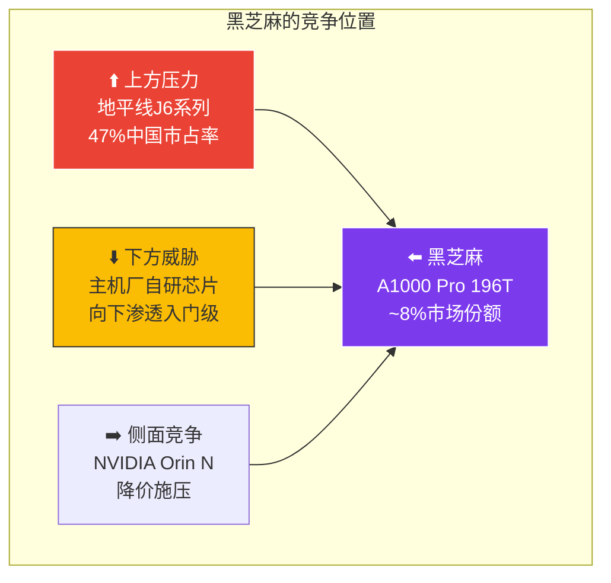

# 第三章：黑芝麻竞争态势深度分析

>  本章聚焦黑芝麻智能在智驾芯片市场的竞争态势，分析其优势、挑战与突围路径。

---

## 3.1 市场份额现状（2024-2025）

### 中国ADAS芯片市场格局

| 厂商 | 2024份额 | 2025份额(预测) | 核心产品 | 趋势 |
|------|---------|---------------|---------|------|
| **地平线** | ~35% | ~38% | J6E/J6M/J6P | 📈 稳步增长 |
| **NVIDIA** | ~25% | ~22% | Orin X/N | 📉 份额缓降 |
| **华为** | ~12% | ~11% | MDC610 | ➡️ 稳定 |
| **黑芝麻** | ~8% | ~7% | A1000/A1000 Pro | ⚠️ 承压 |
| **Mobileye** | ~8% | ~5% | EyeQ6 | 📉 加速下滑 |
| **主机厂自研** | ~2% | ~10% | 图灵/神玑/璇玑 | 📈 快速增长 |
| **其他** | ~10% | ~7% | TI/瑞萨等 | — |

### 黑芝麻的市场定位

---

## 3.2 黑芝麻的核心竞争力

### 产品矩阵分析

| SKU | 算力 | 功耗 | TOPS/W | 目标 | 竞品 |
|-----|------|------|--------|------|------|
| A1000L | 106 TOPS | 5-8W | 13-20 | L1/L2 入门 | J6E, EyeQ6 |
| A1000 | 58 TOPS | 5-10W | 6-10 | L2 主力 | J6M |
| **A1000 Pro** | **196 TOPS** | 15-20W | 10-13 | L2+ 旗舰 | Orin N |

### 优势盘点

| 优势 | 详情 | 竞争力评级 |
|------|------|----------|
| ⭐ **ISP 图像质量** | 自研双路ISP，图像质量行业领先 | 🟢 核心差异化 |
| ✅ **低功耗** | A1000L 5-8W，适合入门场景 | 🟢 成本优势 |
| ✅ **本土供应链** | 不受制裁影响，稳定供货 | 🟢 政策优势 |
| ✅ **1000+人团队** | 深耕芯片8年，积累深厚 | 🟡 中等优势 |
| ✅ **车企合作** | 一汽/东风/江淮等客户 | 🟡 中等优势 |

### 劣势分析

| 劣势 | 详情 | 严重程度 |
|------|------|---------|
| 🔴 **算力上限低** | Pro仅196T，无法覆盖L3+ | 严重 |
| 🔴 **带宽瓶颈** | ~34GB/s，Transformer推理受限 | 严重 |
| 🟡 **生态较弱** | 工具链成熟度不如NVIDIA/地平线 | 中等 |
| 🟡 **下一代不确定** | A2000同为7nm，无代际优势 | 中等 |

---

## 3.3 黑芝麻 vs 地平线：核心竞争对比

| 维度 | 黑芝麻 | 地平线 | 差距分析 |
|------|--------|--------|---------|
| **市场份额** | ~8% | ~38% | 🔴 4-5倍差距 |
| **旗舰算力** | 196T (A1000 Pro) | 560T (J6P) | 🔴 2.8倍差距 |
| **能效比** | 10-13 TOPS/W | 16 TOPS/W (J6P) | 🟡 30%差距 |
| **制程** | 7nm | 7nm | ➡️ 持平 |
| **客户数** | 10+ | 30+ | 🔴 3倍差距 |
| **ISP能力** | ⭐ 领先 | 一般 | 🟢 黑芝麻优势 |
| **团队规模** | 1000+ | 2000+ | 🟡 2倍差距 |
| **融资规模** | ~50亿 | ~150亿(上市) | 🔴 3倍差距 |

---

## 3.4 黑芝麻的突围路径

**黑芝麻的三条突围路径**：

1. **差异化场景** — 利用ISP优势深耕DMS/舱驾融合/商用车等非纯算力竞争领域
2. **机器人/边缘AI** — 从智驾扩展到机器人、工业视觉等更广阔的边缘AI市场
3. **开放合作** — 与行业等中间件平台深度合作，降低客户适配成本

### 路径可行性评估

| 突围路径 | 可行性 | 潜在收益 | 风险 |
|---------|--------|---------|------|
| 差异化场景 | ⭐⭐⭐⭐ | 中等 | 需要时间培育市场 |
| 机器人/边缘AI | ⭐⭐⭐ | 高 | 地平线/NVIDIA也在布局 |
| 开放合作 | ⭐⭐⭐⭐ | 中等 | 无法解决硬件代际差距 |

---

## 3.5 对 行业 的启示

**️ 行业 的风险与机遇**：

- **风险**：如果黑芝麻市场份额继续下滑，行业作为主要基于A1000的平台将受影响
- **机遇**：黑芝麻越是面临竞争压力，越需要中间件合作伙伴来降低客户迁移成本
- **建议**：行业应加速多芯片适配，降低对单一芯片平台的依赖度

---