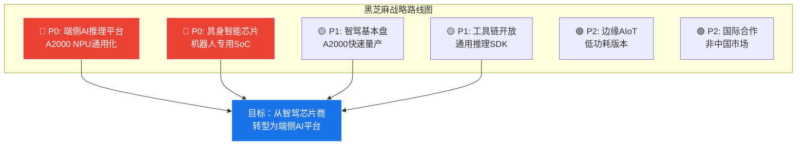
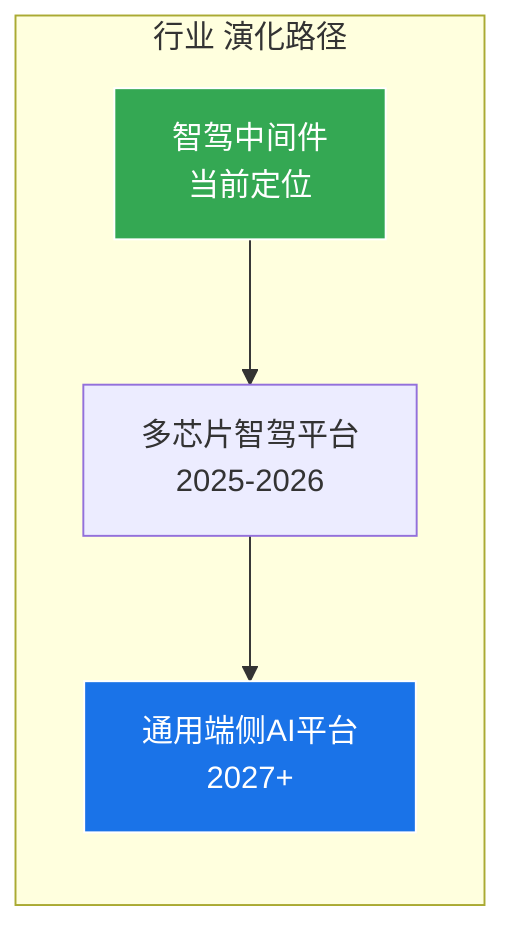

# 第五章：战略建议

>  本章面向芯片厂商、主机厂和中间件平台提出差异化战略建议。

---

## 5.1 对黑芝麻的建议

### 战略优先级矩阵



| 优先级 | 战略方向 | 具体行动 | 时间框架 | 预期效果 |
|--------|---------|---------|---------|---------|
| **P0** | **All-in端侧AI推理平台** | 将A2000的NPU能力通用化，打造跨行业推理平台 | 2025-2026 | 打开10x市场空间 |
| **P0** | **具身智能芯片** | 针对人形机器人推出专用SoC（10-100 TOPS，低功耗） | 2026-2027 | 进入高增长赛道 |
| **P1** | **守住智驾基本盘** | A2000快速量产，守住中端市场和央企客户 | 2025-2026 | 维持现金流 |
| **P1** | **工具链开放生态** | 学习NVIDIA TensorRT，打造通用推理SDK | 2025-2027 | 降低客户门槛 |
| **P2** | **边缘AIoT** | 基于同一NPU架构推出低功耗版本（5-20 TOPS） | 2027+ | 长尾市场 |
| **P2** | **国际合作** | 探索非中国市场的机器人/工业客户 | 2027+ | 多元化收入 |

---

## 5.2 对行业平台的启示

### 从智驾中间件到通用端侧AI平台

从行业的代码架构分析，该平台具备向通用端侧AI演化的潜力：



| 行业现有能力 | 端侧AI通用化方向 | 差距 | 改进路径 |
|-------------|-----------------|------|---------|
| 视觉/CAN/语音多传感器融合 | 通用多模态感知服务 | 中等 | 抽象传感器接口 |
| FastAPI RESTful服务架构 | AI推理即服务（AIaaS） | 小 | 增加模型市场 |
| 边缘部署（systemd/udev） | 多种边缘设备适配 | 中等 | 扩展硬件支持 |
| 指标监控与错误处理 | 生产级AI服务管理 | 小 | 增加SLA管理 |
| 跨域通信（crossdomain router） | 跨设备AI协同 | 大 | 需要联邦学习 |

### 行业 多芯片适配路线图

| 阶段 | 时间 | 目标芯片 | 投入 | 里程碑 |
|------|------|---------|------|--------|
| **Phase 1** | 2025 Q3-Q4 | 地平线 J6E/J6P | 3-4人月 | HAL层扩展+J6适配 |
| **Phase 2** | 2026 Q1-Q2 | NVIDIA Orin X | 2-3人月 | TensorRT集成 |
| **Phase 3** | 2026 Q3-Q4 | 小鹏图灵/比亚迪璇玑 | 待定 | 评估开放度后决策 |

---

## 5.3 对主机厂的建议

### 自研 vs 外购决策矩阵

| 条件 | 建议 | 代表车企 |
|------|------|---------|
| 年销量 >100万辆 + 全栈算法能力 | **深度自研** | 比亚迪、Tesla |
| 年销量 30-100万辆 + 算法团队 >200人 | **半定制（IP+定制NPU）** | 小鹏、蔚来、理想 |
| 年销量 <30万辆 或 算法投入有限 | **外购 + 定制调优** | 多数车企 |

<div class="callout callout-warning">

**️ 主机厂自研的关键风险**：

- **ROI陷阱** — 芯片研发投入10-30亿，年销量低于50万辆很难回本
- **人才竞争** — 芯片人才薪资高涨，200人团队年成本5-10亿
- **代际落后** — 芯片3年迭代一次，自研芯片上市时可能已落后一代
- **生态缺失** — 自研芯片缺少工具链和开发者生态，拖慢算法迭代

</div>

---

## 5.4 投资逻辑总结

```
黑芝麻的投资逻辑变化：

旧逻辑（2022-2024）：
  智驾芯片国产替代 → 看A1000出货量 → 对标地平线
  → 结论：地平线更优 ❌

新逻辑（2025-2028）：
  端侧AI推理平台 → 看跨行业收入占比 → 对标NVIDIA（边缘）
  → 智驾芯片是基本盘（现金牛）
  → 机器人芯片是增长曲线（明星）
  → 通用端侧AI是终局（问题→明星）
  → 结论：如果端侧AI平台成功，估值逻辑完全不同 ✅
```

### 关键观察指标

| 指标 | 2024基线 | 2026目标 | 2028目标 | 判断标准 |
|------|---------|---------|---------|---------|
| 智驾芯片收入占比 | ~95% | ~70% | ~40% | 多元化成功 |
| 机器人/边缘AI收入 | ~0 | ~10% | ~30% | 新赛道验证 |
| 工具链开发者数 | <100 | 1000+ | 10000+ | 生态建设 |
| 跨行业客户数 | <5 | 20+ | 50+ | 市场拓展 |

---