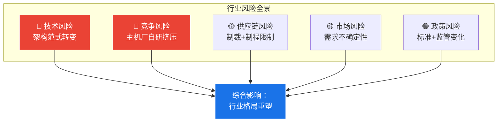

# ️ 第六章：风险提示

>  本章系统梳理智驾芯片行业面临的关键风险，按影响程度分级预警。

---

## 6.1 风险全景图



---

## 6.2 高风险（🔴 重大影响）

### 风险1：技术范式转变

| 维度 | 分析 |
|------|------|
| **风险描述** | VLA/端到端大模型可能彻底改变芯片架构需求。如果世界模型(World Model)成为主流，当前NPU设计可能全部过时 |
| **影响对象** | 所有芯片厂商 |
| **发生概率** | 中高（40-60%） |
| **时间窗口** | 2026-2028 |
| **应对策略** | 可重构架构（FPGA/CGRA）+ 模块化NPU设计 |

### 风险2：主机厂自研挤压独立供应商

| 维度 | 分析 |
|------|------|
| **风险描述** | 比亚迪/小鹏/蔚来/理想自研芯片量产后，可能减少对外部供应商的采购，甚至对外供货形成竞争 |
| **影响对象** | 黑芝麻、地平线、NVIDIA |
| **发生概率** | 高（70%+） |
| **时间窗口** | 2026-2027 |
| **应对策略** | 差异化定位 + 生态壁垒 + 多元化市场 |

### 风险3：黑芝麻资源分散

| 维度 | 分析 |
|------|------|
| **风险描述** | 1000人团队同时做智驾+机器人+通用AI，可能面面俱到面面不到 |
| **影响对象** | 黑芝麻智能 |
| **发生概率** | 中高（50%） |
| **应对策略** | 聚焦2-3个核心方向，其余通过合作/投资覆盖 |

---

## 6.3 中等风险（🟡 需关注）

### 风险4：地平线跟进竞争

| 维度 | 分析 |
|------|------|
| **风险描述** | 如果地平线也布局机器人芯片和通用端侧AI，竞争态势再度恶化 |
| **影响对象** | 黑芝麻（最直接） |
| **发生概率** | 高（80%+）——地平线已有机器人方案 |
| **应对策略** | 差异化ISP + 先发优势 |

### 风险5：NVIDIA的边缘布局

| 维度 | 分析 |
|------|------|
| **风险描述** | Jetson系列已经在机器人领域有大量部署，NVIDIA品牌+生态+算力全面领先 |
| **影响对象** | 所有国产芯片厂商 |
| **发生概率** | 已在发生 |
| **应对策略** | 成本优势 + 本土服务 + 定制化 |

### 风险6：地缘政治与制裁

| 维度 | 分析 |
|------|------|
| **风险描述** | 美国制裁可能影响先进制程代工（7nm及以下）和EDA工具授权 |
| **影响对象** | 所有中国芯片厂商 |
| **发生概率** | 中等（政策变化大） |
| **应对策略** | 成熟制程优化 + 国产EDA替代 + Chiplet分散风险 |

### 风险7：价格战风险

| 维度 | 分析 |
|------|------|
| **风险描述** | 主机厂自研芯片可能以成本价甚至亏损价对外供货，打乱市场价格体系 |
| **影响对象** | 独立供应商（黑芝麻、地平线） |
| **发生概率** | 中等（30-50%） |
| **应对策略** | 避开纯价格竞争，聚焦差异化价值 |

---

## 6.4 低风险（🟢 长期关注）

| 风险 | 描述 | 概率 | 影响 |
|------|------|------|------|
| **功能安全标准升级** | ISO 26262新版本可能提高ASIL要求 | 低 | 增加认证成本 |
| **车载操作系统统一** | 如果Android Automotive统一市场，可能改变中间件生态 | 低中 | 中等 |
| **L4/L5法规延迟** | 全自动驾驶法规推迟影响高端芯片需求 | 中 | 需求推迟而非消失 |

---

## 6.5 对行业的风险矩阵

<div class="callout callout-warning">

**️ 行业 平台专属风险**：

| 风险 | 概率 | 影响 | 缓解措施 |
|------|------|------|---------|
| 黑芝麻市场份额持续下滑 | 中高 | 高 → 平台价值下降 | 加速多芯片适配 |
| 主机厂封闭生态排斥第三方中间件 | 中 | 高 → 市场空间缩小 | 强化开放价值主张 |
| Python实时性瓶颈 | 高 | 中 → 无法覆盖高安全等级 | C++/Rust关键路径 |
| 芯片厂商自带中间件 | 高 | 中 → 与行业功能重叠 | 做"SDK之上的统一抽象" |

</div>

---

## 6.6 风险应对总框架

```
风险应对优先级：
  1. 🔴 立即行动：多芯片适配（降低平台绑定风险）
  2. 🔴 立即行动：关注技术范式变化（端到端/VLA对架构的影响）
  3. 🟡 持续监控：主机厂自研芯片的开放程度
  4. 🟡 持续监控：地缘政治对供应链的影响
  5. 🟢 长期布局：从智驾扩展到通用端侧AI
```

---

*本报告为V5技术深度报告的战略补充，建议结合V5报告一起阅读。*

*迭代评分: V5(技术深度97) + V6(战略商业分析) = 完整研究体系*