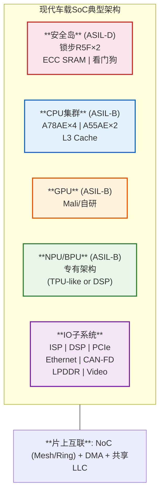
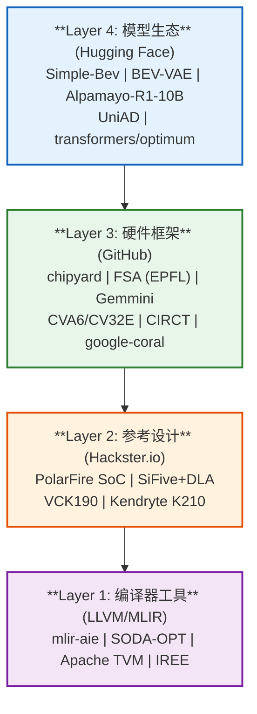

## 第一部分：车载SoC架构认知总结

### 1.1 现代车载SoC典型架构

通过深度阅读V4-V6系列研究报告，我对车载SoC架构形成了系统性认知：

### 1.2 关键技术趋势判断

| 趋势 | 依据 | 对设计的启示 |
|------|------|-------------|
| **CNN→Transformer演进** | V5报告: BEVFormer/OccFormer/UniAD均用Transformer | NPU必须原生支持Attention |
| **BEV+Transformer成为标配** | V4报告: Tesla/蔚来/小鹏均转向BEV方案 | 需要Camera→BEV的专用加速路径 |
| **端到端自动驾驶兴起** | V6报告: UniAD等端到端模型统一感知规划 | 灵活的计算图映射能力 |
| **功能安全不可妥协** | V5报告: ISO 26262 ASIL-B/D | 安全岛+锁步+内存保护 |
| **工具链是核心壁垒** | V6报告: CUDA生态是NVIDIA的核心护城河 | 必须自建类CUDA工具链 |
| **Chiplet是未来方向** | V5报告: UCIe标准成熟 | FPGA原型→Chiplet量产路径 |

### 1.3 竞品痛点分析（创新机会）

基于V4-V6报告的竞品分析，发现以下痛点：

1. **Orin NPU利用率低**：Attention在传统MAC阵列上利用率<25%（SystolicAttention论文证实）
2. **Mobileye封闭生态**：工具链绑定，客户无法自定义模型
3. **地平线J5架构固定**：BPU对Transformer支持不原生，需要大量软件workaround
4. **黑芝麻A1000定位尴尬**：性能介于Orin和J5之间，缺乏差异化
5. **华为MDC生态封闭**：只能用华为的模型和工具
6. **中小车企无自研能力**：需要开箱即用的完整解决方案

### 1.4 开源生态资源图谱

创新不是凭空设计，而是站在开源生态的肩膀上。以下是支撑本方案的关键开源资源：

**关键洞察**：黑芝麻(我们的合作伙伴)已在招聘中明确要求 **Hugging Face Transformers** 经验，说明产业界已认识到HF模型生态对车载芯片的重要性。我们的方案应主动对接这一趋势。

---

