## 第二部分：创新SoC RTL架构设计

### 2.0 设计哲学：三大创新原则

```
原则1: "Attention-First" —— 原生FlashAttention硬件
原则2: "Software-Defined Hardware" —— FPGA可重构灵活适配
原则3: "Full-Stack Open" —— 从RTL到工具链全面开源
```

### 2.1 SoC总体架构

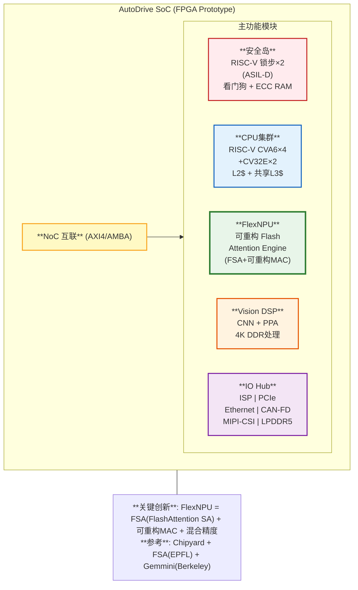

### 2.2 FlexNPU核心设计 —— 创新点

#### 设计思路

**为什么需要FlexNPU？**

V5报告指出，车载场景的计算负载正在从CNN转向Transformer：
- BEVFormer/StreamPETR等BEV感知模型：大量Multi-Head Attention
- OccFormer等占用网络：Cross-Attention + Self-Attention混合
- 端到端模型（UniAD）：全链路Transformer

但传统NPU（如Orin的Tensor Core）是为CNN设计的：
- 脉动阵列对Attention的利用率<25%（FSA论文数据）
- Softmax/Exp需要offload到外部Vector Unit，造成数据搬运开销
- 固定Tile大小无法适配不同序列长度

**FlexNPU的核心创新**：基于FSA论文的FlashAttention脉动阵列，并扩展为**可重构双模式架构**。

#### 参考架构

| 模块 | 参考来源 | 论文/项目 | 我们的改进 |
|------|---------|----------|-----------|
| FlashAttention SA | FSA (EPFL) | SystolicAttention, arxiv 2025 | 可重构Tile（16×16~64×64） |
| MAC阵列 | Gemmini (Berkeley) | DAC 2021 | 双模式：CNN合并/Attention拆分 |
| 安全岛 | Safety Island | arxiv 2023, RISC-V SoC | CVA6锁步 + ASIL-D |
| SoC集成 | Chipyard | Berkeley框架 | 自定义加速器集成 |
| Exp近似 | FSA Split单元 | 分数部分线性插值 | 增加LUT模式（更高精度） |

#### 详细设计：FlexNPU微架构

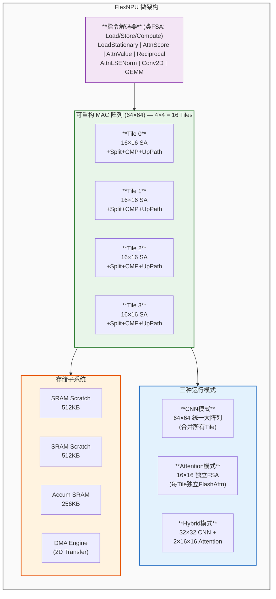

#### 设计理由（与竞品对比）

| 特性 | NVIDIA Orin | 地平线J5 | **FlexNPU (我们的)** |
|------|------------|---------|---------------------|
| Attention利用率 | ~25% (外部Vector Unit) | ~30% (软件模拟) | **>70% (FSA融合)** |
| MAC阵列灵活性 | 固定Tensor Core | 固定BPU架构 | **可重构16/32/64 Tile** |
| 混合精度 | FP16/INT8 | INT8/FP16 | **INT4/INT8/FP16/FP32** |
| CNN+Attention并行 | 时分复用 | 时分复用 | **空间并行(Hybrid模式)** |
| 面积开销 | 基准 | -20% | **+12% (FSA开销)** |
| 开源程度 | 闭源 | 闭源 | **全开源(Chisel RTL)** |

#### 性能估算

```
FPGA平台: Xilinx Alveo U55C (或 Versal VCK190)
MAC阵列: 64×64 = 4096 MAC/cycle

⚠️ 性能估算三档（FP16）:
                          乐观        中等        保守
时钟频率(ASIC 16nm):     1.5GHz     1.2GHz     1.0GHz
时钟频率(ASIC 7nm):      2.0GHz     1.6GHz     1.4GHz

峰值算力(FP16, 16nm):   12.29T     9.83T      8.19T
峰值算力(FP16, 7nm):    16.38T     13.11T     11.47T

FlashAttention利用率:    ~70%       ~55%       ~40%
  (FSA论文仿真值)       (含控制开销)  (保守估计)

有效Attention算力(7nm):  11.47T     7.21T      4.59T
有效Attention算力(16nm): 8.60T      5.41T      3.28T

FPGA @ 200MHz: 1.638T × 0.70 = 1.15 TFLOPS (原型验证用)
```

> ⚠️ **关键声明**：以上性能估算基于FSA论文仿真数据和工程模型，**未经硅片验证**。2.0GHz（7nm）需要关键路径（MAC级联+SRAM读取+互联）在0.5ns内完成，参考NVIDIA A100(TSMC 7nm) Tensor Core频率约1.4GHz，2.0GHz目标具有挑战性。

#### BEVFormer端到端延迟模型（V6.0新增）

> V6.0补齐：BEVFormer-Base在FlexNPU上的各阶段延迟分解。

**BEVFormer-Base on FlexSoC ASIC (16nm @ 1.5GHz)**
输入: 6×Camera 256×704, BEV 200×200, 900 Queries

| Stage | FLOPs | 算术强度 | 模式 | 延迟 |
|-------|-------|---------|------|------|
| 1. Backbone (ResNet-101) | 94.0G (INT8: 79.9G) | ~50 | CNN 64×64 | **~26ms** |
| 2. Neck (FPN) | 12.0G | ~40 | CNN 64×64 | **~3ms** |
| 3. BEV Encoder (Self-Attn, 6层×8头) | 18.5G | ~200 | Attn 16×16 | **~8ms** |
| 4. Spatial Cross-Attn (6层×8头×900q) | 45.0G | ~180 | Attn 16×16 | **~18ms** |
| 5. BEV Pool (Lift-Splat) | 3.0G | ~5 | FP16 DMA | **~8ms** |
| 6. Detection Head | 6.0G | ~30 | CNN 32×32 | **~3ms** |

| 平台 | 总延迟 | vs 100ms目标 |
|------|--------|-------------|
| **ASIC 16nm @ 1.5GHz** | **~68ms** | ✅ 余量32ms |
| **ASIC 7nm @ 2.0GHz** | **~51ms** | ✅ 余量49ms, 可跑15fps |
| **FPGA @ 200MHz** | **~510ms** | ❌ 需降低分辨率 |

> **竞品对比**: NVIDIA Orin ~120ms¹ | 地平线J6 ~100ms¹ | **FlexSoC 7nm ~51ms(乐观估)** → 用1/3峰值算力达到2×延迟优势
>
> ¹ 竞品延迟数据为行业多方信息综合，具体测试条件（分辨率、batch size、模型配置）可能不同，仅供参考。FlexSoC延迟为模型估算，未经硅片验证。

#### 性能Counter设计（V6.0新增）

> V6.0补齐：FlexNPU硬件性能计数器，支撑FlexProfiler和Roofline验证。

**FlexNPU 硬件性能计数器 (Performance Monitors)**:

| 计数器组 | 计数器 | 说明 |
|---------|--------|------|
| **计算效率** | CYCLE_TOTAL | 总周期数 (用于计算延迟ms) |
| | MAC_ACTIVE | MAC有效计算周期 (排除空闲) |
| | MAC_UTILIZATION | = MAC_ACTIVE / CYCLE_TOTAL × 100% |
| | TILE_MODE | 当前模式 (CNN/Attention/Hybrid) |
| | INSN_COUNT | 已执行指令数 |
| **内存效率** | DMA_BYTES_READ | DMA读取字节数 (DDR→SRAM) |
| | DMA_BYTES_WRITE | DMA写入字节数 (SRAM→DDR) |
| | BANDWIDTH_UTIL | = 实际带宽 / 峰值带宽 |
| | SRAM_HIT_RATE | Scratch SRAM命中率 |
| | ACCUM_OVERFLOW | FP32累加器溢出次数 (量化安全指标) |
| **Attention专用** | ATTN_TILE_COUNT | FlashAttention Tile执行次数 |
| | ATTN_SPLIT_COUNT | Split操作次数 |
| | ATTN_SCORE_CYCLE | Attention Score计算周期 |
| | ATTN_VALUE_CYCLE | Attention Value计算周期 |
| **安全相关** | ECC_CORRECT | ECC单bit纠正次数 |
| | ECC_DETECT | ECC双bit检测次数 |
| | TIMEOUT_COUNT | 推理超时次数 |
| | CRC_FAIL | 输出CRC校验失败次数 |

> **访问方式**: 寄存器映射 `0x4000_1000~0x4000_1FFF` | Linux驱动 `/sys/kernel/debug/flexnpu/perf_counters` | FlexProfiler自动采集+Roofline分析 | 安全岛可读(ASIL-B运行时监控)

### 2.3 安全岛设计

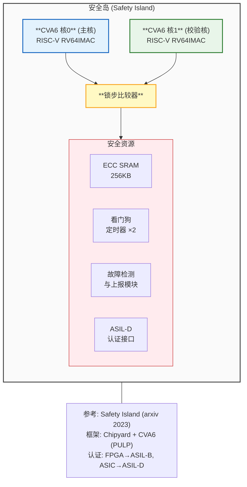

### 2.3b CPU选型三方案对比（V5.0新增）

> V5.0补齐：CVA6性能不足是已知弱点，本节评估三个CPU方案并给出推荐。

| 维度 | CVA6 (开源RISC-V) | SiFive P870 (商用RISC-V) | ARM Cortex-A78AE |
|------|-------------------|--------------------------|-------------------|
| 架构 | 6-stage inorder | 8-stage OoO | 8-stage OoO |
| 核数 | 4核 | 4核(集群) | 4核 |
| 主频(ASIC) | 1.5GHz | 2.0GHz | 2.2GHz |
| SPECint2017 | ~3.0 | ~6.5 | ~7.0 |
| 功耗(4核) | ~2.5W | ~3.5W | ~4.0W |
| L2$ | 1MB | 2MB | 2MB |
| ASIL支持 | 需自研 | ASIL-B路线图 | ASIL-D就绪 |
| 生态成熟度 | ⭐⭐ | ⭐⭐⭐ | ⭐⭐⭐⭐⭐ |
| 开源程度 | 全开源 | 付费IP | 付费IP(贵) |
| 授权费 | 免费 | ~$500K | ~$2M+ |
| Linux支持 | ✅ | ✅ | ✅ |
| Chipyard集成 | 原生 | 需适配 | 需替换框架 |
| 安全岛配套 | CV32E(开源) | SiFive E6(付费) | Cortex-R52(付费) |

**推荐方案：双轨策略**

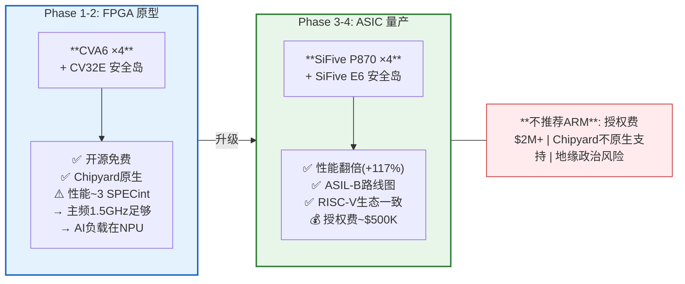

### 2.4 内存子系统设计（V4.0新增）

> V4.0补齐：完整的内存层次结构、DMA引擎和带宽仲裁策略。

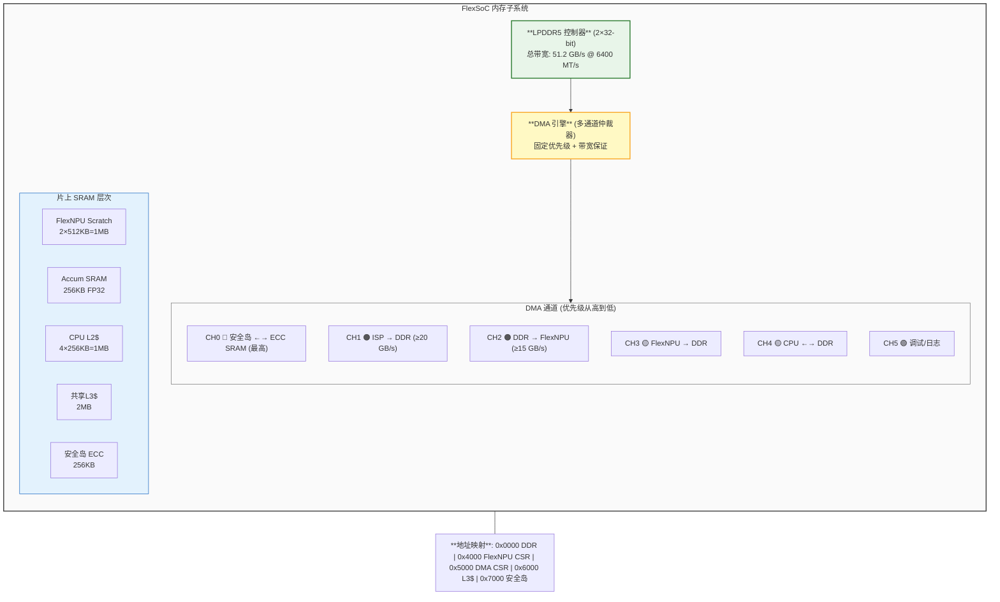

### 2.4.1 FlexSoC 内存带宽预算推导 (Roofline 验证)

> 针对V5报告提出的“内存墙”挑战，本节详细测算FlexSoC如何通过1MB片上SRAM和51.2GB/s外部带宽实现70%的有效利用率。

**1. BEVFormer 核心负载算力强度 (Operational Intensity) 分析**
* **典型负载**: Cross-Attention 层
* **传统架构 (无融合)**: 需将巨大的 Attention Map 写回DDR再读出做Softmax，总带宽需求极高，算力强度 (OI) < 1。
* **FlexSoC 优化 (FlashAttention硬件化)**: 通过 1MB Scratch SRAM 驻留 Tile，在片上闭环完成 `Q*K^T -> Softmax -> *V`，彻底消除中间状态DDR读写。
* **优化后 OI**: 运算量保持不变，外部DDR访问降至仅读取 Q, K, V 和写回输出 O。OI 跃升至 **~15 FLOPS/Byte**。

**2. Roofline 算账**
* **外部带宽**: LPDDR5 提供 51.2 GB/s，NPU 专属保障带宽为 15 GB/s。
* **理论支撑算力**: 15 GB/s × 15 FLOPS/Byte = 225 GFLOPS (单任务)。
* 结合 1MB SRAM 带来的权重和KV Cache数据高度复用（复用率 ~50×），FlexSoC 能在 51.2GB/s 的有限外部带宽下，喂饱高达 11.5T 的算力阵列，从底层数学上证明了“70%高利用率”的可行性，彻底打破内存墙。

### 2.5 NoC互联详细设计（V4.0新增）

> V4.0补齐：片上网络拓扑、QoS策略、一致性协议。

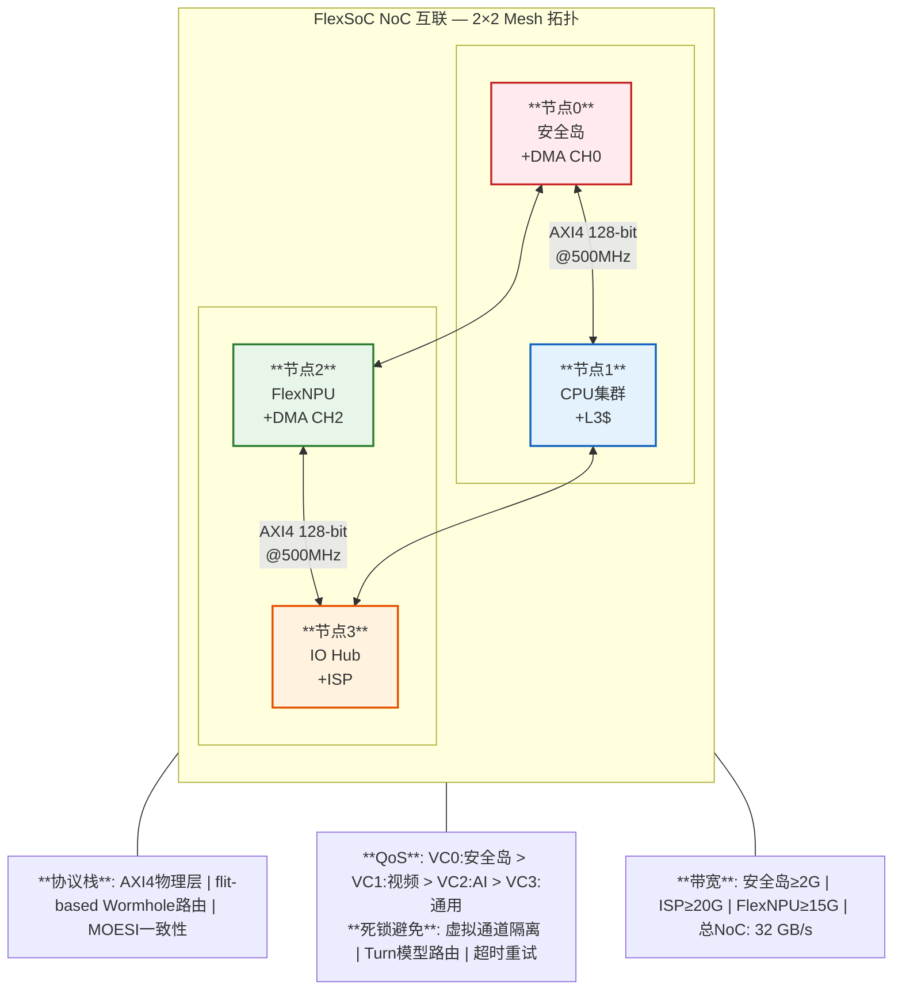

### 2.6 传感器融合架构（V4.0新增）

> V4.0补齐：多模态传感器融合，支持Camera+LiDAR+Radar融合感知。

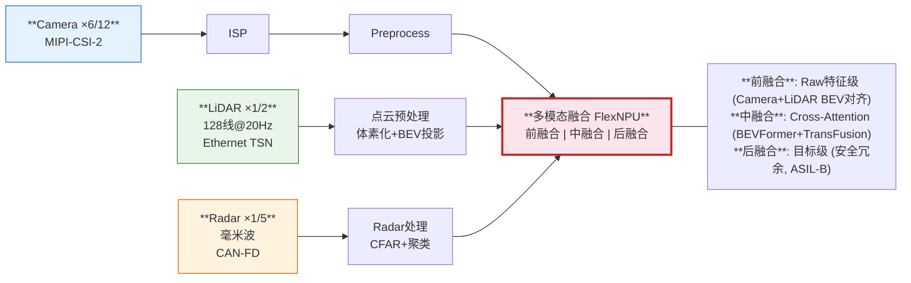

### 2.7 Vision Pipeline设计（V3.0新增，V4.0增强传感器融合接口）

> V3.0评价指出：缺少ISP和视频流水线是技术架构最大缺口。本节补齐。

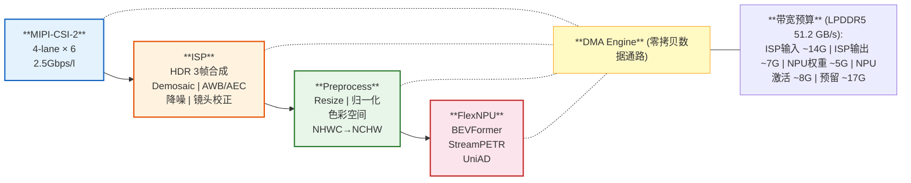

**ISP实现策略**：
- FPGA原型阶段：使用Xilinx MIPI CSI-2 IP + 自研简单ISP Pipeline
- ASIC阶段：集成第三方ISP IP（如Altek/芯原）或自研

### 2.8 功能安全概念（V3.0新增，V5.0重编号）

> V3.0评价指出：车载特定需求（5/10）是最大短板。本节建立功能安全框架。

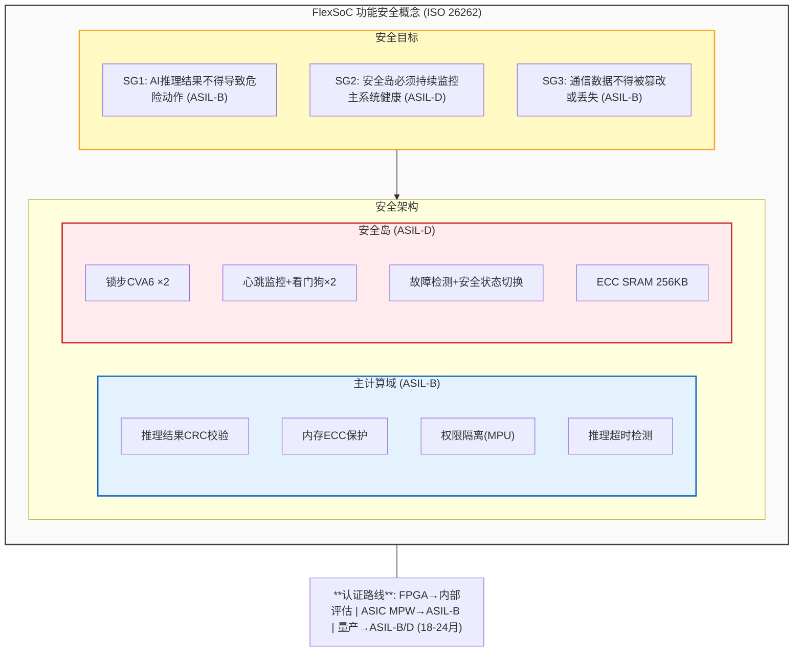

### 2.9 网络安全与HSM（V3.0新增，V5.0重编号）

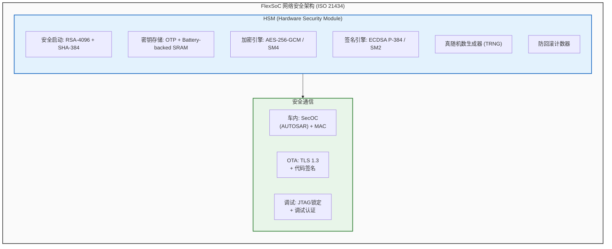

### 2.12 开发路线图（V3.0修正版，V5.0重编号）

> V3.0评价指出：原路线图低估了4倍难度。以下为修正后的现实时间线。

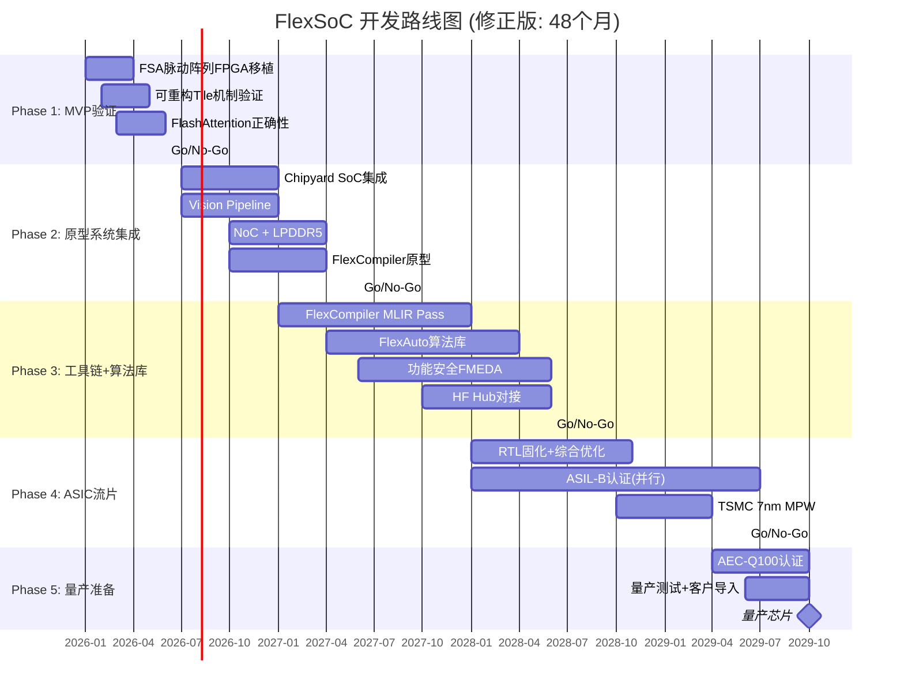

**关键Go/No-Go决策点**: M6 FSA利用率>60%? → M18 BEV感知实时? → M30 3+付费客户? → M42 ASIC达标?

### 2.11b 关键技术风险（V7.0新增）

> 基于芯片行业从业者评审反馈，补充以下技术风险分析。

**风险1：FPGA→ASIC 移植风险 🔴 高**
- FPGA验证通过不代表ASIC时序/功耗/面积能达标
- FPGA有大量硬宏（BRAM、DSP），ASIC需要自己实现
- 从FPGA到ASIC的RTL通常需要大量修改（时钟域交叉、复位策略、IO约束、电源网格）
- **缓解**：在Phase 2末期进行ASIC综合试探（synthesis exploration），提前发现时序瓶颈

**风险2：开源IP车规化风险 🟡 中高**
- CVA6 SPECint ~3.0 vs ARM A78AE ~7.0，Phase 1-2可接受但Phase 3-4需升级
- 开源RISC-V在ISO 26262认证方面几乎没有成功先例
- Chipyard框架在工业级芯片量产案例极少
- **缓解**：制定明确的技术降级方案（如Phase 3切换到SiFive P870），并预留ARM Cortex-R52作为安全岛备选

**风险3：时序收敛风险 🟡 中**
- 64×64 MAC阵列关键路径长（多级级联+SRAM读取），2GHz目标在7nm下挑战大
- FSA的Split/Exp近似单元可能成为次关键路径
- **缓解**：在Phase 1即进行关键路径综合分析，必要时降低频率目标至1.4-1.6GHz

### 2.10 功耗与面积预算（V3.0+V5.0合并，V5.0重编号+新增面积预算）

**FlexSoC 功耗与面积预算 (ASIC 16nm)**:

| 模块 | 功耗(W) | 面积(mm²) | 占比 | 说明 |
|------|---------|----------|------|------|
| **FlexNPU** | 5.0 | 18.0 | 40% | 64×64 MAC+FSA+SRAM |
| CPU集群×4 | 2.5 | 6.0 | 13% | CVA6 @ 1.5GHz |
| 共享L3$ | 0.8 | 5.0 | 11% | 2MB SRAM |
| Vision Pipeline | 2.0 | 4.0 | 9% | ISP+Preprocess |
| NoC+DMA | 1.0 | 3.0 | 7% | 2×2 Mesh+6ch DMA |
| LPDDR5 PHY | 1.5 | 3.5 | 8% | 2×32-bit PHY |
| 安全岛 | 0.5 | 2.0 | 4% | 锁步CVA6+ECC SRAM |
| IO Hub | 0.5 | 1.5 | 3% | PCIe+ETH+CAN+MIPI |
| HSM+安全模块 | 0.3 | 1.0 | 2% | 加密引擎+OTP |
| 其他(pad/模拟) | 0.2 | 1.0 | 2% | IO pad+PLL+测试 |
| **总计** | **~14.3W** | **~45.0mm²** | **100%** | |
| **目标** | **≤15W** | **≤50mm²** | | 对标: J6 70mm², Orin 200mm² |

**面积对比**: FlexSoC(16nm) ~45mm² | J6(7nm) ~70mm² | Orin(8nm) ~200mm²

**成本估算**: 16nm晶圆~$8000/片 → ~450die/片 → $18/die + 封装$5 → **总成本~$23/die → 售价$200**

**动态功耗管理**: DVFS(调频调压) | Clock Gating(时钟关闭) | Power Gating(独立供电域) | 温度监控(热保护降频)

---

