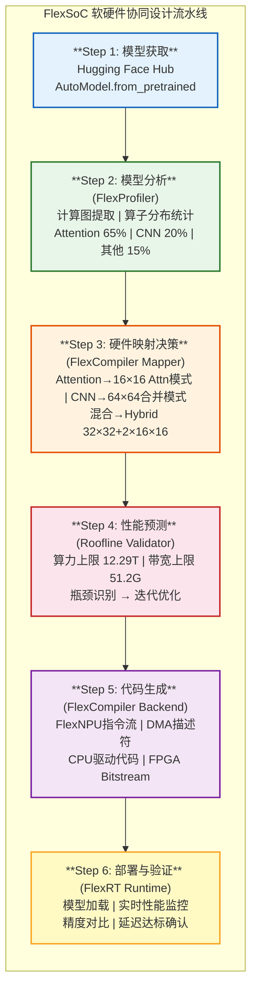
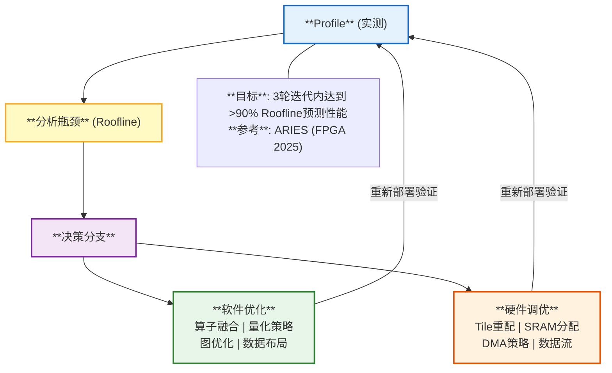

## 第二部分补充：软硬件协同设计方法论

### 2.11 端到端验证方案（V5.0新增）

> V5.0补齐：从RTL到Silicon的三阶段验证方法学。

**FlexSoC 三阶段验证方案**:

| Stage | 工具/平台 | 验证内容 | 通过标准 |
|-------|----------|---------|---------|
| **1. FPGA原型 (M1-M18)** | Xilinx Vitis + Chipyard | FlashAttention正确性, FlexNPU三种模式, DMA传输, 安全岛锁步, BEVFormer端到端 | MSE<1e-4 vs GPU, BEVFormer<200ms, 故障检测<10ms |
| **2. Cycle-Accurate仿真 (M7-M30)** | Verilator + FireSim (开源) | 全SoC功能仿真, 编译器指令流, 性能计数器, Fault Injection | ~10MHz仿真吞吐 |
| **3. ASIC Silicon (M42-M48)** | ATE测试机 + 实车EVB | 制程变异(SS/TT/FF), 功耗实测, 温度(-40~125°C), AEC-Q100, 实车道路测试 | 全部车规认证+客户验收 |

**FPGA资源估算** (基于FSA论文数据): LUT ~800K (70%) | BRAM ~1200 (60%) | DSP ~2000 (40%) | 200MHz

### 2.12 FSA FPGA验证分析（V5.0新增）

> V5.0补齐：基于FSA论文公开数据的FPGA资源估算。

**FSA RTL FPGA资源估算**:

FSA原版 (128×128 SA): 面积开销 +12% | 频率 1.5GHz @ 16nm | 新增: Split+CMP+UpPath

**FlexNPU (16×16 SA × 16 Tiles = 64×64) 资源估算**:

| 组件 | 数量 | FPGA资源 |
|------|------|---------|
| MAC阵列 | 64×64=4096 | 4096 DSP48 (U55C的31%) |
| Split单元 | 16个 (1/Tile) | ~200 LUT/个 |
| CMP row | 16行 | ~100 LUT/行 |
| UpPath | 16条 | ~50 LUT/条 |
| SRAM | 1.25MB | ~375 BRAM36 |
| DMA引擎+解码器 | — | ~2500 LUT + 50 BRAM |
| **FlexNPU核心总计** | | **~350K LUT \| ~400 BRAM \| ~4096 DSP** |

> ️ **风险**: DSP数量瓶颈(31.6%) | 64×64布线复杂→先用32×32验证 | 频率可能降至150MHz

### 2.13 从模型到硬件的完整映射流水线（V5.0重编号）

软硬件协同设计的核心是建立一条**从Hugging Face模型到FPGA Bitstream的自动化流水线**：



### 2.14 性能建模方法论（V5.0重编号）

**Roofline模型驱动的软硬件协同优化**：

```
算力利用率 (TFLOPS)
  ^
  |     算力屋顶 (Peak = 12.29 TFLOPS)
  |────────────────────────────────
  |              ╱
  |            ╱   ← 算力密集区
  |          ╱       (Attention, GEMM)
  |        ╱
  |      ╱  ← 屋脊线 (Arithmetic Intensity转折点)
  |    ╱
  |  ╱         ← 内存密集区
  |╱             (BEV Pool, LayerNorm, Embedding)
  └─────────────────────────────────→
          算术强度 (FLOPs/Byte)

关键观察:
1. FlashAttention (FSA): 算术强度 ~200 FLOPs/Byte → 算力密集 → FlexNPU高效处理
2. BEV Pooling: 算术强度 ~5 FLOPs/Byte → 内存密集 → 需要DMA预取+双缓冲优化
3. Conv2D (Backbone): 算术强度 ~50 FLOPs/Byte → 中间地带 → INT8量化提升效率
```

### 2.15 软硬件协同优化循环（V5.0重编号）



### 2.16 开发者工作流：从Hugging Face到FlexNPU（V5.0重编号）

```python
# 目标开发者体验 (Developer Experience)
# 类似 huggingface/optimum 的使用方式

from flex_auto import FlexModel, FlexConfig

# Step 1: 从Hugging Face Hub下载模型
model = FlexModel.from_pretrained("OpenGVLab/UniAD")

# Step 2: 自动分析+编译（FlexCompiler在后台运行）
config = FlexConfig(
    target="flexsoc_fpga",          # 目标平台
    precision="mixed_fp16_int8",    # 混合精度
    latency_budget_ms=100,          # 延迟预算 100ms
    safety_level="ASIL-B"           # 安全等级
)

compiled_model = model.compile(config)
# 内部流程: HF Model → torch.fx → FlexCompiler → FlexNPU指令

# Step 3: 部署到FPGA/ASIC
runtime = compiled_model.deploy(device="/dev/flexnpu0")

# Step 4: 推理
import numpy as np
images = np.load("camera_inputs.npy")  # 6路摄像头输入
result = runtime.inference({"pixel_values": images})
# result: {boxes, scores, bev_features, trajectories}
```

**对标参考**：
- `optimum-intel` (Intel OpenVINO) — 类似的HF Hub → 边缘部署流水线
- `optimum-nvidia` (TensorRT-LLM) — NVIDIA的HF对接方案
- 我们的创新：**HF Hub → 开源RISC-V NPU**，业界首创

---

