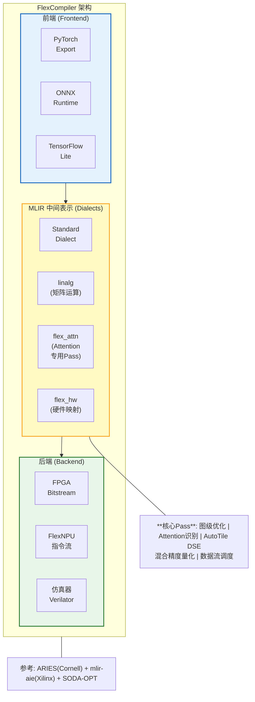
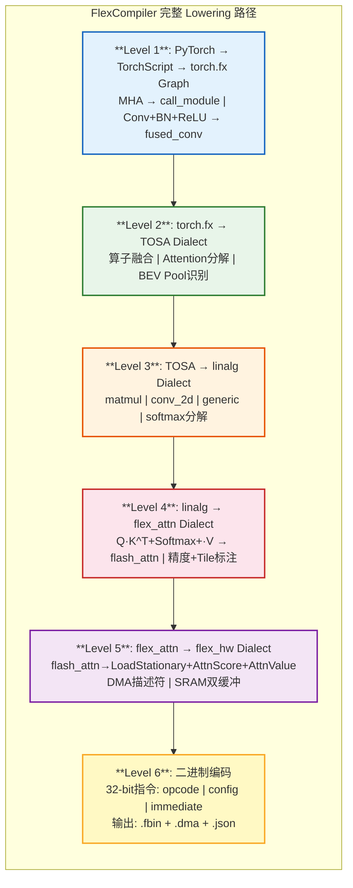
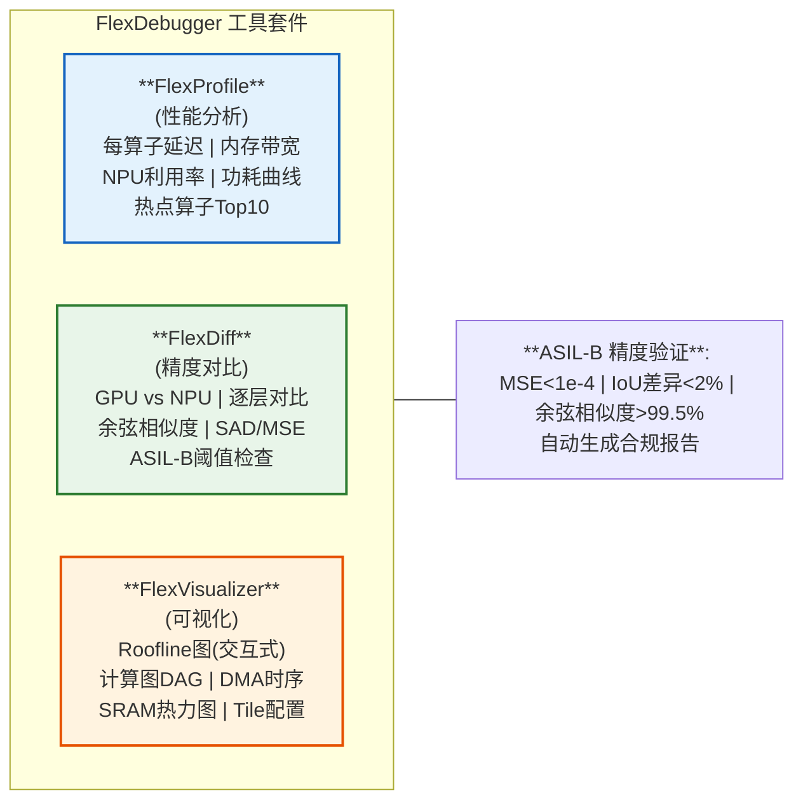

## 第三部分：FlexCompiler工具链设计

### 3.0 设计哲学

> "工具链不是附属品，是核心竞争力。NVIDIA的护城河不是GPU硬件，而是CUDA。"

### 3.1 编译器架构



### 3.2 核心创新：flex_attn Dialect

```mlir
// 示例：BEVFormer的Cross-Attention在flex_attn中的表示
flex_attn.flash_attention {
  %Q = flex_attn.load_query : tensor<256x128xf16>    // BEV特征Query
  %K = flex_attn.load_key : tensor<1000x128xf16>     // 图像特征Key
  %V = flex_attn.load_value : tensor<1000x128xf16>   // 图像特征Value
  
  // 编译器自动配置:
  // - Tile大小: 16×16 (适配短序列)
  // - 精度: FP16 (激活) + FP32 (累加)
  // - 模式: Attention (独立16×16 FSA)
  %O = flex_attn.compute %Q, %K, %V {
    tile_size = 16,
    precision = "fp16_fp32",
    mode = "attention"
  } : tensor<256x128xf16>
  
  flex_attn.store_output %O : memref<256x128xf16>
}
```

### 3.3 AutoTile设计空间探索

```
输入: 模型计算图 + FlexNPU硬件约束
输出: 最优Tile配置 + 精度方案 + 数据流调度

搜索空间:
  ├── Tile大小: {16, 32, 64}
  ├── 精度组合: {INT4, INT8, FP16} × {INT8, FP16, FP32}
  ├── 模式: {CNN合并, Attention独立, Hybrid}
  └── SRAM分配: {双缓冲, 三缓冲}

优化目标:
  ├── 延迟 (Latency) —— 实时性要求
  ├── 吞吐 (Throughput) —— 批处理效率
  └── 精度 (Accuracy) —— 安全性约束

搜索算法: 遗传算法 + Roofline模型评估
  → 参考AutoTrans (ACM 2024) 的设计空间探索方法
```

### 3.4 编译器完整Lowering路径（V4.0新增）

> V4.0补齐：从PyTorch模型到FlexNPU硬件指令的完整编译路径。



### 3.5 FlexDebugger工具设计（V4.0新增）

> V4.0补齐：车载芯片开发必备的调试、性能分析和精度对比工具。



### 3.6 MLIR Dialect 定义（TableGen）

> FlexCompiler 基于 MLIR 框架，使用 TableGen 定义自定义 Dialect。以下是 `flex_hw` Dialect 的核心算子定义：

```tablegen
// ===== flex_hw Dialect 算子定义 =====
// 文件: include/flex_compiler/Dialect/FlexHW/FlexHWOps.td

// ---- 基础定义 ----
def FlexHW_Dialect : Dialect {
  let name = "flex_hw";
  let summary = "FlexNPU hardware mapping dialect";
  let cppNamespace = "flex_compiler::flex_hw";
}

// ---- MatMul 算子 ----
def FlexHW_MatMulOp : FlexHW_Op<"matmul"> {
  let arguments = (ins
    Variadic<Value>:$inputs,       // A, B 矩阵
    I64Attr:$M,                     // 行数
    I64Attr:$N,                     // 列数
    I64Attr:$K,                     // 内积维度
    I64Attr:$tile_m,                // Tile M 大小 (16/32/64)
    I64Attr:$tile_n,                // Tile N 大小
    I64Attr:$tile_k,                // Tile K 大小
    StrAttr:$precision,             // "int8" | "fp16" | "mixed"
    StrAttr:$dataflow               // "ws" | "rs" | "os"
  );
  let results = (outs Variadic<Value>:$outputs);
}

// ---- FlashAttention 算子 ----
def FlexHW_FlashAttnOp : FlexHW_Op<"flash_attn"> {
  let arguments = (ins
    Variadic<Value>:$inputs,       // Q, K, V
    I64Attr:$seq_len,
    I64Attr:$head_dim,
    I64Attr:$num_heads,
    I64Attr:$block_m,              // 分块M (默认16)
    I64Attr:$block_n,              // 分块N (默认64)
    BoolAttr:$causal               // 是否 causal mask
  );
  let results = (outs Variadic<Value>:$outputs);
}

// ---- DMA 传输 ----
def FlexHW_DMAOp : FlexHW_Op<"dma_transfer"> {
  let arguments = (ins
    Value:$src,                     // 源地址 (DDR)
    Value:$dst,                     // 目的地址 (SRAM)
    I64Attr:$size,                  // 传输大小
    I64Attr:$stride,                // 行间距
    I64Attr:$rows,                  // 行数
    StrAttr:$direction              // "ddr_to_sram" | "sram_to_ddr"
  );
}

// ---- 同步屏障 ----
def FlexHW_SyncBarrierOp : FlexHW_Op<"sync_barrier"> {
  let arguments = (ins
    StrAttr:$sync_type              // "tile" | "core" | "soc"
  );
}
```

### 3.7 Tiling Pass 核心算法

> Tiling 是 NPU 编译器最关键的 Pass，决定了 MAC 利用率和带宽效率。

```python
# ===== AutoTile DSE 算法伪代码 =====
# 文件: lib/flex_compiler/Transforms/AutoTile.cpp

def auto_tile_dse(graph, hw_config):
    """
    基于遗传算法的设计空间探索 (DSE)
    优化目标: 最小化执行延迟
    约束: SRAM容量、MAC利用率 >= 50%
    """
    # 硬件约束
    SRAM_SIZE = hw_config.sram_size     # 例: 1MB
    ARRAY_SIZE = hw_config.array_size   # 例: 64x64
    MAC_PER_CYCLE = ARRAY_SIZE ** 2     # 例: 4096

    # 搜索空间
    tile_candidates = [16, 32, 64]
    precision_opts = ["int8", "fp16", "mixed"]

    best_config = None
    best_latency = float('inf')

    # 对每个 GEMM/Conv 算子独立优化
    for op in graph.get_compute_ops():
        M, N, K = op.get_dims()

        for Tm in tile_candidates:
            for Tn in tile_candidates:
                for Tk in tile_candidates:
                    # 约束1: Tile 适配阵列
                    if Tm > ARRAY_SIZE or Tn > ARRAY_SIZE:
                        continue

                    # 约束2: SRAM 容量
                    sram_needed = (Tm * Tk + Tk * Tn + Tm * Tn) * 2  # 双缓冲
                    if sram_needed > SRAM_SIZE:
                        continue

                    # 计算算术强度 (Arithmetic Intensity)
                    ops = 2 * Tm * Tn * Tk             # 每Tile MAC数
                    bytes_accessed = (Tm*Tk + Tk*Tn + Tm*Tn) * 2  # 字节数
                    ai = ops / bytes_accessed            # ops/byte

                    # Roofline 延迟估算
                    compute_time = (M * N * K) / (MAC_PER_CYCLE * freq)
                    bandwidth = hw_config.dram_bw       # 例: 25.6 GB/s
                    memory_time = (M*N*K*2 + M*N*2) / (bandwidth * max(1, ai/100))

                    # 取最大值 (compute-bound 或 memory-bound)
                    tile_latency = max(compute_time, memory_time)

                    # MAC利用率
                    mac_util = min(Tm, M) * min(Tn, N) / (ARRAY_SIZE ** 2)

                    if tile_latency < best_latency and mac_util >= 0.5:
                        best_latency = tile_latency
                        best_config = {
                            'op': op, 'Tm': Tm, 'Tn': Tn, 'Tk': Tk,
                            'mac_util': mac_util, 'latency': tile_latency
                        }

    return best_config
```

**Tiling 决策示例**（ResNet-50 Conv 层）：

| 层 | 维度 (M×N×K) | Tile (Tm×Tn×Tk) | MAC利用率 | 算术强度 | 瓶颈 |
|----|-------------|----------------|---------|---------|------|
| Conv1 (7×7) | 3136×64×147 | 32×64×32 | 50% | 16.5 | Compute |
| Conv3_1 (3×3) | 784×128×576 | 64×64×16 | 100% | 42.7 | Compute |
| Conv4_1 (3×3) | 196×256×1152 | 32×64×32 | 50% | 85.3 | Memory |
| Conv5_1 (3×3) | 49×512·2304 | 16×32·64 | 12.5% | 170.7 | Memory |

### 3.8 代码生成：从 MLIR 到 FlexNPU 指令流

```python
# ===== FlexNPU 指令编码格式 =====
# 32-bit 指令格式:
# [31:28] opcode  [27:20] config  [19:0] immediate

OPCODES = {
    'NOP':        0x0,
    'MATMUL':     0x1,  # 矩阵乘法
    'LOAD_TILE':  0x2,  # 加载权重Tile到SRAM
    'STORE_TILE': 0x3,  # 从SRAM写出结果
    'DMA_START':  0x4,  # 启动DMA传输
    'DMA_WAIT':   0x5,  # 等待DMA完成
    'SYNC':       0x6,  # 同步屏障
    'FLASH_ATTN': 0x7,  # FlashAttention (FSA模式)
    'SET_PREC':   0x8,  # 设置精度
    'SET_MODE':   0x9,  # 设置数据流模式
}

def generate_matmul_inst(Tm, Tn, Tk, precision, dataflow):
    """生成单个MatMul Tile的指令序列"""
    insts = []

    # 1. 设置精度和数据流
    prec_code = {'int8': 0, 'fp16': 1, 'mixed': 2}[precision]
    df_code = {'ws': 0, 'rs': 1, 'os': 2}[dataflow]
    insts.append((OPCODES['SET_PREC'], prec_code, 0))
    insts.append((OPCODES['SET_MODE'], df_code, 0))

    # 2. DMA: 加载 A Tile (DDR -> SRAM)
    insts.append((OPCODES['DMA_START'], 0x01, Tm * Tk * 2))  # size
    insts.append((OPCODES['DMA_WAIT'],  0x00, 0))

    # 3. DMA: 加载 B Tile (DDR -> SRAM)
    insts.append((OPCODES['DMA_START'], 0x02, Tk * Tn * 2))  # size
    insts.append((OPCODES['DMA_WAIT'],  0x00, 0))

    # 4. 执行 MatMul
    config = (Tm // 16 - 1) << 4 | (Tn // 16 - 1)  # tile编码
    insts.append((OPCODES['MATMUL'], config, Tk))

    # 5. DMA: 写出 C Tile (SRAM -> DDR)
    insts.append((OPCODES['DMA_START'], 0x03, Tm * Tn * 4))  # FP32 累加
    insts.append((OPCODES['DMA_WAIT'],  0x00, 0))

    return insts
```

**一个 MatMul 的完整旅程**（64×64 × 64×64, INT8, WS 数据流）：

```
Step 1: PyTorch 模型
    output = torch.matmul(A, B)  # A: [64,64], B: [64,64]

Step 2: torch.fx Graph
    %1 = call_function[torch.matmul](%A, %B)

Step 3: TOSA Dialect
    %1 = tosa.matmul(%A, %B) : tensor<64x64xi8>, tensor<64x64xi8> -> tensor<64x64xi32>

Step 4: linalg Dialect
    %1 = linalg.matmul ins(%A, %B: tensor<64x64xi8>, tensor<64x64xi8>)
                        outs(%C: tensor<64x64xi32>)

Step 5: flex_hw Dialect (AutoTile 后)
    %dma0 = flex_hw.dma_transfer %A_sram, %A_ddr {size=1024, dir="ddr_to_sram"}
    %dma1 = flex_hw.dma_transfer %B_sram, %B_ddr {size=1024, dir="ddr_to_sram"}
    %result = flex_hw.matmul {M=64, N=64, K=64, tile_m=32, tile_n=32, tile_k=32,
                              precision="int8", dataflow="ws"}
    %dma2 = flex_hw.dma_transfer %C_ddr, %C_sram {size=4096, dir="sram_to_ddr"}

Step 6: 二进制指令流 (.fbin)
    [0x80 0x00 0x00 0x00]  SET_PREC int8
    [0x90 0x00 0x00 0x00]  SET_MODE ws
    [0x40 0x01 0x04 0x00]  DMA_START src=DDR, size=1024B
    [0x50 0x00 0x00 0x00]  DMA_WAIT
    [0x40 0x02 0x04 0x00]  DMA_START src=DDR, size=1024B
    [0x50 0x00 0x00 0x00]  DMA_WAIT
    [0x10 0x11 0x20 0x00]  MATMUL tile=32x32, K=32
    [0x10 0x11 0x20 0x00]  MATMUL tile=32x32, K=32  (循环4次: 2x2 tiles)
    [0x40 0x03 0x10 0x00]  DMA_START dst=DDR, size=4096B
    [0x50 0x00 0x00 0x00]  DMA_WAIT
```

<div class="callout callout-insight">

**端到端可见性**：FlexCompiler 的 6 级 Lowering 路径让每一步都可追溯——开发者可以在任何层级插入断点、检查中间表示、对比精度，这对于车载场景的 ASIL-B 合规验证至关重要。

</div>

> **参考文献**:
> - [MLIR] Lattner, C., et al. "MLIR: Scaling Compiler Infrastructure for Domain Specific Computation." CGO 2021.
> - [ARIES] Hong, C., et al. "ARIES: A Chiplet-Aware Compiler Framework for DNN Accelerators." Cornell Tech, 2024.
> - [AutoTrans] Li, Z., et al. "AutoTrans: Optimizing Tensor Program for Distributed Inference." ACM 2024.

---

