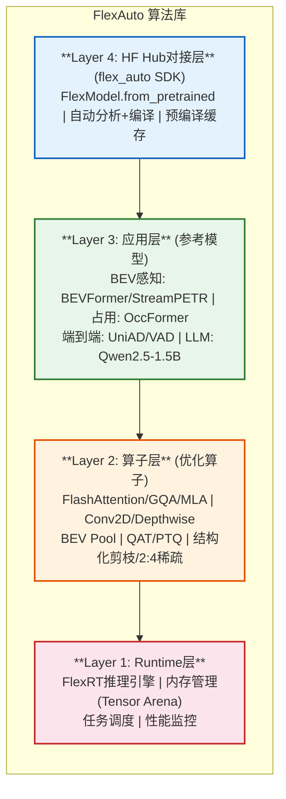
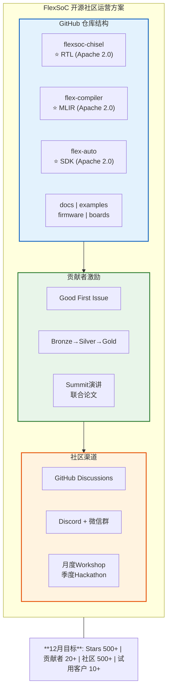
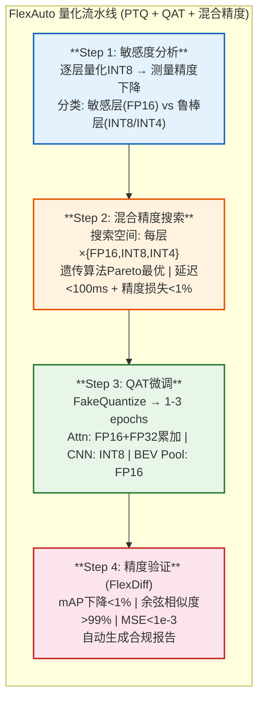
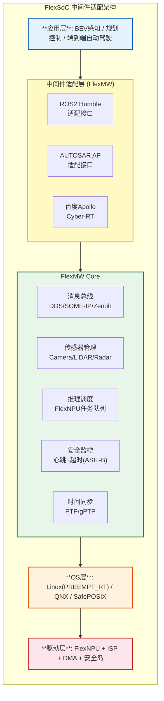
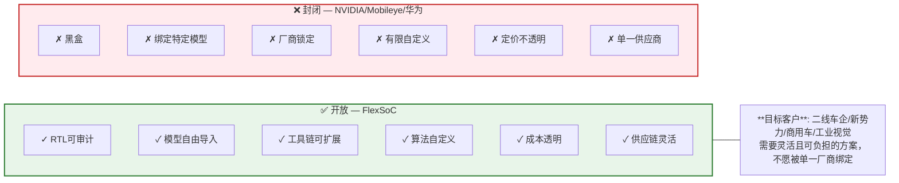

## 第四部分：算法库与生态策略

### 4.1 FlexAuto算法库架构

### 4.2 开源社区运营方案（V6.0新增）

> V6.0补齐：从代码开源到社区建设的完整运营策略。

### 4.3 开源生态策略（V4.0原有）

| 策略 | 具体措施 | 目标 |
|------|---------|------|
| **RTL开源** | Chisel HDL, Chipyard框架, 类Apache 2.0许可 | 学术界贡献, 信任建立 |
| **工具链开源** | MLIR Pass, Python API, 类FSA的JIT编译 | 降低开发门槛 |
| **算法库开源** | PyTorch集成, 预训练模型, 量化脚本 | 快速上手 |
| **参考设计** | FPGA评估套件, BEV感知Demo | 证明可行性 |
| **技术社区** | GitHub + Discord + 定期Workshop | 生态建设 |

### 4.3 QAT量化流水线（V5.0新增）

> V5.0补齐：车载AI芯片必须的量化精度保证机制。

### 4.4 中间件适配层（V4.0新增）

> V4.0补齐：车载软件栈的中间件/OS适配，是算法库到车端的桥梁。

### 4.5 差异化竞争：开放 vs 封闭

---

