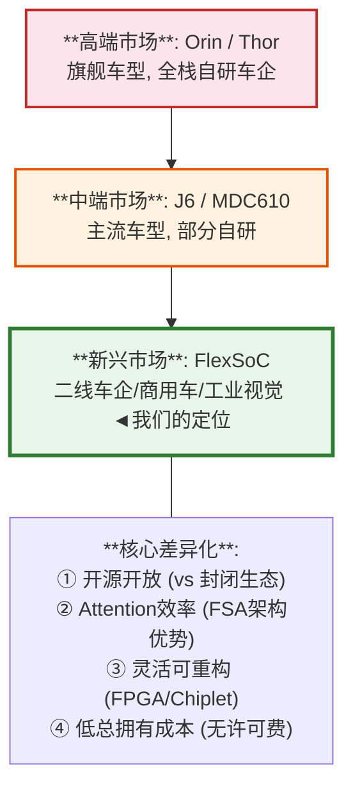

## 第五部分：竞品深度对标

### 5.1 技术维度对标

| 维度 | NVIDIA Orin | 地平线J6 | 华为MDC610 | **FlexSoC (FPGA)** | **FlexSoC (ASIC)** |
|------|------------|---------|-----------|-------------------|-------------------|
| AI算力(FP16) | 67 TFLOPS | 33 TFLOPS | 44 TFLOPS | 1.6 TFLOPS | 12 TFLOPS |
| Attention效率 | ~25% | ~35% | ~30% | **~70%** | **~70%** |
| 有效Attention | 16.7T | 11.5T | 13.2T | 1.1T | **8.6T** |
| 功耗 | 45W | 25W | 35W | 30W(FPGA) | 15W(ASIC) |
| 安全等级 | ASIL-B | ASIL-B | ASIL-B | ASIL-B | ASIL-D |
| 工具链 | CUDA(成熟) | 天工(一般) | MindSpore(封闭) | **FlexCompiler(开源)** | 同左 |
| 开源程度 | 闭源 | 闭源 | 闭源 | **全开源** | **全开源** |
| 单价 | $1500 | $300 | $800 | $500(FPGA) | $200(ASIC) |
| 量产状态 | 量产 | 量产 | 量产 | **原型阶段** | **规划中** |

### 5.3 7nm方案与J6公平对比（V6.0新增）

> V6.0补齐：与地平线J6(7nm)的公平工艺对比。

| 维度 | FlexSoC 7nm | 地平线J6 (7nm) | 优势 |
|------|------------|---------------|------|
| 面积 | ~20mm² | ~70mm² | **3.5×更小** |
| 功耗 | ~10W | ~25W | **2.5×更低** |
| AI算力(FP16) | 16.4 TFLOPS | 33 TFLOPS | 0.5×(但效率高) |
| 有效Attn算力 | 11.5 TFLOPS | ~11.5 TFLOPS | **持平** |
| Attn利用率 | **~70%** | ~35% | **2×更高** |
| BEVFormer延迟 | ~51ms | ~100ms | **2×更快** |
| TOPS/W | 1.64 | 1.32 | 1.24×更高 |
| TOPS/mm² | 0.82 | 0.47 | 1.74×更高 |
| 工具链 | 开源MLIR | 天工(封闭) | **开放** |
| 单价(预估) | ~$150 | ~$300 | **半价** |

**7nm面积/功耗缩放(从16nm)**:
- 面积: 45mm² × 0.44 ≈ 20mm² (7nm逻辑密度2.3×)
- 功耗: 14.3W × 0.7 ≈ 10W (电压降低+面积减小)
- 频率: 1.5GHz → 2.0GHz (+33%)
- 成本: 晶圆$18000/片, 每片~1600die, ~$11/die + 封装$5 → 总成本~$16/die → 售价$150(9.4×加价率)

> **结论**: 7nm性价比最优，与J6同工艺下全面领先。面积效率高因为：FSA融合减少外部缓冲、无GPU省面积、可重构Tile共享MAC阵列、紧凑RISC-V CPU。

### 5.4 差异化定位

---

