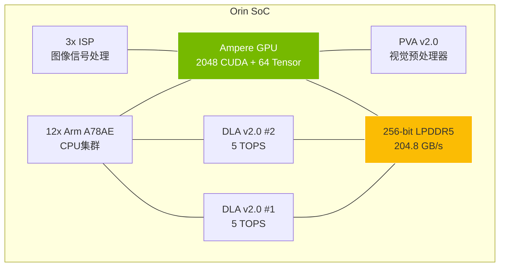
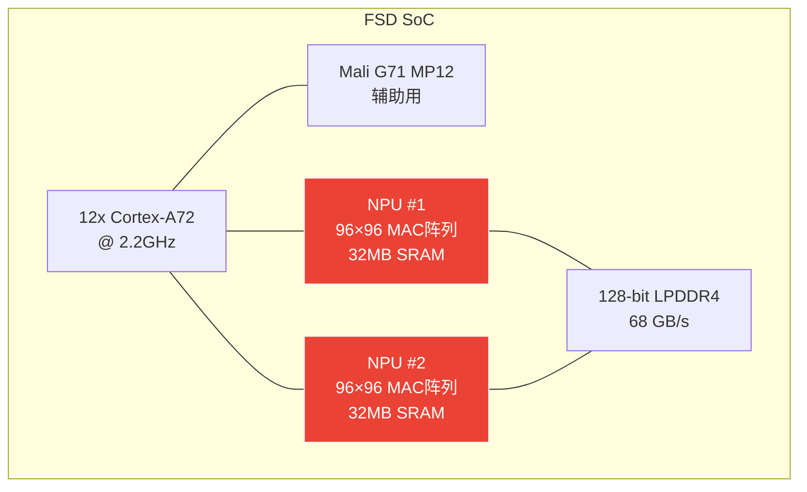
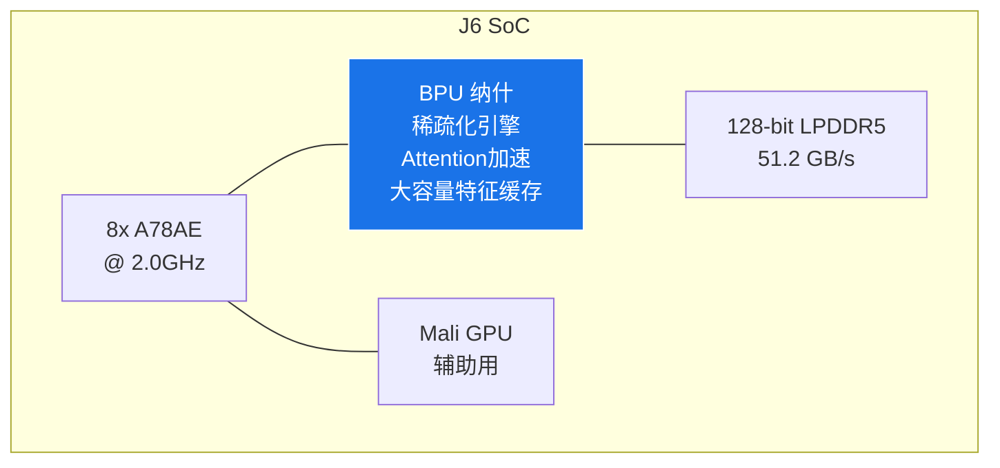
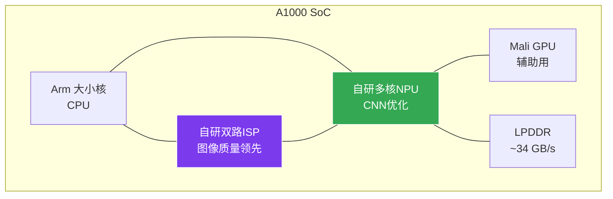
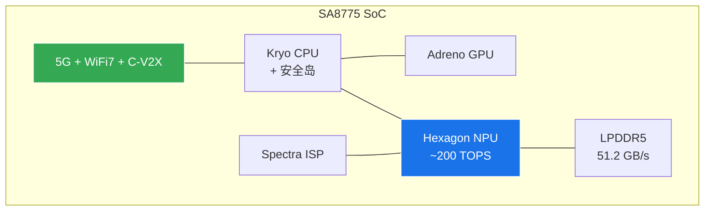

# 第4章：智驾芯片架构深度剖析

> ️ 本章对 7 大主流智驾芯片进行架构级深度剖析，覆盖 CPU/GPU/NPU/内存/制程等核心维度。

---

## 4.1 NVIDIA Orin / Thor — GPU 中心架构 🟢

### Orin SoC 架构

| 参数 | 规格 | 置信度 |
|------|------|--------|
| CPU | 12x Arm A78AE | 🟢 官方 |
| GPU | Ampere 2048 CUDA + 64 Tensor Cores | 🟢 官方 |
| DLA | 2x DLA v2.0 (各5 TOPS) + PVA v2 | 🟢 官方 |
| ISP | 3x ISP | 🟢 官方 |
| 内存 | 256-bit LPDDR5 @ 204.8 GB/s | 🟢 官方 |
| Orin X 算力 | **254 TOPS(稀疏) / ~127 TOPS(稠密)** = GPU~131T + 2×DLA×5T + PVA~7T + ... | 🟢 官方 |
| 功耗 | 60-75W | 🟢 官方 |
| 制程 | Samsung 8nm | 🟢 官方 |

**架构特点**：NVIDIA 采用 GPU 中心架构，通过 CUDA 生态构建强大软件壁垒。Orin 的 GPU 可编程性极强，但功耗偏高（60-75W），不适合对功耗敏感的场景。

### Thor SoC — 下一代

| 参数 | 规格 | 置信度 |
|------|------|--------|
| AI 算力 | 1000+ INT8 TOPS / 2000 FP4 FLOPS | 🟢 官方 |
| CPU | Grace (Neoverse V2) 16核 | 🟢 官方 |
| 互联 | NVLink C2C | 🟢 官方 |
| 制程 | TSMC 4nm | 🟢 官方 |
| 架构 | Blackwell，支持VLA模型 | 🟢 官方 |

**️ Thor 延迟风险**：Thor 原计划 2024 年量产，已多次推迟。2025 年推出 Thor X（2000T），但客户适配周期长，短期内对市场影响有限。

**⚠️ FP4 算力口径说明**：Thor X 的 "2000 TOPS" 基于 FP4 精度。FP4 仅有 16 个可表示值，动态范围极窄，在车载安全场景中的实际适用性存疑：
- **精度风险**：FP4 量化对 BEV 感知模型的 mAP 损失尚无公开评估数据
- **校准难度**：FP4 → 有效推理需大量校准数据，车载部署周期可能远超 INT8
- **建议**：评估 Thor X 时，建议以 **INT8 稠密算力 ~1000T** 为参考基准，2000T(FP4) 作为理论峰值参考

---

## 4.2 Tesla FSD — 自研 NPU 中心架构 🟢

### Tesla FSD HW3 架构

| 参数 | HW3 规格 | HW4/HW5 规格 |
|------|---------|--------------|
| CPU | 12x A72 @ 2.2GHz | 升级 |
| NPU | 2x NPU, 96×96 MAC, 32MB SRAM/NPU | 大幅升级 |
| 单NPU算力 | 36.86 TOPS(INT8) | 估算 2-3x |
| 单SoC算力 | **73.72 TOPS** (2×NPU) | 估算 ~300-500 TOPS |
| 板卡总算力 | **~144 TOPS** (2×SoC) | HW4/HW5板卡 |
| 内存 | 128-bit LPDDR4 @ 68 GB/s | 升级带宽 |
| 制程 | Samsung 14nm | 三星7nm+ |
| HW5/AI5 | — | TSMC 3nm, 5-10x HW4, 2026量产 |

**Tesla 的 NPU 中心设计哲学**：Tesla 放弃通用 GPU，专注于自研 NPU，以最低成本实现最高推理效率。双 SoC 冗余设计体现了功能安全理念。HW5 预计算力跃升 5-10 倍，将再次定义行业标杆。

---

## 4.3 地平线 J6 — BPU 专用架构 🟢

### BPU "纳什" 架构

### J6 产品矩阵

| SKU | 稠密算力 | 功耗 | TOPS/W | 目标场景 | 竞争对手 |
|-----|---------|------|--------|---------|---------|
| **J6E** | 128 TOPS | ~15W | 8.5 | L2+ 高速NOA | Orin N |
| **J6M** | 256 TOPS | ~25W | 10.2 | L2+ 城市NOA | Orin X |
| **J6P** | **560 TOPS** | ~35W | **16.0** | L3 全域 | Thor |

**地平线的核心优势**：
- **算法定义硬件**：与理想、大众等深度合作，芯片设计直接针对实际算法需求
- **极致能效**：J6P 达到 16 TOPS/W，远超 Orin 的 1.7 TOPS/W
- **本土生态**：47.66% 中国 ADAS 市占率，客户基础雄厚
- **J7 路线图**：2027 年对标 Thor-X，持续迭代

---

## 4.4 黑芝麻 A1000 — 感知融合架构 🟢 

### A1000 系列架构

### A1000 产品矩阵

| SKU | 算力 | 功耗 | TOPS/W | 目标 | 定位 |
|-----|------|------|--------|------|------|
| A1000L | 106 TOPS | 5-8W | 13-20 | L1/L2 | 入门级 |
| A1000 | 58 TOPS | 5-10W | 6-10 | L2 | 主力级 |
| A1000 Pro | 196 TOPS | 15-20W | 10-13 | L2+ | 旗舰级 |

**平台优势**：
- ✅ ISP 图像质量领先
- ✅ 低功耗低成本
- ✅ 本土供应链

**平台瓶颈**：
- 算力上限低（196T Pro）
- 带宽~34GB/s 是瓶颈
- 下一代 A2000 同为 7nm 优化版，制程无代际优势

---

## 4.5 高通 SA8775 — 通信融合架构 🟢

| 参数 | 规格 | 置信度 |
|------|------|--------|
| CPU | Kryo + 安全岛 | 🟢 官方 |
| NPU | Hexagon ~200 TOPS | 🟡 多方印证 |
| ISP | Spectra ISP | 🟢 官方 |
| 通信 | 5G + WiFi7 + C-V2X | 🟢 官方 |
| 制程 | TSMC 5nm | 🟢 官方 |
| 内存 | LPDDR5 @ 51.2 GB/s | 🟢 官方 |

**高通的差异化**：SA8775 将 5G 基带集成在 SoC 中，是唯一提供完整通信方案的智驾芯片。适合需要车路协同（V2X）的场景。但 AI 算力（~200T）在 2026 年已不占优势。

---

## 4.6 华为 MDC — 全栈国产架构 🟢

| 参数 | 规格 | 置信度 |
|------|------|--------|
| AI Core | Da Vinci: 16×16×16 Cube (4096 MAC) + Vector + Scalar | 🟢 官方 |
| 算力 | ~200 TOPS | 🟡 多方印证 |
| 制程 | 7nm | 🟢 官方 |
| 带宽 | 68-307 GB/s | 🟡 多方印证 |

**️ 华为的挑战**：受美国制裁影响，先进制程受限，但凭借全栈能力（芯片+算法+云+车）构建了独特的封闭生态。MDC 主要服务华为系车企（问界、智界、享界）。

---

## 4.7 Mobileye EyeQ6 Ultra — 视觉优先架构 🟢

| 参数 | 规格 | 置信度 |
|------|------|--------|
| 算力 | 176 TOPS (INT8) | 🟢 官方 |
| 安全 | ASIL-D | 🟢 官方 |
| 引擎 | CV Engine + NPU双引擎 + REM地图引擎 | 🟢 官方 |

**️ Mobileye 的困境**：黑盒模式（EyeQ + REM）在 2025-2026 面临严重挑战。车企越来越需要自主掌控算法，Mobileye 的封闭模式与行业趋势相悖。预计份额从 8% 下降到 4%。

---

## 4.8 七大架构对比总览

| 芯片 | 架构理念 | 算力(稠密) | 算力(稀疏) | 功耗 | TOPS/W(D) | 制程 | 核心优势 | 核心劣势 |
|------|---------|-----------|-----------|------|-----------|------|---------|---------|
| **Orin X** | GPU中心 | ~127T | 254T | 60-75W | ~1.9 | 8nm | 生态完整 | 功耗高 |
| **Thor X** | GPU中心 | ~1000T(估) | 2000T(FP4) | ~100W | ~10(估) | 4nm | 算力最强 | 延迟/功耗 |
| **FSD HW3** | NPU中心 | ~144T(板卡) | — | ~36W(板卡) | ~4.0 | 14nm | 自研高效 | 仅自用 |
| **J6P** | BPU专用 | 560T | — | ~35W | **16.0** | 7nm | 能效最高 | 生态较窄 |
| **A1000 Pro** | 感知融合 | 196T | — | 15-20W | 10-13 | 7nm | ISP领先 | 算力上限低 |
| **SA8775** | 通信融合 | ~200T | — | — | — | 5nm | 5G+V2X | AI算力弱 |
| **EyeQ6U** | 视觉优先 | 176T | — | — | — | — | 成熟安全 | 黑盒模式 |

> 📌 TOPS/W(D) 列统一使用稠密TOPS口径，消除稀疏/稠密混合对比问题。Thor X FP4 2000T 为极低精度理论峰值，以 ~1000T(INT8稠密) 作为参考基准。Tesla HW3 板卡含2颗SoC，单SoC约73.72T。

---

## Roofline 性能模型对比

>  Roofline 模型展示了各芯片在不同计算强度下的实际性能上限。内存带宽（而非峰值算力）往往是 Transformer 推理的真正瓶颈。

---