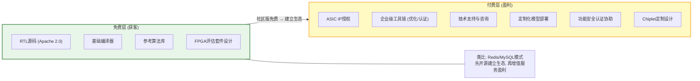
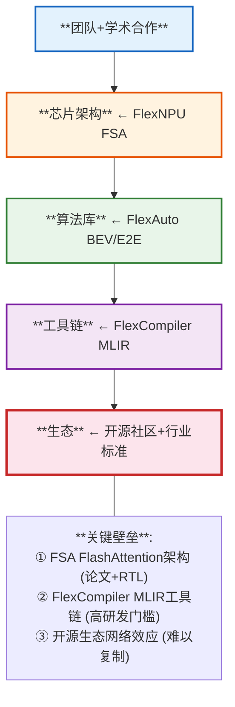
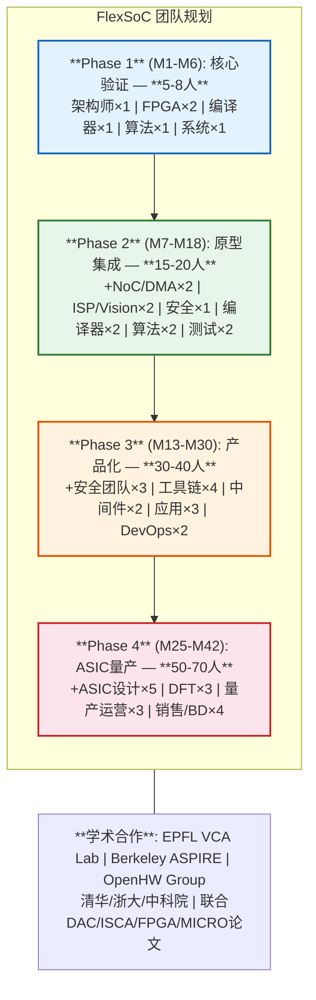
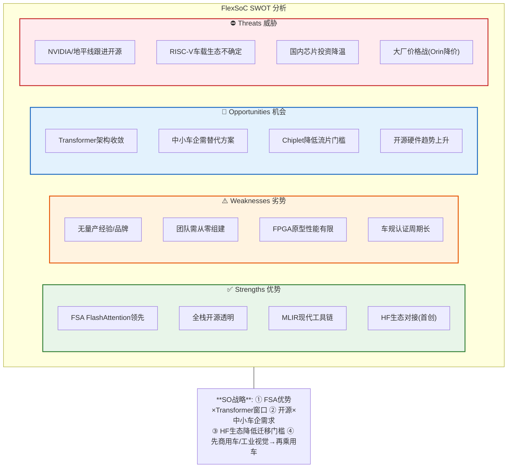
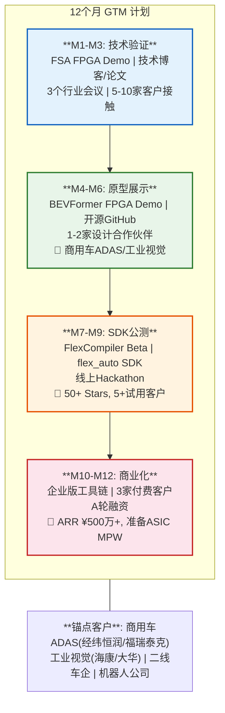

## 第六部分：商业计划与市场竞争力

### 6.1 商业模式：开源硬件 + 增值服务

### 6.2 收入预测（5年）

| 年份 | 阶段 | 收入来源 | 预计收入 |
|------|------|---------|---------|
| Y1 | 原型 | FPGA评估套件 + 咨询 | ¥500万 |
| Y2 | 验证 | IP授权(中小客户) + 工具链 | ¥2000万 |
| Y3 | 量产 | ASIC IP + 企业工具链 + 认证 | ¥8000万 |
| Y4 | 扩展 | 多客户IP + Chiplet + 海外 | ¥2亿 |
| Y5 | 成熟 | 生态平台 + 行业标准 | ¥5亿 |

### 6.3 核心竞争力总结

### 6.4 团队与组织规划（V4.0新增）

> V4.0补齐：各阶段团队规模、核心岗位需求和学术合作计划。

### 6.5 融资策略（V4.0新增）

> V4.0补齐：融资节奏、估值逻辑和里程碑绑定。

| 轮次 | 时间 | 金额 | 估值 | 里程碑 | 投资人画像 |
|------|------|------|------|--------|-----------|
| **种子轮** | Y1 Q1 | ¥2000万 | ¥1亿 | FSA FPGA验证 + Demo | 高校孵化基金/天使 |
| **Pre-A** | Y1 Q4 | ¥5000万 | ¥3亿 | Chipyard SoC原型运行BEVFormer | 芯片产业基金 |
| **A轮** | Y2 Q3 | ¥2亿 | ¥10亿 | 完整SDK + 3家付费客户 + ASIL-B启动 | VC+战略投资(车企) |
| **B轮** | Y4 Q1 | ¥5亿 | ¥30亿 | ASIC MPW成功 + 10家客户 | PE+车企CVC |

**估值逻辑**：
- 种子轮：团队+技术Demo = ¥1亿（对比：SiFive种子轮¥6000万/¥3亿估值）
- A轮：3家付费客户×¥2000万ARR = ¥10亿（50x ARR）
- B轮：ASIC量产前 = ¥30亿（对标：地平线D轮¥500亿估值，我们1/15）

### 6.6 SWOT分析（V4.0新增）

### 6.7 12个月GTM(Go-To-Market)计划（V4.0新增）

### 6.8 关键风险与应对

| 风险 | 概率 | 影响 | 应对策略 |
|------|------|------|---------|
| 大厂跟进开源 | 中 | 高 | 先发优势+社区锁定 |
| FPGA性能不足 | 高 | 中 | 定位中低端市场, ASIC路线 |
| 功能安全认证难 | 中 | 高 | Phase 1只做ASIL-B, 逐步升级 |
| 生态建设慢 | 高 | 高 | 学术合作+Hackathon+企业试点 |
| 融资困难 | 中 | 高 | 开源模式降低客户信任门槛 |

---

