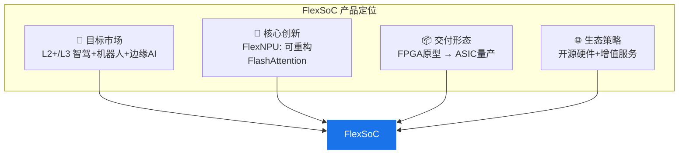

# 第五篇：FlexSoC 产品市场分析与设计实现

> **文档类型**: 产品市场分析与设计实现报告 | **版本**: 1.0 | **日期**: 2026-05-30
>
> 本篇整合 V4-V6 产业深度研究报告与 FlexSoC V6.0 创新设计方案，形成完整的"市场分析→产品设计→商业可行性"三位一体产品报告。

---

## 产品定位

### FlexSoC 是什么？

FlexSoC 是面向 **BEV+Transformer 时代**的车载 SoC 产品方案，核心设计理念是：

> **用 FPGA 可重构架构实现"算法即硬件"，用开源生态打破 NVIDIA 的 CUDA 壁垒。**

### 市场空白定位

| 竞品 | 算力 | 功耗 | Transformer支持 | 开源 | 定位 |
|------|------|------|----------------|------|------|
| NVIDIA Orin | 254T | 60-75W | ✅ 好 | ❌ | 高端闭源 |
| 地平线 J6P | 560T | ~35W | ✅ 好 | ❌ | 中高端闭源 |
| 黑芝麻 A1000 Pro | 196T | 15-20W | ⚠️ 受限 | ❌ | 中端闭源 |
| **FlexSoC (FPGA)** | 可配置 | 可配置 | ⭐ 原生 | ✅ | **开源灵活** |
| **FlexSoC (ASIC)** | 目标300-500T | 目标15-25W | ⭐ 原生 | ✅ | **开源高效** |

---

## 产品架构概览

### SoC 核心模块

| 模块 | 设计 | 特色 |
|------|------|------|
| **FlexNPU** | 可重构 FlashAttention SA + MAC阵列 | 原生Attention加速 |
| **CPU** | RISC-V CVA6×4 + CV32E×2 | 开源处理器 |
| **安全岛** | RISC-V 锁步×2 (ASIL-D) | 功能安全 |
| **Vision DSP** | CNN + PPA | 4K图像处理 |
| **IO Hub** | MIPI-CSI/PCIe/Ethernet/CAN-FD | 全接口覆盖 |
| **NoC** | AXI4/AMBA互联 | 可扩展 |

### 关键差异化

**FlexSoC 三大差异化**：

1. **"Attention-First"** — 原生FlashAttention硬件加速，非事后补丁
2. **"Software-Defined Hardware"** — FPGA可重构，算法演进时硬件跟随
3. **"Full-Stack Open"** — 从RTL到编译器全面开源，降低用户门槛

---

## 产品报告结构

本篇包含以下核心文档：

| 章节 | 文档 | 核心内容 |
|------|------|---------|
| ch43 | **产品市场分析**（本章） | 市场定位、竞品分析、差异化策略 |
| ch44 | **V2→V3 评价与迭代** | 产品方案评审、改进建议 |
| ch45 | **V5 多维度评价** | 最新版评价分析 |

### 完整设计文档索引

| 设计模块 | 详细章节 | 说明 |
|---------|---------|------|
| SoC总体架构 | ch35 | FlexNPU核心设计 |
| 软硬件协同设计 | ch36 | 验证方案 |
| FlexCompiler工具链 | ch37 | 编译器设计 |
| 算法库与生态 | ch38 | FlexAuto算法库 |
| 竞品对标 | ch39 | 技术维度对比 |
| 商业计划 | ch40 | 融资+GTM |
| PE级微架构 | ch46-54 | NPU最深层设计 |

---