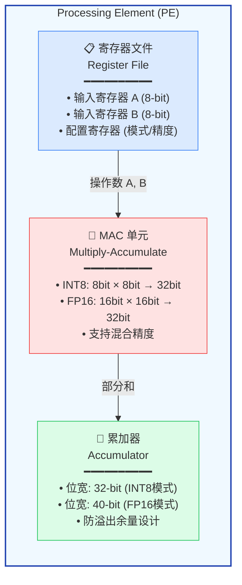
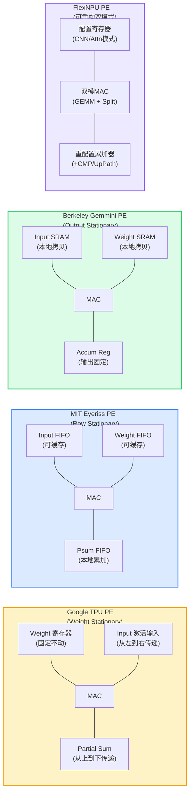
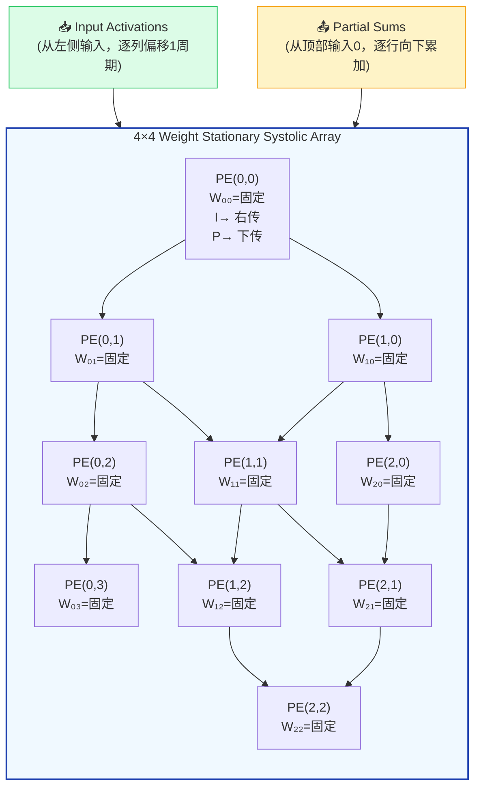
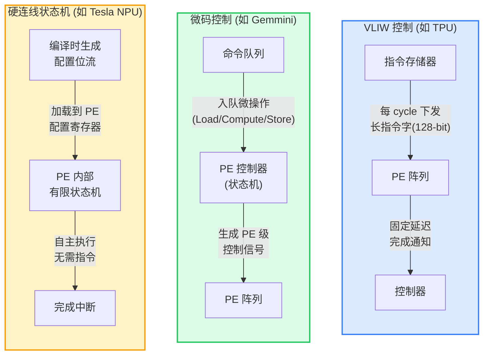
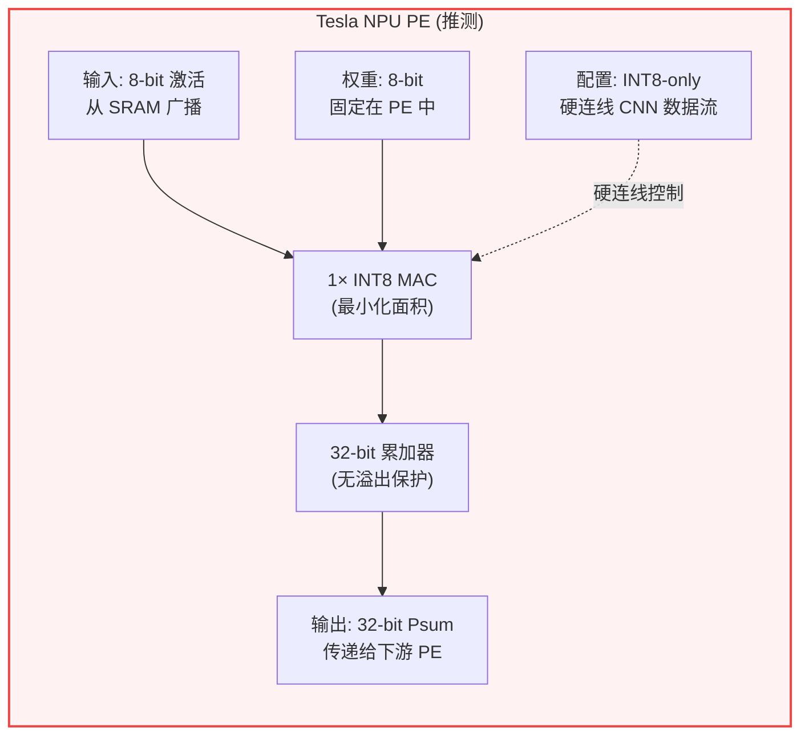
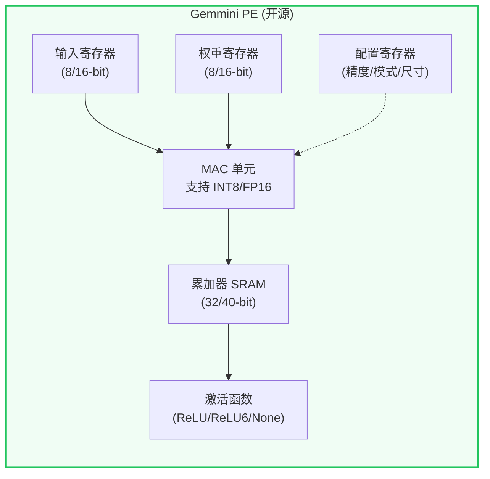

## 18. PE 级微架构深度设计 [新增]

>  **本章目标**：从黑盒 "96×96 MAC阵列" 打开到单个 PE 内部，揭示 NPU 计算的核心微观机制。

### 18.1 什么是 PE（Processing Element）？

PE 是 NPU 中最小的独立计算单元，相当于晶体管之于芯片。一个典型的 PE 包含：



<div class="callout callout-insight">

**为什么累加器需要 32-bit？** INT8 × INT8 的最大结果是 127×127 = 16129（14-bit）。但一个 MAC 阵列的一列可能有 256 个 PE 同时累加，最坏情况需要 14 + 8 = 22-bit。留出 32-bit 余量可避免溢出检测开销。

</div>

### 18.2 四种典型 PE 微架构对比



| 参数 | TPU PE | Eyeriss PE | Gemmini PE | FlexNPU PE |
|------|--------|------------|------------|------------|
| **数据流策略** | Weight Stationary | Row Stationary | Output Stationary | 可重构 |
| **寄存器文件** | 无（直通） | 3 × 96-entry FIFO | SRAM 本地拷贝 | 配置寄存器 + SRAM |
| **累加器位宽** | 32-bit | 32-bit | 32/40-bit | 32/40-bit |
| **面积 (45nm)** | ~2500 μm² | ~3800 μm² | ~3000 μm² | ~4200 μm² (+12% for FSA) |
| **精度支持** | INT8 only | INT8/INT16 | INT8/FP16 | INT4/INT8/FP16 |
| **特色功能** | 极简设计 | GLB 数据复用 | 参数化 Chisel | FlashAttention Split |

> **参考文献 [P22]**: Jouppi, N.P., et al. "In-Datacenter Performance Analysis of a Tensor Processing Unit." ISCA 2017.

> **参考文献 [P23]**: Wu, H., et al. "Gemmini: Enabling Systematic Design Space Exploration for Accelerators." DAC 2021.

### 18.3 PE 流水线设计

一个 PE 的典型 5 级流水线如下：

```mermaid
gantt
    title PE 5-Stage Pipeline (单周期指令执行)
    dateFormat X
    axisFormat %s

    section Cycle 1
    IF - 指令/配置读取     :a1, 0, 1
    section Cycle 2
    RD - 寄存器/RF读取     :a2, 1, 2
    section Cycle 3
    MAC - 乘法执行          :a3, 2, 3
    section Cycle 4
    ACC - 累加 + 溢出检测  :a4, 3, 4
    section Cycle 5
    WB - 结果写回/传递      :a5, 4, 5

    section Cycle N (流水线满)
    IF                    :b1, 0, 1
    RD                    :b2, 1, 2
    MAC                   :b3, 2, 3
    ACC                   :b4, 3, 4
    WB                    :b5, 4, 5
```



```
    流水线详解:
    
    Stage 1: IF (Instruction Fetch)
    ├── 从指令队列读取微操作
    ├── 或从配置寄存器读取控制信号
    └── 延迟: ~0.2ns @ 2GHz
    
    Stage 2: RD (Register Read)
    ├── 从寄存器文件读取操作数 A, B
    ├── 或从脉动链接收上游数据
    └── 延迟: ~0.3ns (SRAM 读取)
    
    Stage 3: MAC (Multiply)
    ├── INT8: 8×8→16 bit 乘法
    ├── FP16: 16×16→FP32 乘法 (需要归一化)
    └── 延迟: ~0.3ns (INT8) / ~0.5ns (FP16)
    
    Stage 4: ACC (Accumulate)
    ├── 16-bit 乘积 + 32-bit 累加器
    ├── 溢出检测和饱和处理
    └── 延迟: ~0.2ns
    
    Stage 5: WB (Write-Back)
    ├── 写回累加器或本地寄存器
    ├── 或传递给下游 PE (脉动)
    └── 延迟: ~0.2ns
```

<div class="callout callout-warning">

**️ 流水线冒险**：在脉动阵列中，数据依赖通过**时钟对齐**避免——每个 PE 固定延迟 1 cycle 传递数据，无需冒险检测逻辑。这是脉动阵列相比通用处理器的关键简化。

</div>

### 18.4 脉动阵列中的数据流动

以 4×4 Weight Stationary 脉动阵列为例，展示数据如何在 PE 间流动：



```
    时间步展示 (4×4 矩阵乘法 C = A × B):
    
    t=0:  PE(0,0) 收到 a₀₀, b₀₀ → p₀₀ = a₀₀·b₀₀
    t=1:  PE(0,0) 收到 a₀₁, b₁₀ → p₀₀ += a₀₁·b₁₀  (传 a₀₀→PE(0,1))
          PE(0,1) 收到 a₀₀, b₀₁ → p₀₁ = a₀₀·b₀₁
          PE(1,0) 收到 a₁₀, b₀₀ → p₁₀ = a₁₀·b₀₀
    t=2:  ... 对角线波前传播 ...
    
    → 完整计算需要 4+3 = 7 个 cycle (4×4 + 流水线排空)
    → 峰值吞吐: 16 MAC/cycle (所有 PE 同时工作)
    → 利用率: 16/16 = 100% (矩阵尺寸=阵列尺寸时)
```

### 18.5 PE 控制机制

PE 如何知道该做什么？三种主流控制方式：



| 控制方式 | 灵活性 | 面积开销 | 延迟 | 典型应用 |
|---------|--------|---------|------|---------|
| **VLIW** | ★★★ | 高 (指令存储器) | 低 (1 cycle) | 早期 DSP |
| **微码** | ★★★★ | 中等 | 中 (2-3 cycle) | Gemmini, NVDLA |
| **硬连线** | ★ | 极低 | 最低 (组合逻辑) | Tesla NPU |
| **可重构配置** | ★★★★★ | 较高 (配置寄存器) | 低 (配置后自主) | FlexNPU |

### 18.6 实际 NPU PE 设计案例分析

#### Tesla NPU PE（推测，基于 HotChips 31 披露）



**设计哲学**：极简主义。每个 PE 只做 INT8 MAC，面积最小化，使得 96×96 = 9216 个 PE 可以放入芯片。代价是完全不可编程。

#### Gemmini PE（开源，Berkeley）



**设计哲学**：参数化。用 Chisel 硬件生成语言实现，可以在编译时配置 PE 的位宽、精度、数据流策略。是学术研究的标准平台。

### 18.7 PE 面积与功耗估算

**PE 面积估算 (7nm 工艺节点)**:

| 模块 | 面积(μm²) | 占比 | 说明 |
|------|----------|------|------|
| INT8 MAC 单元 | ~400 | 25% | 8×8→16 bit |
| FP16 MAC 单元 | ~2400 | — | 16×16→32 |
| 累加器 (32-bit) | ~200 | 13% | 寄存器文件 |
| 寄存器文件 | ~600 | 38% | 2×8-bit+cfg |
| 控制逻辑 | ~200 | 13% | 状态机+MUX |
| 互联 (布线开销) | ~200 | 13% | 到邻居PE |
| **INT8 PE 总计** | **~1600 μm²** | | |
| **FP16 PE 总计** | **~3600 μm²** | | |

> Tesla 96×96 INT8: 9216 × 1600 ≈ **14.7 mm²** | FlexNPU 64×64 混合: 4096 × 2600 ≈ **10.6 mm²**

<div class="callout callout-success">

**关键洞察**：PE 面积主要由**寄存器文件**（38%）而非 MAC 单元（25%）决定。优化 PE 面积的关键是减少寄存器数量，这正是脉动阵列的优势——通过 PE 间直接传递数据，避免了大型寄存器文件。

</div>

> **参考文献 [P24]**: Chen, Y.-H., et al. "Eyeriss v2: A Flexible Accelerator for Emerging Deep Neural Networks on Mobile Devices." IEEE JSSC 2019. (PE 面积数据)

> **参考文献 [P25]**: Kwon, H., et al. "Understanding Reuse, Performance, and Hardware Cost of DNN Dataflows." MICRO 2019. (数据流分析框架)

---