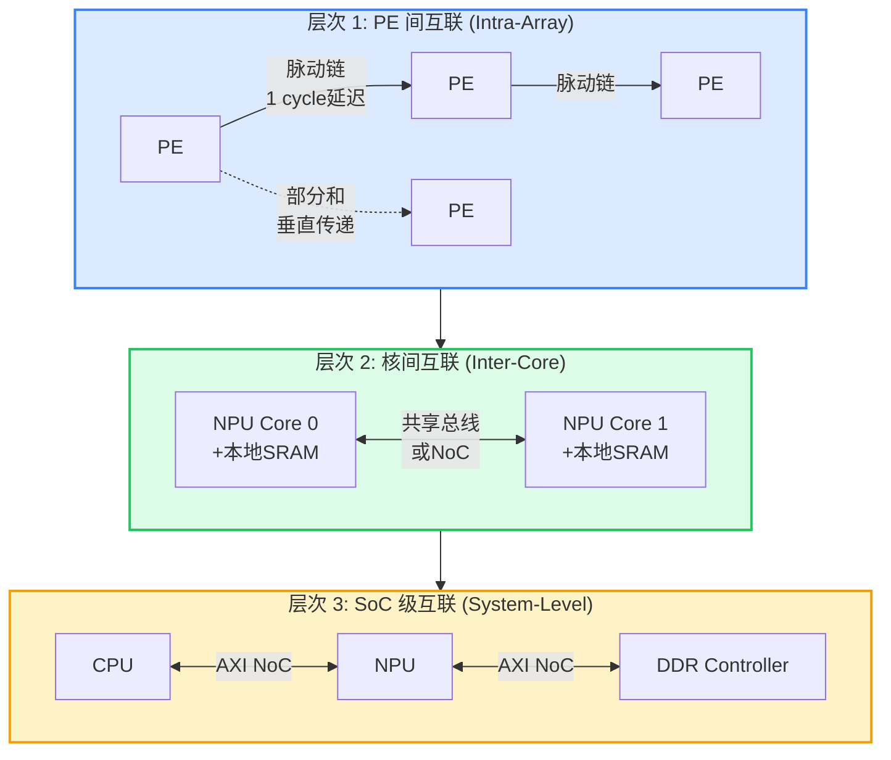
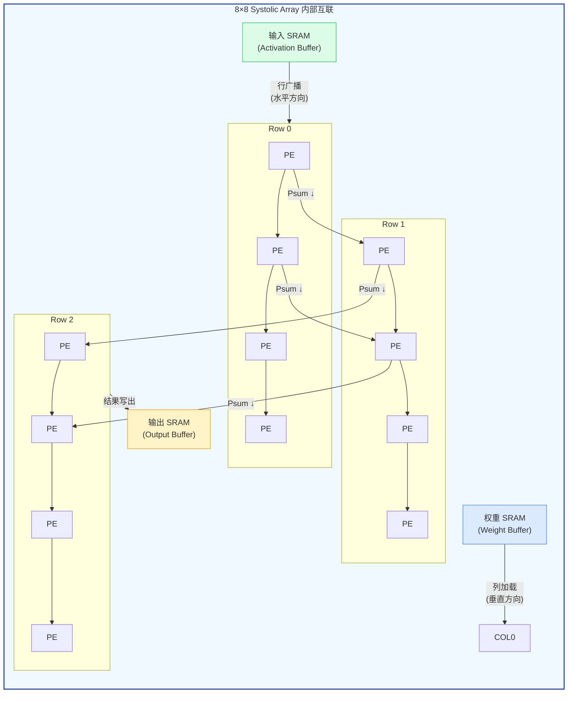
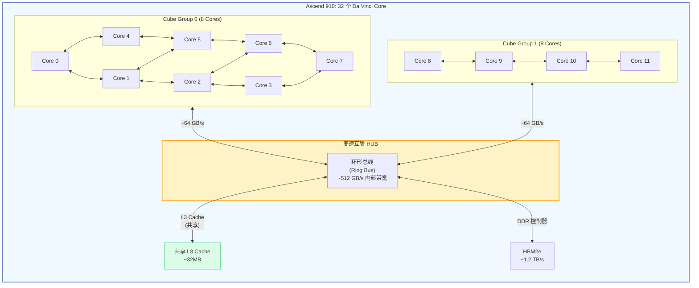
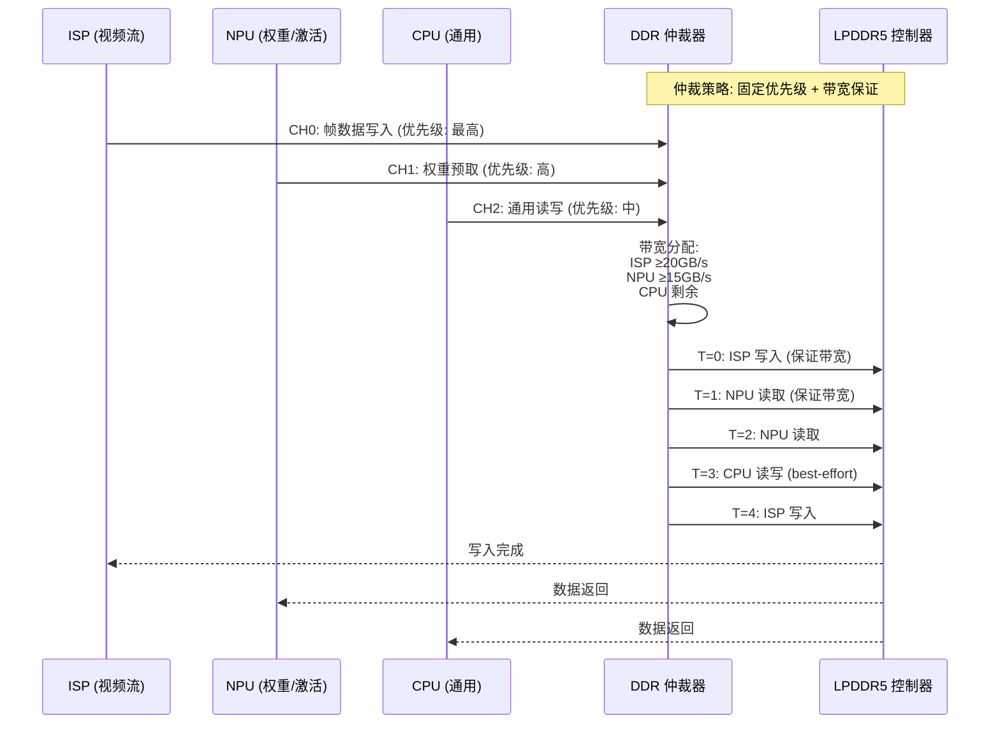
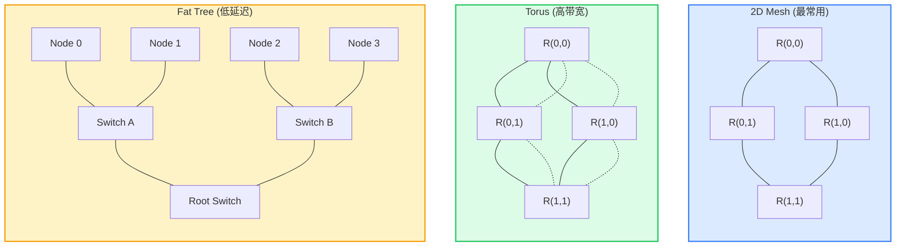
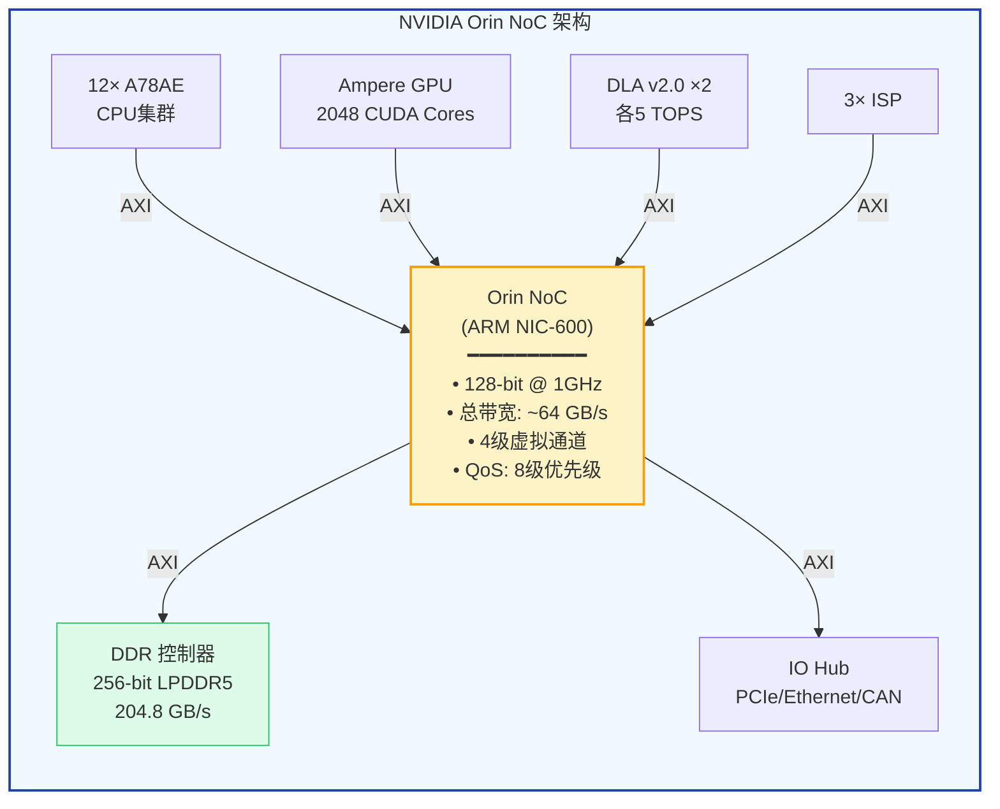
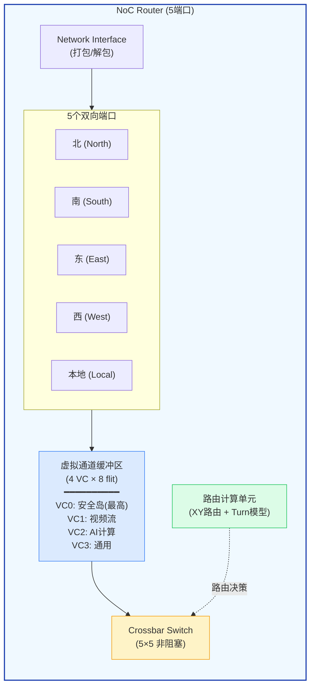

## 19. 片上互联与数据路由 [新增]

>  **本章目标**：深入 NPU 内部的数据路由网络，理解 PE 间、核间、SoC 级的通信机制。

### 19.1 NPU 内部互联的三个层次



### 19.2 PE 间互联：脉动阵列内部数据路由



**互联方式对比**：

| 互联方式 | 带宽 | 延迟 | 面积开销 | 适用场景 |
|---------|------|------|---------|---------|
| **直接脉动链** | 1 word/cycle | 1 cycle | 极低 | WS/OS 脉动阵列 |
| **行广播总线** | 1 row/cycle | 1 cycle | 低 | 输入广播 |
| **多播网络** | 可配置 | 1-2 cycle | 中等 | 灵活数据流 |
| **Crossbar** | N² 带宽 | 1 cycle | O(N²) 面积 | 小阵列(<16×16) |

<div class="callout callout-insight">

**脉动阵列的最大优势**：PE 间只需**单 bit 控制信号 + 数据线**，不需要复杂的路由逻辑。96×96 阵列的互联面积仅占总面积的 ~5%。相比之下，通用 NoC 路由器每个节点需要 ~0.1mm²。

</div>

### 19.3 多核 NPU 核间互联

华为 Da Vinci 32 核架构是研究多核 NPU 互联的经典案例：



**核间通信模式**：

| 模式 | 说明 | 带宽需求 | 延迟 |
|------|------|---------|------|
| **模型并行** | 不同核负责不同层的计算 | 高（中间激活传递） | ~100ns |
| **数据并行** | 不同核处理不同输入帧 | 低（仅需同步梯度） | ~50ns |
| **流水线并行** | 核间形成推理流水线 | 中（层间激活传递） | ~200ns |

### 19.4 DDR 带宽仲裁机制

多个 Master 竞争 DDR 带宽时的调度策略：



**仲裁算法对比**：

| 算法 | 公平性 | 延迟保证 | 实现复杂度 | 典型应用 |
|------|--------|---------|-----------|---------|
| **Round-Robin** | ★★★★★ | ❌ 无 | 低 | 简单SoC |
| **固定优先级** | ★★ | ⚠️ 低优先级饿死 | 低 | 嵌入式 |
| **TDMA** | ★★★★ | ✅ 时隙保证 | 中 | 实时系统 |
| **信用量 (Credit)** | ★★★★ | ✅ 带宽保证 | 高 | 高端SoC |
| **QoS + 优先级** | ★★★★★ | ✅ 双重保证 | 最高 | 车载SoC |

### 19.5 NoC 拓扑选择



| 拓扑 | 最大跳数 | 链路数 | 面积 | 适用场景 |
|------|---------|--------|------|---------|
| **2D Mesh** | 2(N-1) | 2N(N-1) | 低 | 大多数SoC (ARM NIC-600) |
| **Torus** | N | 2N² | 中 | 高带宽需求 |
| **Fat Tree** | 2log(N) | O(N logN) | 高 | 数据中心 |
| **Ring** | N/2 | N | 最低 | 少量节点 (4-8) |

### 19.6 典型 SoC NoC 实例



**Orin 带宽瓶颈分析**：
- GPU 峰值带宽需求: ~100 GB/s (满载时)
- DLA 峰值带宽需求: ~20 GB/s
- 总 DDR 带宽: 204.8 GB/s
- GPU + DLA 同时满载 → 带宽余量 ~85 GB/s，**但实际场景很少同时满载**

### 19.7 NoC 路由器微架构



**NoC 路由器参数**：

| 参数 | 典型值 | 说明 |
|------|--------|------|
| 端口数 | 5 (4方向+本地) | 2D Mesh 标准 |
| 虚拟通道 | 4 | 避免死锁 + QoS |
| 缓冲深度 | 4-8 flit/VC | 面积与性能权衡 |
| 路由算法 | XY / Turn Model | 确定性路由，低复杂度 |
| 单跳延迟 | 2-3 cycle | @ 1GHz 约 2-3ns |
| 面积 | ~0.1 mm² (7nm) | 5端口路由器 |

> **参考文献 [P26]**: ARM, "AMBA AXI and ACE Protocol Specification." ARM IHI 0022, 2021.

> **参考文献 [P27]**: Balfour, J., et al. "Design Tradeoffs for Tiled CMP On-Chip Networks." ICS 2006.

---
### 19.8 NoC 路由算法深度解析

#### XY 维度路由 (Dimension-Order Routing)

```python
def xy_route(src_x, src_y, dst_x, dst_y):
    """XY维度路由: 先X后Y, 确定性无死锁"""
    path = []
    x, y = src_x, src_y
    while x != dst_x:          # 阶段1: X方向
        x += 1 if x < dst_x else -1
        path.append((x, y))
    while y != dst_y:          # 阶段2: Y方向
        y += 1 if y < dst_y else -1
        path.append((x, y))
    return path
```

**XY路由特性**：确定性（同src-dst同路径）、无死锁（路径单调不回头）

#### Turn Model 死锁避免

| Turn Model | 禁止转向 | 特点 | 适用场景 |
|-----------|---------|------|--------|
| **West-First** | 先向西，再任意转向 | 适合东向为主的流量 | 大多数SoC |
| **Negative-First** | 负方向优先 | 平衡流量 | 对称拓扑 |
| **Odd-Even** | 基于列号奇偶约束 | 最小禁止转向数 | 高利用率 |

> **核心原理**：通过禁止特定转向，从拓扑上消除所有可能的循环依赖，从而避免死锁。

### 19.9 虚拟通道 (VC) 微观设计

**VC 分配时序流水线**：

| Cycle | 阶段 | 操作 | 延迟贡献 |
|-------|------|------|---------|
| T+0 | 路由计算 (RC) | XY路由确定输出端口 | 1 cycle |
| T+1 | VC 分配 (VA) | WRR仲裁分配输出VC | 1 cycle |
| T+2 | Switch 分配 (SA) | iSLIP仲裁Crossbar | 1 cycle |
| T+3 | Switch 传输 (ST) | 数据通过Crossbar | 1 cycle |
| T+4 | 链路传输 (LT) | 数据在链路上传播 | 1 cycle |

**总单跳延迟: 5 cycle** (@ 1GHz = 5ns)

**VC 带宽保证**（128-bit @ 1GHz, WRR调度）：

| VC | 用途 | 权重 | 保证带宽 | 最坏延迟 |
|----|------|------|---------|----------|
| VC0 | 安全岛 | 4 | 6.4 GB/s (40%) | <10 ns |
| VC1 | 视频流 | 3 | 4.8 GB/s (30%) | <50 ns |
| VC2 | NPU计算 | 2 | 3.2 GB/s (20%) | <200 ns |
| VC3 | 通用 | 1 | 1.6 GB/s (10%) | best-effort |

### 19.10 NoC 面积与功耗估算 (3x3 Mesh)

| 组件 | 单个面积 | 单个功耗 | 数量 | 总面积 | 总功耗 |
|------|---------|---------|------|--------|--------|
| 路由器 (5端口x4VC) | ~100K um2 | ~50 mW | 9 | 0.9 mm2 | 450 mW |
| 链路 (128-bit, 1mm) | ~5K/mm | ~10/mm | ~18 | 0.09 mm2 | 180 mW |
| NI (Network Interface) | ~20K um2 | ~15 mW | 9 | 0.18 mm2 | 135 mW |
| **NoC 总计** | | | | **~1.17 mm2** | **~765 mW** |

> 占 FlexSoC 总面积 (~80 mm2) 的 ~1.5%，占总功耗 (~15W) 的 ~5%

> **参考文献 [P28]**: Dally, W., et al. "Principles and Practices of Interconnection Networks." Morgan Kaufmann, 2004.
> **参考文献 [P29]**: Peh, L.S., et al. "A Router Architecture for Virtual Channel Flow Control." HPCA 2004.
