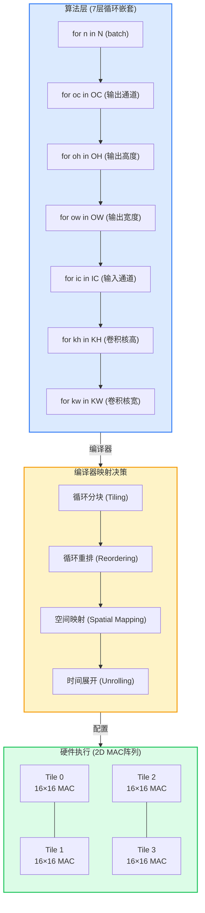
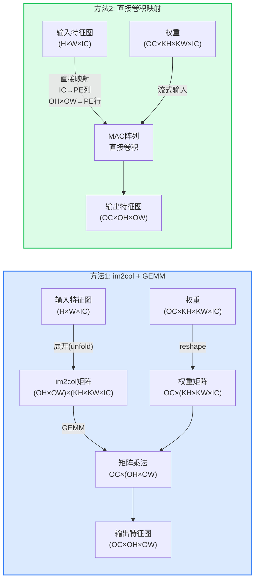
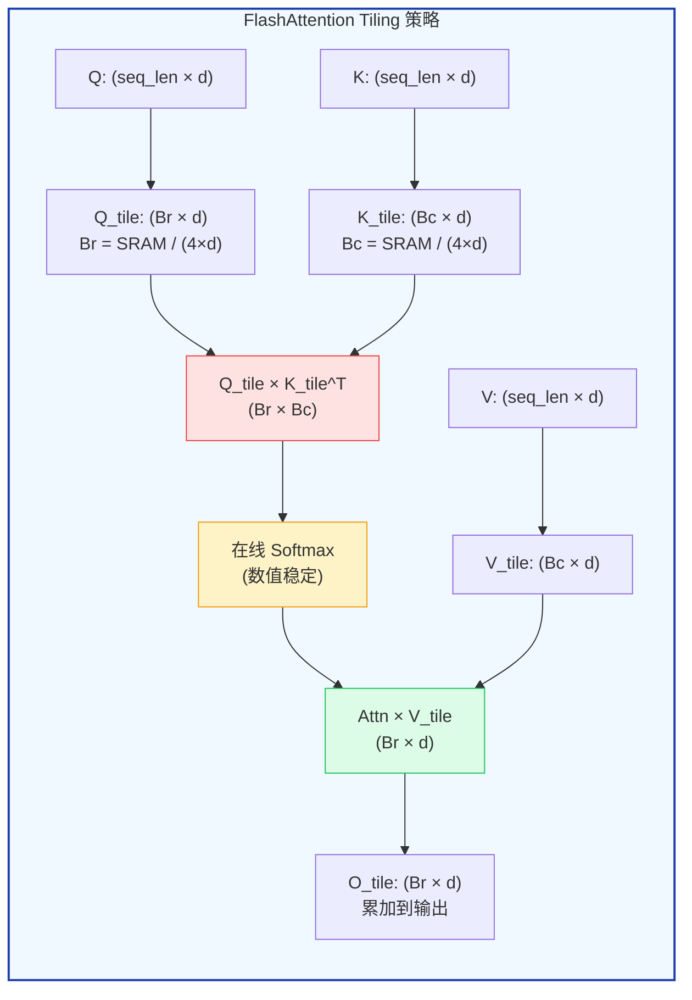
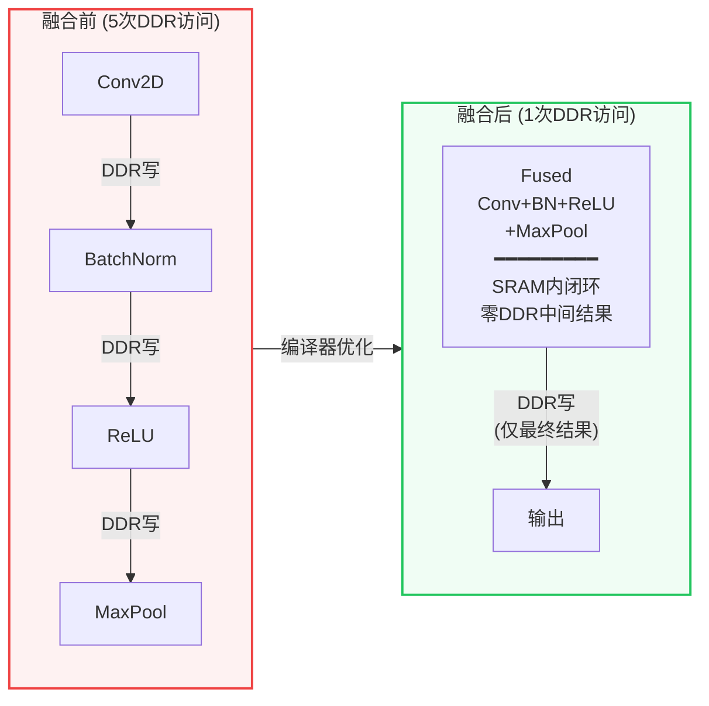
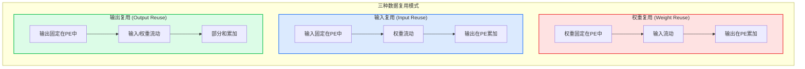

## 20. 编译器后端与计算映射 [新增]

>  **本章目标**：揭示编译器如何将 7 层循环嵌套的卷积/Attention 映射到 2D MAC 阵列——这是 NPU 设计中最核心的软件-硬件协同问题。

### 20.1 从算法到硬件：映射的本质

### 20.2 Tiling 数学推导

Tiling 是映射的核心——决定每次计算多大的子问题。

假设: MAC阵列 R×C, SRAM 容量 S bytes, 带宽 BW bytes/s

卷积 GEMM 化后的矩阵乘法:  M × K  ×  K × N  =  M × N

**Tiling 约束条件**:

| 约束 | 公式 | 说明 |
|------|------|------|
| **SRAM容量** | Tile_A(Tm×Tk) + Tile_B(Tk×Tn) + Tile_C(Tm×Tn) + 累加器 ≤ S | Tile必须放入片上SRAM |
| **阵列尺寸** | Tm ≤ R, Tn ≤ C (或通过折叠映射) | Tile不能超过MAC阵列尺寸 |
| **带宽** | 数据加载时间 ≤ 计算时间 | 2×Tm×Tn×Tk / (R×C×freq) |

**优化目标**: 最大化 MAC利用率 = Tm×Tn / (R×C) × 数据复用因子

**实例**: ResNet-50 Conv3_1 (M=784, N=256, K=576), Tesla NPU (R=96, C=96, S=32MB):
→ Tm=96, Tn=96, Tk=576 → SRAM=14.9MB ✅ → 利用率=100%

### 20.3 CNN 卷积映射：im2col vs 直接卷积

| 维度 | im2col + GEMM | 直接卷积映射 |
|------|---------------|-------------|
| **内存开销** | 高 (展开后矩阵是原来的 KH×KW 倍) | 低 (原地计算) |
| **MAC利用率** | 高 (GEMM 是 MAC 阵列的最优负载) | 中等 (受限于卷积参数) |
| **适用性** | 1×1, 3×3 标准卷积 | Depthwise, Group 卷积 |
| **Tesla NPU** | ✅ 使用 (网络架构适配) | ❌ |
| **地平线 BPU** | ⚠️ 混合使用 | ✅ 专用卷积映射 |
| **NVIDIA DLA** | ✅ 使用 | ⚠️ 部分支持 |

### 20.4 Attention 映射：FlashAttention 到脉动阵列

**FlashAttention 到 FSA 脉动阵列的映射**：

```mermaid
gantt
    title FlashAttention 在 16×16 FSA 阵列上的调度
    dateFormat X
    axisFormat %s

    section 加载 Q_tile
    DMA: Q → Scratch SRAM    :a1, 0, 2

    section 外循环 (K/V tiles)
    Load K_tile #0           :b1, 2, 4
    Q×K^T (MAC阵列)          :b2, 4, 8
    在线Softmax (Split单元)   :b3, 8, 10
    Load V_tile #0           :b4, 4, 6
    Attn×V (MAC阵列)         :b5, 10, 14
    累加到 O_tile             :b6, 14, 15

    section K/V tile #1
    Load K_tile #1           :c1, 15, 17
    Q×K^T                    :c2, 17, 21
    Softmax                  :c3, 21, 23
    Load V_tile #1           :c4, 17, 19
    Attn×V                   :c5, 23, 27
    累加                     :c6, 27, 28

    section 写回输出
    DMA: O → DDR             :d1, 28, 30
```

### 20.5 算子融合规则

**常见融合模式**：

| 融合模式 | 适用模型 | SRAM需求节省 | 带宽节省 |
|---------|---------|-------------|---------|
| **Conv + BN + ReLU** | 所有CNN | 输出特征图大小 × 2 | ~3× |
| **Q·K^T + Softmax + ·V** | Attention | n² × 4 bytes | ~5-10× |
| **Linear + GELU** | Transformer FFN | 中间激活大小 | ~2× |
| **Conv + BN + ReLU + Pool** | CNN backbone | 输出 × 3 | ~4× |
| **BEV Pool + BEV Attn** | BEVFormer | BEV特征图 | ~3× |

**融合的关键约束**：融合需要中间结果全部在 SRAM 中驻留。如果中间结果（如 Attention Map n²）超过 SRAM 容量，就无法完全融合——这正是 FlashAttention tiling 解决的问题。

### 20.6 数据复用分析

| 工作负载 | 最佳复用模式 | 复用因子 | 每MAC所需带宽 |
|---------|------------|---------|-------------|
| **标准CNN (3×3 Conv)** | 输入复用 | ~9× | ~0.11 bytes/MAC |
| **1×1 Conv** | 权重复用 | ~H×W× | ~0.01 bytes/MAC |
| **Depthwise Conv** | 输出复用 | ~1× | ~1.0 bytes/MAC |
| **Attention Q×K^T** | 输入复用 (Q) | ~n× | ~4/n bytes/MAC |
| **Attention Attn×V** | 输入复用 (V) | ~n× | ~4/n bytes/MAC |

### 20.7 Timeloop 建模框架

Timeloop 是学术和工业界广泛使用的 DNN 加速器建模工具：

**Timeloop 建模流程**:

| 阶段 | 内容 |
|------|------|
| **输入** | 算法描述 (Conv/FC参数) \| 架构描述 (MAC阵列/SRAM/带宽) \| 映射约束 (数据流策略/Tile大小) |
| **Timeloop 分析** | 循环嵌套展开→空间/时间映射 \| 数据复用分析→带宽需求 \| MAC利用率计算 \| 能耗估算 (Accelergy+CACTI) |
| **输出** | 延迟(cycles) \| 能耗(mJ) \| 面积(mm²) \| MAC利用率(%) \| 带宽利用率(%) |

> **参考文献 [P28]**: Parashar, A., et al. "Timeloop: A Systematic Approach to DNN Accelerator Evaluation." ISPASS 2020.

> **参考文献 [P29]**: Yang, X., et al. "Interstellar: Using Halide's Scheduling to Explore DNN Accelerator Design Spaces." DAC 2020.

> **参考文献 [P30]**: Niu, W., et al. "SODA: A Full-Stack DNN Compiler and Accelerator Generator." DAC 2023.

---