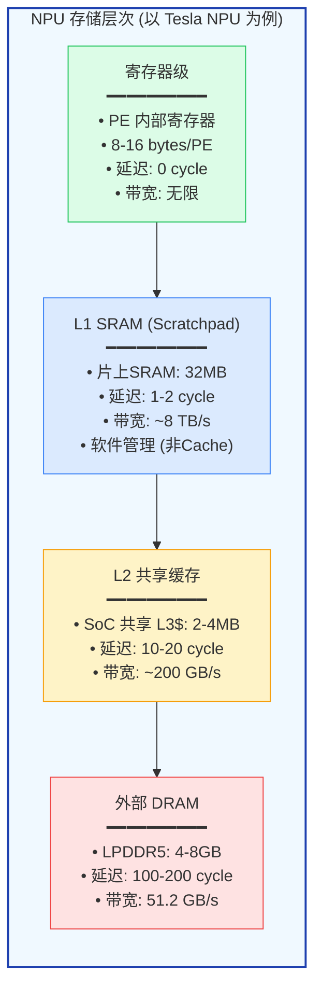
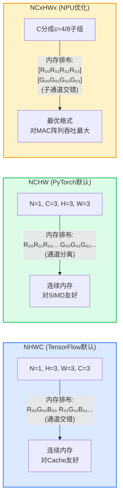
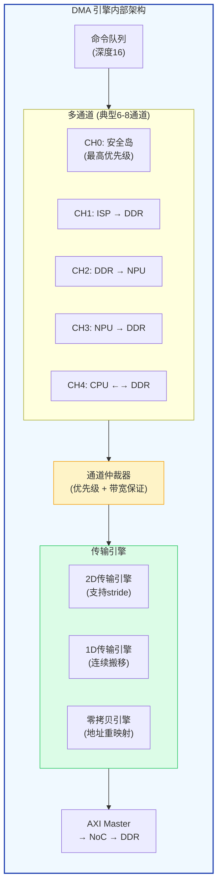

## 21. 存储子系统微观设计 [新增]

>  **本章目标**：深入 NPU 存储层次的最底层——权重排布、DMA 传输、SRAM 管理策略。

### 21.1 NPU 存储层次架构

**各 NPU 存储层次对比**：

| NPU | 片上 SRAM | 类型 | 管理方式 | 带宽 (内部) |
|-----|----------|------|---------|------------|
| **Tesla NPU** | 32 MB | Scratchpad | 软件 DMA | ~8 TB/s |
| **NVIDIA Tensor Core** | 共享 L2 (6MB) | Hardware Cache | 硬件管理 | ~2 TB/s |
| **华为 Da Vinci** | L1: 512KB/Core | Scratchpad | 软件 + Cube Buffer | ~256 GB/s/Core |
| **地平线 BPU** | ~8 MB | Scratchpad | 软件 DMA | ~1 TB/s |
| **FlexNPU** | 2×512KB + 256KB | Scratchpad | 软件 DMA + 双缓冲 | ~512 GB/s |

### 21.2 权重排布格式

| 格式 | 推理效率 | 权重压缩友好度 | DMA效率 | 适用场景 |
|------|---------|--------------|---------|---------|
| **NHWC** | ★★★ | ★★ | ★★★ | GPU/CPU 推理 |
| **NCHW** | ★★★★ | ★★★ | ★★★ | PyTorch 训练 |
| **NC/4HW/4** | ★★★★★ | ★★★★★ | ★★★★★ | NPU 专用 (INT8) |
| **NC/32HW/32** | ★★★★★ | ★★★★★ | ★★★★ | NVIDIA Tensor Core |

### 21.3 DMA 引擎设计

**2D DMA 传输**（NPU 最常用的传输模式）：

**2D DMA 传输示意 — DDR中的权重 (NCHW格式)**:

| Row | 数据 | stride |
|-----|------|--------|
| Row 0 | W₀₀ W₀₁ W₀₂ ... W₀ₙ | N×sizeof(data) |
| Row 1 | W₁₀ W₁₁ W₁₂ ... W₁ₙ | |
| Row 2 | W₂₀ W₂₁ W₂₂ ... W₂ₙ | |
| ... | ... | |
| Row M | Wₘ₀ Wₘ₁ Wₘ₂ ... Wₘₙ | |

**DMA 描述符**: src_addr (DDR起始) | dst_addr (SRAM起始) | x_size (每行字节) | y_size (行数) | src_stride (源行间距) | dst_stride (目的行间距)

> 优势: 只搬移需要的区域, 跳过padding和不需要的通道

### 21.4 双缓冲/三缓冲流水线

```mermaid
gantt
    title 双缓冲流水线 (计算与DMA重叠)
    dateFormat X
    axisFormat %s

    section DMA通道
    加载 Tile 0 → SRAM_A   :a1, 0, 3
    加载 Tile 1 → SRAM_B   :a2, 3, 6
    加载 Tile 2 → SRAM_A   :a3, 6, 9
    加载 Tile 3 → SRAM_B   :a4, 9, 12

    section NPU计算
    等待 (首次)            :b0, 0, 3
    计算 Tile 0 (SRAM_A)   :b1, 3, 6
    计算 Tile 1 (SRAM_B)   :b2, 6, 9
    计算 Tile 2 (SRAM_A)   :b3, 9, 12
    计算 Tile 3 (SRAM_B)   :b4, 12, 15

    section DMA写回
    等待                   :c0, 0, 6
    写回 Tile 0 → DDR      :c1, 6, 9
    写回 Tile 1 → DDR      :c2, 9, 12
    写回 Tile 2 → DDR      :c3, 12, 15
```

**双缓冲 vs 三缓冲**：双缓冲将 DMA 延迟隐藏 ~50%，三缓冲可隐藏 ~67%。但每增加一级缓冲，SRAM 开销翻倍。车载场景通常选择**双缓冲**（SRAM 面积约束）。

### 21.5 SRAM 管理策略

```mermaid
flowchart TB
    subgraph SW_MANAGED["软件管理 Scratchpad"]
        direction TB
        SW1["编译器/DMA 完全控制<br/>数据何时加载/驱逐"]
        SW2["优势: 可预测延迟<br/>100% 利用率<br/>无Cache miss"]
        SW3["代价: 编程复杂<br/>需手动管理分配"]
    end

    subgraph HW_CACHE["硬件管理 Cache"]
        direction TB
        HW1["硬件自动管理<br/>替换策略 (LRU/PLRU)"]
        HW2["优势: 编程简单<br/>自动适配访问模式"]
        HW3["代价: 不可预测延迟<br/>Miss penalty ~100ns<br/>面积开销 ~20%"]
    end

    subgraph HYBRID["混合管理 (推荐)"]
        direction TB
        HB1["权重/激活: Scratchpad<br/>(编译器控制DMA)"]
        HB2["代码/配置: Cache<br/>(硬件自动管理)"]
        HB3["优势: 兼顾效率与易用性"]
    end

    style SW_MANAGED fill:#dcfce7,stroke:#22c55e,stroke-width:2px
    style HW_CACHE fill:#dbeafe,stroke:#3b82f6,stroke-width:2px
    style HYBRID fill:#fef3c7,stroke:#f59e0b,stroke-width:2px
```

**各 NPU SRAM 管理策略**：

| NPU | 权重 SRAM | 激活 SRAM | 累加器 SRAM | 管理方式 |
|-----|----------|----------|------------|---------|
| **Tesla** | 32MB (统一) | 共享权重SRAM | 独立 32-bit | 软件 DMA |
| **Da Vinci** | 512KB L1 | 512KB L1 | 256KB FP32 | 软件 + 硬件混合 |
| **Tensor Core** | L2 Cache | L2 Cache | 寄存器文件 | 硬件 Cache |
| **FlexNPU** | 2×512KB | 2×512KB | 256KB FP32 | 软件 DMA + 双缓冲 |

> **参考文献 [P31]**: Wang, Y., et al. "Demystifying the Memory System of NPU." IEEE Micro 2023.

---