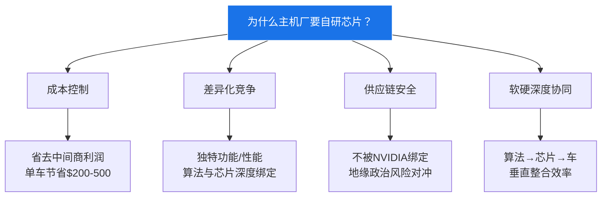
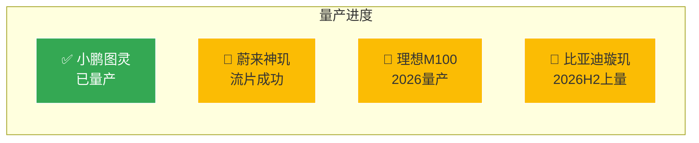

# 第5章：主机厂自研芯片四强（2025-2026 新势力）

>  主机厂自研芯片是 2025-2026 年智驾芯片行业最大的变量。本章深度剖析小鹏、蔚来、理想、比亚迪四大车企的造芯战略。

---

## 5.1 主机厂造芯浪潮

---

## 5.2 小鹏图灵 — 最快落地的自研芯片 🟢

### 核心规格

| 参数 | 规格 | 置信度 |
|------|------|--------|
| 芯片名称 | 图灵 | 🟢 官方确认 |
| 制程 | 5nm | 🟢 官方确认 |
| 算力 | **750 TOPS**（稠密） | 🟢 官方确认 |
| 功耗 | ~40W | 🟡 推测（非官方详细功耗数据） |
| TOPS/W | ~19 | 🟡 推测 |
| 量产状态 | ✅ 已量产（G6/G9） | 🟢 官方确认 |

**小鹏的优势**：
- **最快量产**：四强中唯一已量产上车的自研芯片
- **对外供货**：不仅自用，还向大众等合作伙伴供货
- **高能效**：19 TOPS/W 超越大部分独立芯片厂商

**⚠️ 硅片物理可行性分析**：750T稠密 / 40W = 19 TOPS/W 在 5nm 下属非常激进的指标。
- **MAC阵列反推**：750T / (2×2GHz) ≈ 187,500 个MAC单元 → 约 432mm² MAC阵列面积（5nm）
- **功耗合理性**：187K MAC @ 40W → 每MAC约 0.21mW，在 5nm @ 2GHz 下需高翻转率设计
- **与竞品对比**：J6P(7nm) 560T/35W=16 TOPS/W，图灵 19 TOPS/W 在 5nm 下提升 ~19% 属合理范围
- **结论**：该指标处于物理可行性的边界，可能包含部分稀疏优化贡献，实际稠密TOPS/W可能低于标称值

---

## 5.3 蔚来神玑 NX9031 — 最激进的算力 🟡

### 核心规格

| 参数 | 规格 | 置信度 |
|------|------|--------|
| 芯片名称 | 神玑 NX9031 | 🟢 官方确认 |
| 制程 | 5nm | 🟢 官方确认 |
| 算力 | **>1000 TOPS** | 🟢 官方确认 |
| 功耗 | ~50W | 🟡 多方推测 |
| TOPS/W | ~20 | 🟡 推测 |
| 量产状态 | 🔶 流片成功 | 🟢 官方确认 |
| 首发车型 | ET9 | 🟢 官方确认 |

**蔚来的战略**：
- 成立**独立神玑公司**，对外授权芯片 IP
- 目标不仅是自用，更是成为芯片供应商
- 定位高端，算力 >1000T 对标 Thor

---

## 5.4 理想 M100 — 最大稠密算力 🟢

### 核心规格

| 参数 | 规格 | 置信度 |
|------|------|--------|
| 芯片名称 | M100 | 🟢 官方确认 |
| 制程 | 5nm | 🟢 官方确认 |
| 算力 | **1280 TOPS**（稠密） | 🟢 官方确认 |
| 功耗 | ~60W | 🟡 推测（非官方详细功耗数据） |
| TOPS/W | ~21 | 🟡 推测 |
| 量产状态 | 🔶 流片成功，2026年量产 | 🟢 官方确认 |

**️ 理想的挑战**：
- M100 是四强中功耗最高的（~60W），对散热要求高
- 2026年才量产，时间窗口可能被小鹏和比亚迪抢占
- 优势在于稠密算力最大（1280T），适合 L3+ 场景

**⚠️ 硅片物理可行性分析**：1280T稠密 / 60W = 21.3 TOPS/W 是极其激进的指标。
- **MAC阵列反推**：1280T / (2×2GHz) ≈ 320,000 个MAC单元 → 约 736mm²（超出5nm单片经济Die面积上限~800mm²）
- **功耗合理性**：320K MAC @ 60W → 每MAC约 0.19mW，在 5nm 高性能库下处于极限边界
- **关键疑点**：21 TOPS/W 超过了 NVIDIA H100（TSMC 4nm, ~3.5 TOPS/W稠密INT8）和地平线 J6P（16 TOPS/W），如果属实将是业界最高能效
- **可能解释**：①功耗仅为NPU子系统，不包含CPU/IO/内存；②算力包含稀疏优化贡献；③官方宣传取较优条件
- **结论**：该数据需要持审慎态度，建议以 **实际部署后的第三方评测** 为准

---

## 5.5 比亚迪璇玑 A3 — 规模优势 🟡

### 核心规格

| 参数 | 规格 | 置信度 |
|------|------|--------|
| 芯片名称 | 璇玑 A3 | 🟡 多方印证 |
| 制程 | **4nm**（最先进）⚠️ | 🟡 行业推测 |
| 算力 | **700 TOPS**⚠️ | 🟡 行业推测 |
| 功耗 | ~40W⚠️ | 🟡 推测 |
| TOPS/W | ~17.5⚠️ | 🟡 推测 |
| 量产状态 | 🔶 2026H2 全面上量⚠️ | 🟡 预测 |

> ⚠️ **数据可信度警告**：比亚迪璇玑A3的**所有核心参数均为行业推测**，比亚迪官方尚未发布详细规格。4nm制程、700T算力、40W功耗等数据需等待官方确认或第三方独立验证。

**比亚迪的杀手锏**：
- **规模优势**：年销 300 万+ 辆车，芯片用量巨大
- **最先进制程**：4nm 是四强中制程最先进的
- **全栈自研**：电池 + 电机 + 电控 + 芯片全链条垂直整合

---

## 5.6 四强对比总览

| 维度 | 🏆 小鹏图灵 | 蔚来神玑 | 理想M100 | 比亚迪璇玑 |
|------|-----------|---------|---------|-----------|
| **算力** | 750T | >1000T | **1280T** | 700T⚠️ |
| **制程** | 5nm | 5nm | 5nm | **4nm**⚠️ |
| **TOPS/W** | ~19🟡 | ~20🟡 | ~21🟡 | ~17.5⚠️ |
| **量产时间** | ✅ 已量产 | 2026 | 2026H2 | 2026H2⚠️ |
| **是否对外** | ✅ 大众等 | ✅ 对外授权 | ❌ 仅自用 | ❌ 仅自用 |
| **年用量(估)** | ~50万颗 | ~20万颗 | ~50万颗 | **~300万颗** |
| **数据可信度** | 🟢 高 | 🟡 中 | 🟡 中(功耗待验证) | 🔴 低(全为推测) |

---

## 5.7 对独立芯片厂商的冲击

**️ 独立芯片厂商面临的挑战**：
1. **市场份额被蚕食**：主机厂自研芯片份额从 2025 年的 ~6% 增长到 2028 年的 ~27%
2. **定价权下降**：主机厂有了自研替代方案，议价能力大幅提升
3. **客户关系变化**：从"供应商→客户"变为"竞争对手→合作伙伴"

**独立芯片厂商的应对策略**：
- 地平线：加强与主机厂的深度定制合作（如与理想、大众的合资模式）
- NVIDIA：巩固高端市场，Thor X 算力仍领先
- 黑芝麻：专注中小车企和商用车，错位竞争
- 高通：利用 5G+V2X 差异化

---