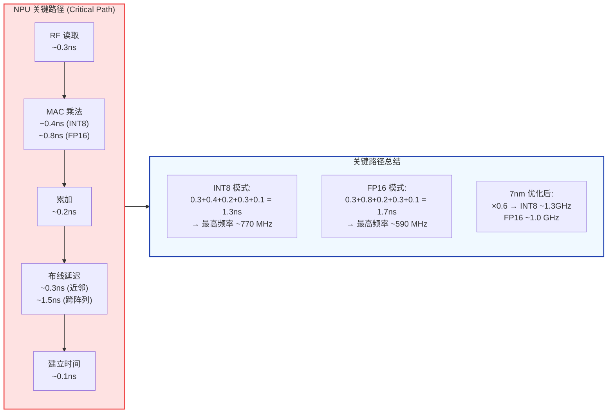
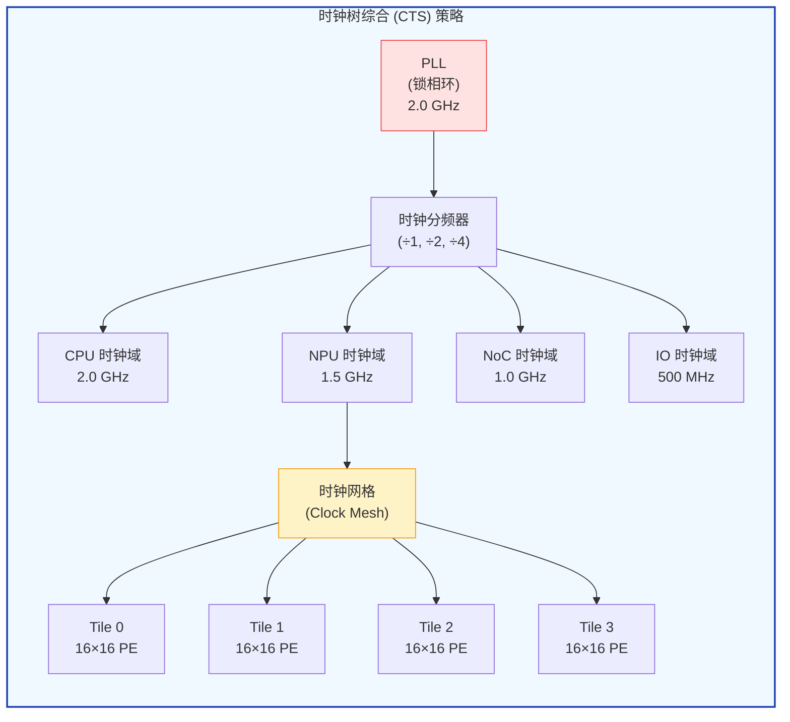
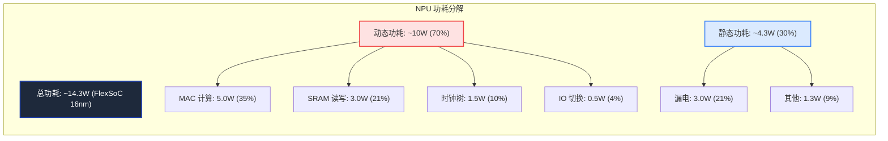
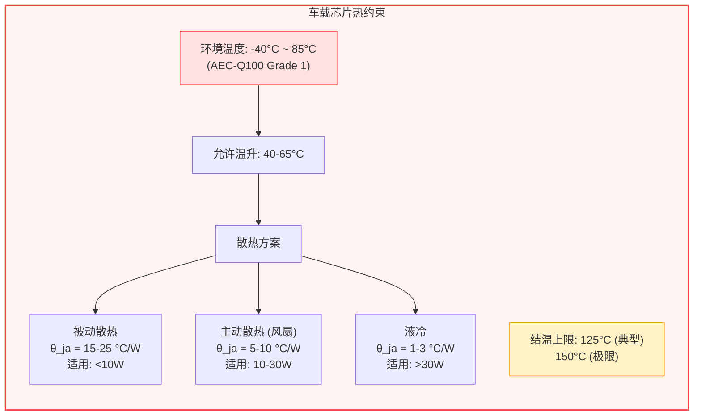
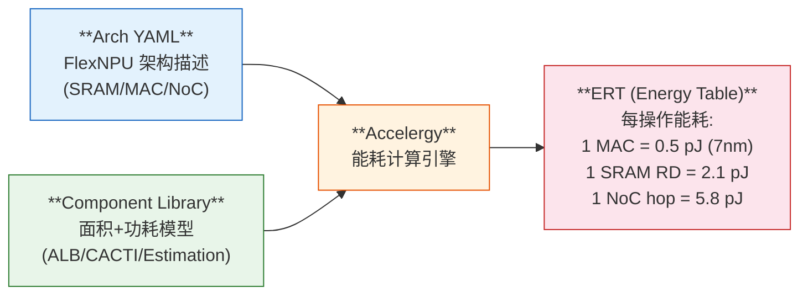

## 22. 功耗时序与物理设计 [新增]

>  **本章目标**：从 RTL 到硅片的物理实现——关键路径、时钟树、功耗分解和工艺选择。

### 22.1 关键路径分析



<div class="callout callout-warning">

**️ 布线延迟是最大挑战**：在 96×96 MAC 阵列中，对角 PE 的布线长度可达 ~1mm（7nm），延迟 ~1.5ns。这是限制大阵列频率的主要因素。解决方案：**分段流水线**（每 16×16 插入寄存器）。

</div>

### 22.2 时钟树设计



**时钟树关键参数**：

| 参数 | 目标值 | 说明 |
|------|--------|------|
| **时钟偏斜 (Skew)** | <50ps | 同域内 PE 间最大偏斜 |
| **时钟抖动 (Jitter)** | <20ps | PLL + 电源噪声引起 |
| **时钟延迟 (Latency)** | <2ns | PLL 到最远 PE |
| **功耗占比** | 15-25% | 总功耗中时钟树占比 |
| **面积占比** | 5-8% | 时钟布线和缓冲器 |

### 22.3 功耗分解



**功耗公式**：

**动态功耗**: P_dyn = α × C × V² × f

- α = 切换活性 (0~1, NPU典型值: 0.3-0.5)
- C = 电容 (与面积成正比, 7nm: ~0.1 fF/μm)
- V = 电压 (7nm: 0.7V, 5nm: 0.65V)
- f = 频率 (1.0-2.0 GHz)

**静态功耗**: P_static = I_leak × V

- I_leak = 漏电流 (7nm: ~10 nA/μm)
- 温度每升高 10°C, 漏电增加 ~2×

**工艺缩放对功耗的影响**:

| 工艺 | Vdd | 动态功耗 | 静态功耗 |
|------|-----|---------|---------|
| **16nm** | 0.8V | 基准 | 基准 |
| **7nm** | 0.7V | -23% (-V²) | +15% (更密) |
| **5nm** | 0.65V | -34% | +20% |
| **3nm** | 0.60V | -44% | +30% |

> ️ 工艺缩放对动态功耗帮助大, 但静态功耗问题越来越严重!

### 22.4 工艺选择对 NPU PPA 的影响

| 工艺 | MAC面积 (INT8) | 最高频率 | 功耗密度 | 晶圆成本 | 适用产品 |
|------|---------------|---------|---------|---------|---------|
| **16nm** | ~1600 μm² | ~1.5 GHz | 中等 | ~$8000 | 成本敏感 (FlexSoC) |
| **7nm** | ~900 μm² | ~2.0 GHz | 较高 | ~$15000 | 主流智驾 (Orin/J6) |
| **5nm** | ~600 μm² | ~2.5 GHz | 高 | ~$20000 | 高端 (Thor) |
| **3nm** | ~400 μm² | ~3.0 GHz | 很高 | ~$30000 | 旗舰 |

### 22.5 散热设计约束



**各智驾芯片功耗与散热方案**：

| 芯片 | 功耗 | 散热方案 | 结温估算 |
|------|------|---------|---------|
| **Tesla FSD** | ~36W | 主动散热 + 热管 | ~110°C |
| **NVIDIA Orin** | ~45W | 主动散热 (液冷可选) | ~105°C |
| **地平线 J6** | ~20W | 被动 + 小风扇 | ~95°C |
| **FlexSoC (目标)** | ~15W | 被动散热 | ~90°C |

<div class="callout callout-success">

**FlexSoC 功耗优势**：15W 功耗允许纯被动散热，省去风扇成本（~$10-20）和可靠性风险（风扇 MTBF ~5万小时），这是车载场景的重要优势。

</div>

### 22.6 功耗建模方法论：CACTI / Accelergy

<div class="callout callout-info">

**建模工具链**：FlexSoC 功耗估算基于 Accelergy (MIT) + CACTI (HP Labs) 两级建模。Accelergy 提供组件级能耗估算，CACTI 提供 SRAM/Cache 的精确面积和功耗模型。

</div>

**Accelergy 能耗估算流程**：



**各模块单操作能耗参考 (7nm工艺)**：

| 操作 | 能耗 (pJ) | 来源 | 备注 |
|------|----------|------|------|
| INT8 MAC | 0.5 | Accelergy ALB | 乘法+累加 |
| FP16 MAC | 1.8 | Accelergy ALB | ~3.6× INT8 |
| SRAM RD (1KB) | 2.1 | CACTI 7nm | 单端口 |
| SRAM RD (64KB) | 8.5 | CACTI 7nm | 面积增加 |
| SRAM WR (64KB) | 9.2 | CACTI 7nm | 略高于读 |
| DRAM RD (LPDDR5) | 640 | Micron 模型 | ~75× SRAM |
| NoC 单跳 (1 router) | 5.8 | Accelergy | 128-bit flit |
| 时钟翻转 (1 FF) | 0.15 | Liberty 7nm | 每周期 |

### 22.7 业界NPU功耗比率对标

| 芯片 / NPU | MAC占比 | SRAM占比 | 时钟树 | NoC/互联 | IO | 控制/其他 |
|-----------|---------|---------|--------|---------|-----|---------|
| **TPU v1** (Google) | ~35% | ~25% | ~15% | ~5% | ~10% | ~10% |
| **NVDLA** (NVIDIA) | ~28% | ~30% | ~18% | ~8% | ~6% | ~10% |
| **Eyeriss v2** (MIT) | ~32% | ~22% | ~20% | ~12% | ~4% | ~10% |
| **Gemmini** (UCB) | ~30% | ~28% | ~17% | ~10% | ~5% | ~10% |
| **FlexNPU (估算)** | ~35% | ~21% | ~10% | ~8% | ~4% | ~22% |

> **参考来源**: TPU (Jouppi et al., ISCA 2017), NVDLA (NVIDIA开源文档), Eyeriss v2 (Chen et al., JSSC 2019), Gemmini (Genc et al., DAC 2021)

### 22.8 DVFS 功耗曲线

**FlexNPU DVFS (动态电压频率调整) 档位**：

| P-State | 频率 (MHz) | 电压 (V) | 动态功耗 (W) | 总功耗 (W) | 推理延迟 | 适用场景 |
|---------|-----------|---------|-------------|-----------|---------|---------|
| P0 (Turbo) | 1500 | 0.85 | 10.2 | 14.3 | 1.0× | 高速驾驶 |
| P1 (Nominal) | 1200 | 0.80 | 6.9 | 10.5 | 1.25× | 城市驾驶 |
| P2 (Efficient) | 800 | 0.70 | 3.0 | 6.2 | 1.9× | 停车场/低速 |
| P3 (Ultra-Low) | 400 | 0.60 | 0.9 | 3.5 | 3.75× | 待机/监控 |

**功耗-延迟 trade-off**：

```
功耗 (W)
  15 |  * P0 (14.3W, 1.0x 延迟)
     |
  10 |       * P1 (10.5W, 1.25x)
     |
   5 |              * P2 (6.2W, 1.9x)
     |                     * P3 (3.5W, 3.75x)
   0 +----|----|----|----|----|--→ 延迟倍数
         1.0  1.5  2.0  3.0  4.0
```

### 22.9 与竞品功耗效率详细对标

| 芯片 | 工艺 | NPU算力 | NPU功耗 | TOPS/W | MAC利用率 | 实际TOPS/W |
|------|------|---------|---------|--------|---------|-----------|
| **Tesla FSD** | 7nm | 144 TOPS | ~20W | 7.2 | ~40% | ~2.9 |
| **Orin (DLA)** | 7nm | 50 TOPS | ~8W | 6.3 | ~50% | ~3.2 |
| **地平线 J6** | 7nm | 128 TOPS | ~12W | 10.7 | ~45% | ~4.8 |
| **华为昇腾310P** | 7nm | 140 TOPS | ~18W | 7.8 | ~42% | ~3.3 |
| **FlexNPU (估算)** | 16nm | 64 TOPS | ~10W | 6.4 | ~55% | ~3.5 |
| **FlexNPU (7nm)** | 7nm | 128 TOPS | ~12W | 10.7 | ~55% | ~5.9 |

<div class="callout callout-insight">

**关键发现**：FlexNPU 在 7nm 工艺下的实际 TOPS/W (~5.9) 优于 J6 (~4.8)，主要得益于更高的 MAC 利用率 (55% vs 45%)，这来自 FlexCompiler 的优化 Tiling 策略。

</div>

> **参考文献 [P32]**: Stillmaker, A., et al. "Scaling Trends for Fine-Grained Computing: 7nm, 5nm, 3nm." IEEE JSSC 2020.
> **参考文献 [P33]**: Wu, Y., et al. "Accelergy: An Architecture-Level Energy Estimation Methodology for Accelerator Designs." DATE 2019.
> **参考文献 [P34]**: Muralidhara, S., et al. "CACTI 7.0: A Tool for Modeling SRAM and DRAM Arrays." SRC 2020.

---
