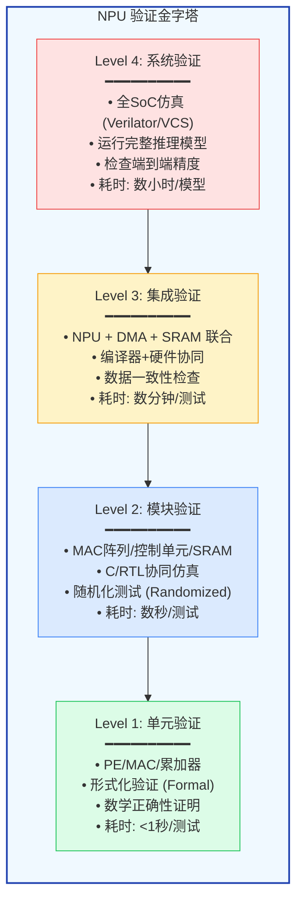
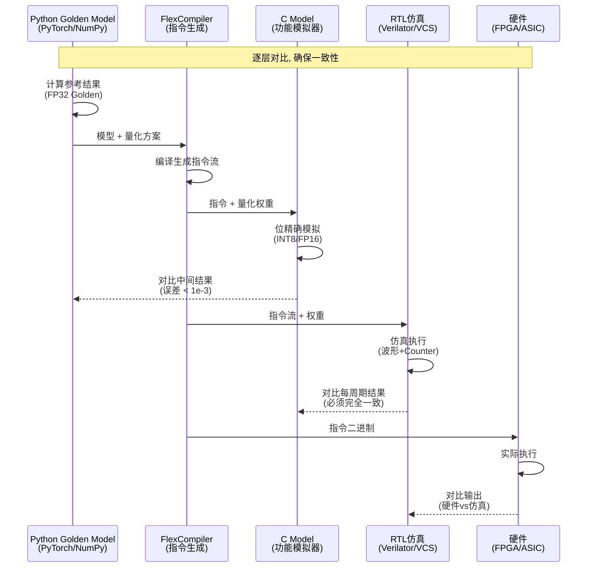
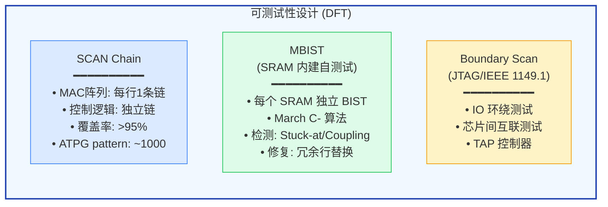
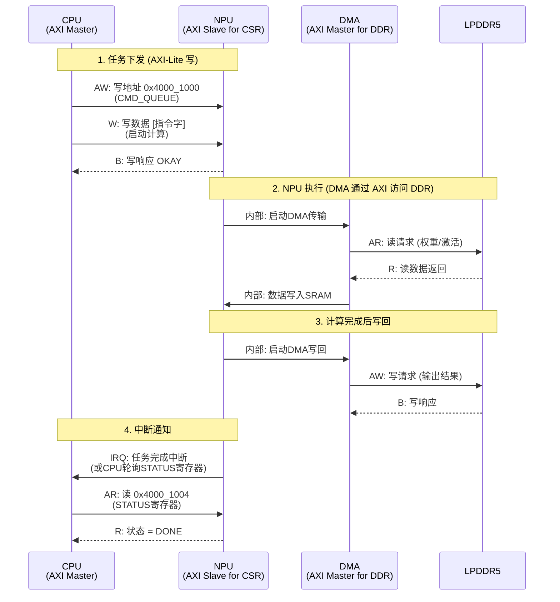
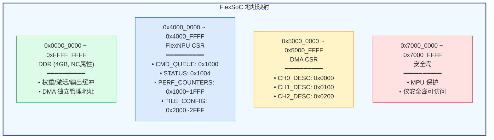
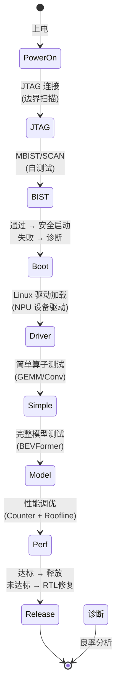

## 23. 验证测试与 NPU-SoC 接口 [新增]

>  **本章目标**：从功能验证到硅后调试，以及 NPU 与 SoC 其余部分的接口细节。

### 23.1 功能验证方法学

**验证覆盖率目标**：

| 指标 | 目标 | 方法 |
|------|------|------|
| **代码覆盖率** | >95% | Line/Branch/Condition |
| **功能覆盖率** | >90% | SVFC (SystemVerilog) |
| **交叉覆盖率** | >80% | 精度×模式×Tile交叉 |
| **形式化验证** | 关键模块 100% | Jasper/VC Formal |

### 23.2 Golden Model 验证流程

### 23.3 DFT/DFD 设计

**DFT 面积开销**：

| DFT 机制 | 面积开销 | 说明 |
|---------|---------|------|
| **SCAN** | +3-5% | 寄存器替换为扫描寄存器 |
| **MBIST** | +1-2% | BIST 控制器 + 诊断逻辑 |
| **Boundary Scan** | +0.5% | IO 单元添加扫描单元 |
| **压缩 (EDT)** | -2% (减少pin) | 减少测试时间 |
| **总计** | +5-8% | 行业标准 |

### 23.4 AXI 总线接口详解

**NPU AXI 接口配置**：

| 接口 | 协议 | 位宽 | 频率 | 用途 |
|------|------|------|------|------|
| **CSR Slave** | AXI4-Lite | 32-bit | 500 MHz | CPU 配置 NPU |
| **DMA Master** | AXI4 | 128-bit | 500 MHz | NPU 访问 DDR |
| **NoC Master** | AXI4 | 128-bit | 1 GHz | NPU 通过 NoC |

### 23.5 地址空间与内存管理

### 23.6 硅后 Bring-up 流程

**Bring-up 工具链**：

| 阶段 | 工具 | 目的 |
|------|------|------|
| **JTAG** | OpenOCD + GDB | 边界扫描、寄存器读写 |
| **BIST** | 自研脚本 | SRAM 缺陷诊断 |
| **Driver** | Linux kernel module | `/dev/flexnpu` 设备驱动 |
| **Simple Test** | C/C++ 测试程序 | 单算子精度验证 |
| **Model Test** | FlexCompiler + Runtime | 完整模型端到端验证 |
| **Perf Tuning** | FlexProfiler | Counter采集 + Roofline分析 |

**硅后调试的"黄金法则"**：80% 的硅后问题与**时序**有关（setup/hold violation），而非功能错误。因此 FPGA 原型验证极其重要——它能在流片前发现大部分时序相关 bug。

> **参考文献 [P33]**: IEEE, "IEEE Standard for Access Port and Boundary-Scan Architecture." IEEE 1149.1, 2017.

> **参考文献 [P34]**: Keating, M., et al. "Reuse Methodology Manual for System-on-a-Chip Designs." Springer, 3rd Edition. (验证方法学)

---