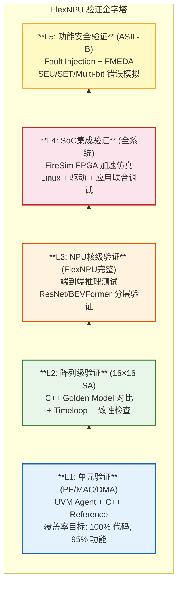
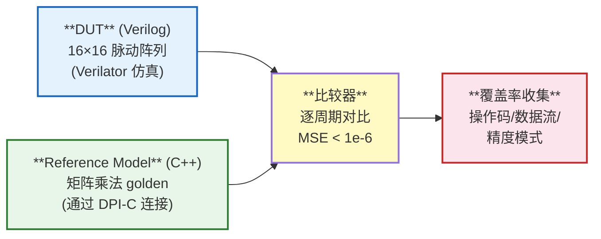
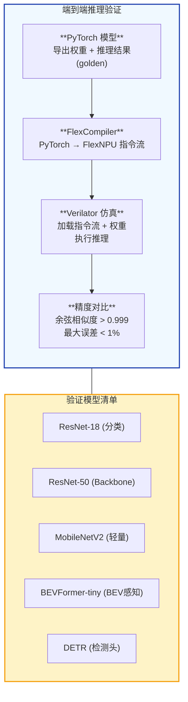
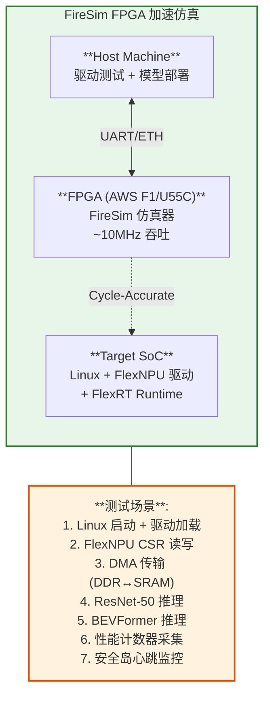
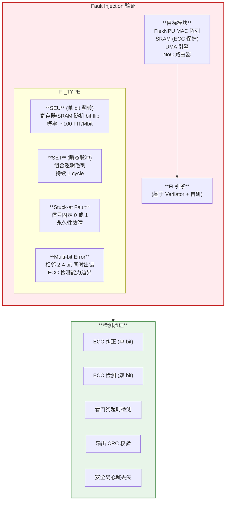

## 附录B：NPU 验证方法学

>  **本章目标**：建立 FlexNPU 从单元级到系统级的完整验证策略，覆盖 UVM、Formal、FPGA 原型和功能安全验证。

### B.1 验证层次总览



### B.2 L1: 单元级 UVM 验证

#### UVM Agent 结构 (以 Int8MAC 为例)

```systemverilog
// ===== Int8MAC UVM Agent =====
// 文件: testbench/agents/int8mac_agent.sv

class int8mac_seq_item extends uvm_sequence_item;
    `uvm_object_utils(int8mac_seq_item)

    rand logic signed [7:0]   a;       // 激活值
    rand logic signed [7:0]   b;       // 权重
    rand logic signed [31:0]  acc_in;  // 累加输入
    rand logic                valid;   // 使能

    // 约束: 模拟真实分布
    constraint c_act_range { a inside {[-128:127]}; }
    constraint c_wgt_range { b inside {[-128:127]}; }
    constraint c_acc_range { acc_in inside {[-2147483648:2147483647]}; }
    constraint c_valid_dist { valid dist {1:=80, 0:=20}; }  // 80% 有效
endclass

class int8mac_scoreboard extends uvm_scoreboard;
    `uvm_component_utils(int8mac_scoreboard)

    // C++ Reference Model (通过 DPI-C 调用)
    import "DPI-C" function int compute_mac_ref(input int a, input int b, input int acc);

    virtual function void check(input int8mac_seq_item req, output logic [31:0] actual);
        int expected = compute_mac_req(req.a, req.b, req.acc_in);
        if (actual !== expected) begin
            `uvm_error("SCOREBOARD", $sformatf(
                "Mismatch: a=%0d, b=%0d, acc_in=%0d, expected=%0d, got=%0d",
                req.a, req.b, req.acc_in, expected, actual))
        end
    endfunction
endclass
```

#### 断言 (SVA) 示例

```systemverilog
// ===== FlexNPU PE 关键断言 =====

// P1: 复位后输出必须为0
assert property: @(posedge clk) !rst_n |=> (acc_out == 0);

// P2: valid=0 时累加器保持不变
assert property: @(posedge clk) !valid |=> $stable(acc_out);

// P3: 乘法结果范围检查 (8×8 → 16-bit, 不会溢出)
assert property: @(posedge clk) valid |->>
    (product >= -32768 && product <= 32767);

// P4: 累加不溢出 (INT8×INT8 累加到 INT32, 最多累加 2^16 次不溢出)
// 这是一个 liveness property: 如果连续累加超过 65536 次, 必须清零
assert property: @(posedge clk)
    mac_count > 65536 |-> clear_acc;

// P5: 部分和传递延迟 (脉动阵列: 每级1 cycle)
assert property: @(posedge clk)
    pes[r][c].valid_out |=> pes[r+1][c].psum_in == $past(pes[r][c].psum_out);
```

#### 覆盖率指标

| 覆盖率类型 | 目标 | 工具 | 说明 |
|-----------|------|------|------|
| **行覆盖率** | 100% | VCS/Xcelium | 所有代码行至少执行1次 |
| **条件覆盖率** | ≥95% | VCS/Xcelium | if/else/mux所有分支 |
| **翻转覆盖率** | ≥90% | VCS/Xcelium | 信号0→1和1→0翻转 |
| **状态机覆盖率** | 100% | VCS/Xcelium | FSM所有状态和转换 |
| **功能覆盖率** | ≥95% | UVM Covergroup | 自定义覆盖点 |

---

### B.3 L2: 阵列级 C++ Golden Model



**测试矩阵**：

| 测试用例 | 矩阵维度 | 精度 | 数据流 | 通过标准 |
|---------|---------|------|--------|---------|
| GEMM-1 | 16×16 × 16×16 | INT8 | WS | MSE < 1e-6 |
| GEMM-2 | 64×64 × 64×64 (分块) | INT8 | WS | MSE < 1e-5 |
| Conv-1 | 3×3 kernel, 16ch | INT8 | WS+im2col | MSE < 1e-4 |
| Attn-1 | QK^T 16×16 | FP16 | RS | MSE < 1e-3 |
| FlashAttn-1 | 128×64 序列 | FP16 | FSA | MSE < 1e-4 |
| Random-1 | 随机矩阵 | 混合 | 全模式 | 无异常 |

---

### B.4 L3: NPU 核级端到端验证



---

### B.5 L4: SoC 集成验证 (FireSim)



**FireSim vs 纯软件仿真**：

| 方式 | 吞吐 | BEVFormer 测试耗时 | 成本 |
|------|------|-------------------|------|
| Verilator (纯软件) | ~1 KHz | ~170 小时 | 低 (CPU) |
| FireSim (FPGA) | ~10 MHz | ~10 分钟 | 中 (FPGA) |
| 实际 FPGA 原型 | 200 MHz | ~0.5 秒 | 高 (开发板) |

---

### B.6 L5: 功能安全验证 (ASIL-B)

#### Fault Injection 框架



**FMEDA (Failure Modes, Effects, and Diagnostic Analysis)** 示例：

| 模块 | 故障模式 | 影响 | 诊断措施 | 覆盖率 | ASIL |
|------|---------|------|---------|--------|------|
| MAC 阵列 | SEU (结果 bit 翻转) | 推理精度下降 | 输出 CRC 校验 | 99% | B |
| SRAM (1MB) | SEU (单 bit 翻转) | 数据损坏 | ECC SEC-DED | 99.9% | B |
| SRAM (1MB) | MBU (多 bit 翻转) | 数据不可恢复 | ECC 检测 + 安全岛报警 | 95% | B |
| DMA 引擎 | 地址计算错误 | 数据覆盖 | 地址范围检查 | 90% | B |
| NoC 路由器 | Packet 丢失 | 数据不完整 | 序列号 + 重传 | 99% | B |
| 安全岛 | 锁步核不一致 | 安全状态切换 | 锁步比较器 | 99.99% | D |

---

### B.7 Formal 验证

| 验证类型 | 目标 | 工具 | 应用 |
|---------|------|------|------|
| **等价性检查** | RTL vs 综合网表一致 | Conformal/Lec | 每次综合后 |
| **断言证明** | 关键属性数学证明 | JasperGold/VC Formal | PE 状态机、FIFO 溢出 |
| **X 传播检查** | 未初始化信号不传播 | X-Propagation Analysis | 复位后检查 |
| **死锁检查** | NoC/FIFO 无死锁 | Formal Deadlock Analysis | NoC 路由器 |

---

### B.8 验证环境搭建脚本

```bash
# FlexNPU 验证环境一键搭建 (基于 Chipyard + Verilator)

# 1. 克隆 Chipyard (包含 Gemmini 参考验证框架)
git clone https://github.com/ucb-bar/chipyard.git
cd chipyard
./scripts/init-submodules-no-riscv-tools.sh

# 2. 编译 Verilator 仿真器 (含 FlexNPU)
cd sims/verilator
make CONFIG=FlexSoCConfig

# 3. 运行单元测试
make run-binary BINARY=int8mac_test.elf

# 4. 运行端到端推理测试
make run-binary BINARY=resnet50_test.elf

# 5. FireSim FPGA 仿真 (需要 AWS 账号)
cd ../../sims/firesim
./scripts/build-fpga-afi.sh  # 编译 FPGA 镜像
./scripts/launch-run.sh      # 启动仿真

# 6. 覆盖率收集
make coverage CONFIG=FlexSoCConfig
```

---

> **参考文献**:
> - [UVM] Accellera, "Universal Verification Methodology (UVM) 1.2 Class Reference." 2014.
> - [FireSim] Karandikar, S., et al. "FireSim: FPGA-Accelerated Cycle-Exact Scale-Out System Simulation in the Public Cloud." ISCA 2018.
> - [ISO26262] ISO 26262-5:2018, "Road Vehicles — Functional Safety — Part 5: Product Development at Hardware Level."

---