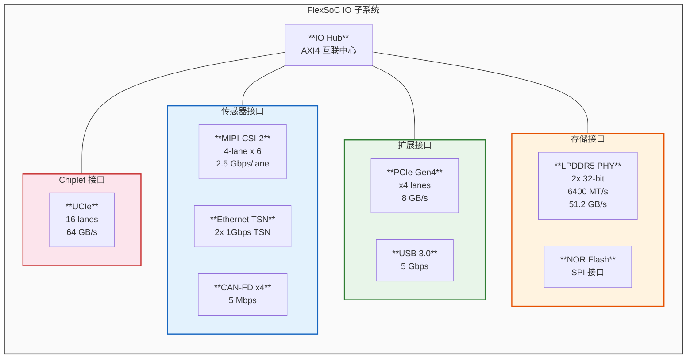
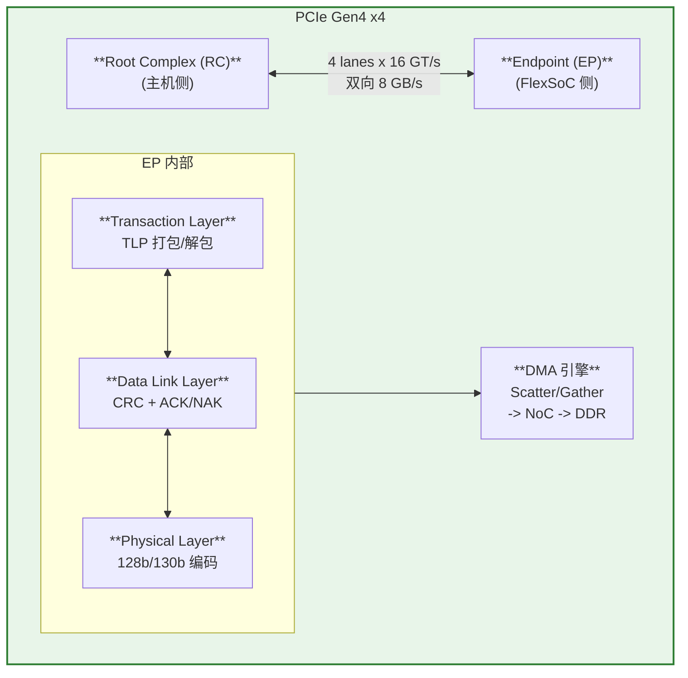

## 附录C：IO 子系统与 PHY 设计

>  **本章目标**：补全 FlexSoC 的 IO 接口设计，覆盖 MIPI-CSI、PCIe、Ethernet TSN、CAN-FD、LPDDR5 PHY 和 UCIe Chiplet 接口。

### C.1 IO 子系统总览

### C.2 MIPI-CSI-2 接口设计

**带宽预算** (6 路 Camera)：

| Camera | 分辨率 | 帧率 | RAW格式 | 带宽需求 |
|--------|--------|------|---------|---------|
| Camera 0-3 (主) | 1920x1080 | 30fps | RAW12 | 4 x 0.75 GB/s = 3.0 GB/s |
| Camera 4-5 (辅) | 1280x720 | 30fps | RAW10 | 2 x 0.33 GB/s = 0.66 GB/s |
| **总计** | | | | **~3.7 GB/s** |

> 峰值 6 x 4-lane x 2.5 Gbps = 60 Gbps = **7.5 GB/s** 理论带宽，满足需求

**MIPI-CSI-2 帧格式**：

| 字段 | 说明 | 大小 |
|------|------|------|
| SoT (Start of Transmission) | LP->HS 切换 | 4 byte |
| Packet Header | 数据类型+通道+长度 | 4 byte |
| Packet Data | 有效像素数据 | 可变 |
| ECC | 头部纠错 | — |
| Checksum (CRC) | 数据校验 | 2 byte |
| EoT (End of Transmission) | HS->LP 切换 | — |

---

### C.3 PCIe Gen4 接口

**PCIe 使用场景**：

| 场景 | 方向 | 数据量 | 频率 |
|------|------|--------|------|
| 模型权重下载 | Host -> FlexSoC | ~200MB (BEVFormer) | 初始化时 |
| 推理结果上传 | FlexSoC -> Host | ~1MB/帧 | 30fps |
| 调试/日志 | FlexSoC -> Host | ~10MB/s | 持续 |
| 固件升级 | Host -> FlexSoC | ~50MB | OTA时 |

---

### C.4 Ethernet TSN 接口

**TSN 调度策略 (802.1Qbv)**：

| 优先级 | 流量类型 | 带宽保证 | 最大延迟 |
|--------|---------|---------|---------|
| 最高 (7) | LiDAR 点云 | >=400 MB/s | <=100 us |
| 高 (5-6) | 安全消息 | >=10 MB/s | <=500 us |
| 中 (3-4) | 诊断日志 | best-effort | — |
| 低 (0-2) | 通用数据 | best-effort | — |

---

### C.5 LPDDR5 PHY 设计

**LPDDR5 关键参数**：

| 参数 | 值 | 说明 |
|------|---|------|
| 数据速率 | 6400 MT/s | DDR3200 |
| 通道宽度 | 2 x 32-bit | 总 64-bit |
| 总带宽 | 51.2 GB/s | 6400 x 64 / 8 |
| 供电 | 1.1V (VDDQ) | LPDDR5 规格 |
| Bank 数 | 16 Bank / 通道 | 8 Bank Group |
| 突发长度 | BL32 | 32-byte burst |
| 刷新间隔 | 3.9 us (tREFI) | 正常温度 |

**Training 序列**：Write Leveling -> Read Training (DQS gate) -> VREF Training -> Margins Check (眼图分析)

---

### C.6 UCIe Chiplet 接口

**UCIe 带宽与延迟**：

| 配置 | 带宽 | 延迟 | 适用场景 |
|------|------|------|---------|
| UCIe x16 (Standard) | 64 GB/s | ~40 ns | NPU + IO 扩展 |
| UCIe x64 (Advanced) | 256 GB/s | ~30 ns | 大规模推理集群 |
| UCIe x8 (Lite) | 32 GB/s | ~50 ns | 成本敏感方案 |

**UCIe 协议栈**：Protocol Layer (CXL.io / CXL.cache / CXL.mem 或 AXI Streaming) -> Data Link Layer (CRC + 重传) -> Physical Layer (16 lanes, 32 GT/s/lane)

---

### C.7 IO 面积与功耗预算

| IO 模块 | 面积 (mm2) | 功耗 (W) | 说明 |
|---------|----------|---------|------|
| MIPI-CSI-2 x6 | 0.8 | 0.3 | 含 D-PHY |
| PCIe Gen4 x4 | 0.4 | 0.2 | 含 PHY |
| Ethernet TSN x2 | 0.3 | 0.15 | 含 MAC+PHY |
| CAN-FD x4 | 0.1 | 0.05 | 简单 |
| LPDDR5 PHY x2 | 3.5 | 1.5 | 最大功耗IO |
| UCIe x16 | 1.0 | 0.3 | Chiplet |
| NOR Flash (SPI) | 0.1 | 0.02 | 固件 |
| **IO 总计** | **~6.2 mm2** | **~2.5 W** | |

---

> **参考文献**:
> - [MIPI-CSI2] MIPI Alliance, "MIPI Camera Serial Interface 2 (CSI-2) Specification v3.0." 2019.
> - [PCIe] PCI-SIG, "PCI Express Base Specification Rev 4.0." 2017.
> - [TSN] IEEE 802.1Qbv-2015, "Enhancements for Scheduled Traffic."
> - [LPDDR5] JEDEC, "LPDDR5 SDRAM Standard (JESD209-5)." 2019.
> - [UCIe] UCIe Consortium, "Universal Chiplet Interconnect Express Specification 1.0." 2022.

---