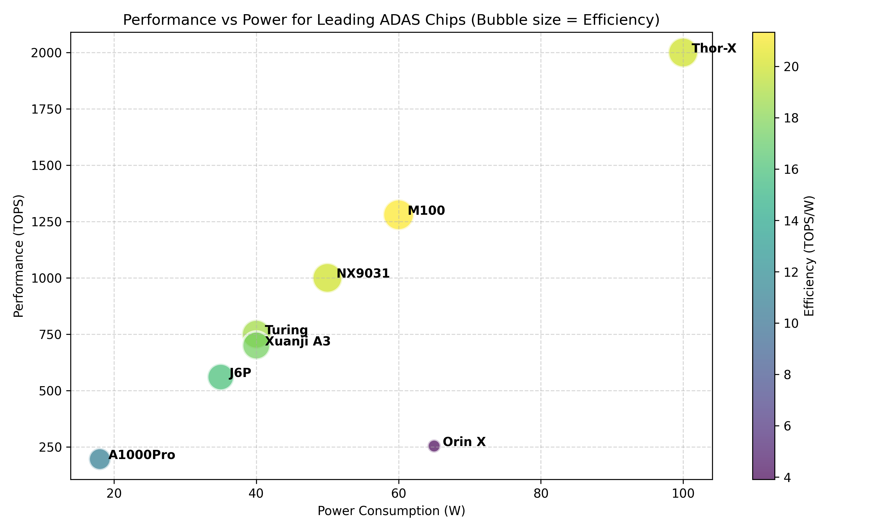
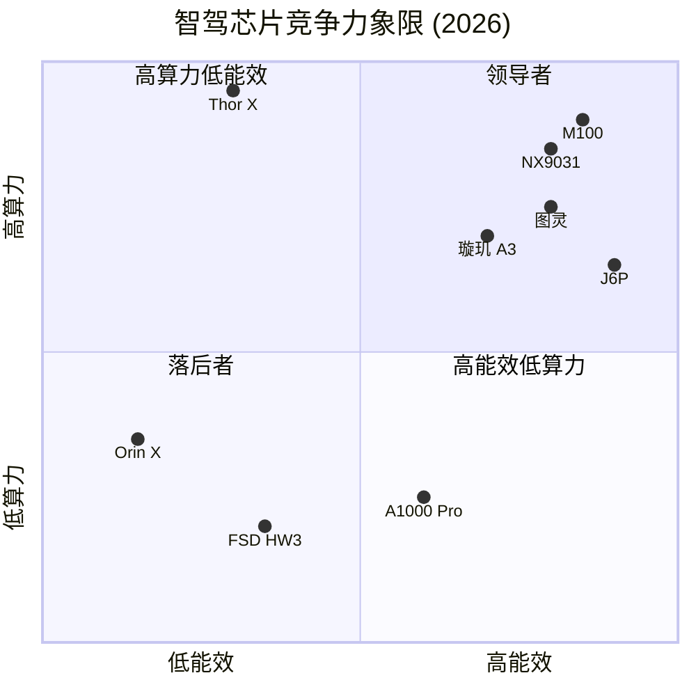
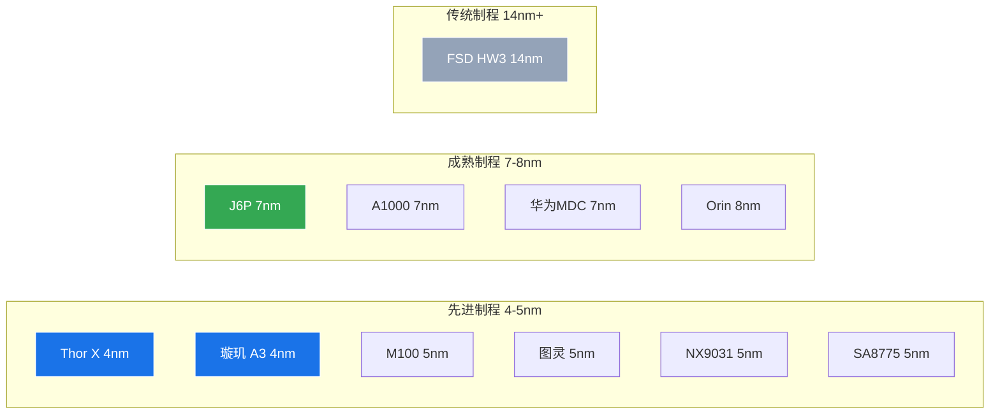

# 第7章：多维度架构对比总览

>  本章从算力、能效、带宽、制程、生态等多个维度对主流智驾芯片进行横向对比。

  
  
图：主流智驾芯片算力(TOPS)与能效对比

---

## 7.1 算力 vs 能效 — 核心竞争力象限

---

## 7.2 全维度对比表

### 硬件规格对比

| 芯片 | 架构类型 | 制程 | 算力(稠密) | 功耗 | TOPS/W | 内存带宽 | 安全等级 |
|------|---------|------|----------|------|--------|---------|---------|
| **Orin X** | GPU中心 | 8nm | ~127T(D) / 254T(S) | 60-75W | **~1.9**(D) | 204.8 GB/s | ASIL-D |
| **Thor X** | GPU中心 | 4nm | ~1000T(D) / 2000T(FP4) | ~100W | **~10**(D,估) | ~800 GB/s | ASIL-D |
| **FSD HW3** | NPU中心 | 14nm | ~144T(板卡,2×SoC) | ~36W(板卡) | **~4.0**(板卡) | 68 GB/s | 自定义 |
| **J6P** | BPU专用 | 7nm | 560T | ~35W | **16.0** | 51.2 GB/s | ASIL-B/D |
| **A1000 Pro** | 感知融合 | 7nm | 196T | 15-20W | 10-13 | ~34 GB/s | ASIL-B |
| **SA8775** | 通信融合 | 5nm | ~200T | — | — | 51.2 GB/s | ASIL-D |
| **EyeQ6U** | 视觉优先 | — | 176T | — | — | — | ASIL-D |
| **图灵** | 自研 | 5nm | 750T | ~40W🟡 | 19🟡 | — | 待认证 |
| **M100** | 自研 | 5nm | 1280T | ~60W🟡 | 21🟡⚠️ | — | 待认证 |
| **NX9031** | 自研 | 5nm | >1000T | ~50W🟡 | 20🟡 | — | 待认证 |
| **璇玑 A3** | 自研 | 4nm⚠️ | 700T⚠️ | ~40W⚠️ | 17.5⚠️ | — | 待认证 |

> 📌 TOPS/W列统一为**稠密TOPS口径**。🟡=推测值 ⚠️=待独立验证。Orin X 1.9TOPS/W基于~127T(稠密)/67.5W计算；旧版1.7混合了稀疏254T口径，已修正。详见[intro_1术语定义](/#/intro_1?id=📖-术语与算力口径定义)。

---

## 7.3 关键指标排行

### TOPS/W 能效排行（稠密口径，⚠️含推测值）

| 排名 | 芯片 | TOPS/W(D) | 数据可信度 | 类型 |
|------|------|-----------|-----------|------|
| 🥇 | **M100** | 21⚠️ | 🟡 推测,硅片物理边界 | 主机厂自研 |
| 🥈 | **NX9031** | 20⚠️ | 🟡 推测 | 主机厂自研 |
| 🥉 | **图灵** | 19🟡 | 🟡 推测(功耗非官方) | 主机厂自研 |
| 4 | **璇玑 A3** | 17.5⚠️ | 🔴 全为推测 | 主机厂自研 |
| 5 | **J6P** | **16.0** | 🟢 官方+实测 | 独立厂商 |
| 6 | **A1000 Pro** | 10-13 | 🟢 官方 | 独立厂商 |
| 7 | **Thor X** | ~10(估) | 🟡 估算(1000T稠密/100W) | 独立厂商 |
| 8 | **FSD HW3** | ~4.0(板卡) | 🟢 反推 | 自研(仅自用) |
| 9 | **Orin X** | **~1.9** | 🟢 官方(127T稠密/67.5W) | 独立厂商 |

> ⚠️ 前4名（主机厂自研）的TOPS/W数据均含推测成分，部分处于硅片物理可行性的极限边界，详见[ch5硅片物理分析](/#/ch5?id=⚠️-硅片物理可行性分析)。J6P是目前**唯一有实测数据支撑的高能效芯片**。

**关键洞察**：主机厂自研芯片在 TOPS/W 标称值上全面领先独立厂商，但**数据可信度参差不齐**。原因在于自研芯片针对自有算法深度优化，有效算力利用率可能确实更高。但独立厂商在**生态成熟度**和**功能安全认证**方面仍有优势，且其数据经过大量客户验证。

---

## 7.4 内存带宽 — Transformer 推理的真正瓶颈

**️ 内存墙问题**：
- BEVFormer 等模型计算强度约 50-100 OP/Byte
- 大部分智驾芯片在 Transformer 推理时受内存带宽限制，而非算力限制
- Orin 虽有 204.8 GB/s 带宽，但 GPU 架构对 Attention 的利用率仅 ~25-35%
- J6P 虽然带宽仅 51.2 GB/s，但 BPU 架构对 Attention 利用率可达 ~60%

---

## 7.5 制程与成本分析

### 制程 vs 成本大致关系

> ⚠️ 以下成本为**粗略估算**，实际成本受良率、Die面积、封装方式、测试成本、NRE费用分摊等因素影响极大。汽车芯片还需额外AEC-Q100认证和车规测试成本。

| 制程 | 晶圆成本(估) | Die面积(典型) | 良率(估) | 单Die成本(估)¹ | 封装+测试 | 总成本² | 代表芯片 |
|------|-------------|-------------|---------|-------------|---------|--------|---------|
| 4nm | $18,000-22,000 | 300-400mm² | 60-75% | $300-600+ | $30-80 | $330-680 | Thor X, 璇玑A3⚠️ |
| 5nm | $14,000-18,000 | 200-350mm² | 70-85% | $200-500 | $20-50 | $220-550 | M100, 图灵, SA8775 |
| 7nm | $9,000-12,000 | 50-100mm² | 80-90% | $50-150 | $10-30 | $60-180 | J6P, A1000, MDC |
| 8nm³ | $7,000-9,000 | 100-200mm² | 85-92% | $80-180 | $15-40 | $95-220 | Orin |
| 14nm | $4,000-6,000 | 80-100mm² | 90-95% | $30-80 | $10-25 | $40-105 | FSD HW3 |

> ¹ 单Die成本 = 晶圆成本 × Die面积 / (晶圆面积 × 良率)，为简化估算，未含光罩费（NRE $5M-30M/制程节点）分摊
> ² 总成本 = Die成本 + 封装 + 测试 + AEC-Q100认证分摊，不含研发NRE
> ³ Samsung 8nm（Orin使用）成本低于TSMC同等级节点

**关键洞察**：
- 4nm/5nm芯片单Die成本$200-600+，年出货50万颗以上才能将NRE（$5亿+）摊薄到合理水平
- 比亚迪璇玑A3（4nm）年用量~300万颗，规模效应显著
- 地平线J6P（7nm, ~$60-180/die）成本优势明显，适合中端市场

---

## 7.6 生态成熟度评估

| 芯片 | 编译器/工具链 | SDK/API | 社区 | 功能安全 | 总评 |
|------|-------------|---------|------|---------|------|
| **Orin/Thor** | CUDA/TensorRT ⭐⭐⭐⭐⭐ | DriveOS ⭐⭐⭐⭐⭐ | 全球最大 ⭐⭐⭐⭐⭐ | ASIL-D ⭐⭐⭐⭐⭐ | ⭐⭐⭐⭐⭐ |
| **J6** | TogetherROS ⭐⭐⭐⭐ | J6 SDK ⭐⭐⭐⭐ | 中国最强 ⭐⭐⭐⭐ | ASIL-B/D ⭐⭐⭐⭐ | ⭐⭐⭐⭐ |
| **A1000** | 黑芝麻SDK ⭐⭐⭐ | 山海SDK ⭐⭐⭐ | 较小 ⭐⭐ | ASIL-B ⭐⭐⭐ | ⭐⭐⭐ |
| **FSD** | Tesla内部 ⭐⭐⭐⭐⭐ | 闭源 ⭐ | 无 ⭐ | 自定义 ⭐⭐⭐ | ⭐⭐⭐ |
| **EyeQ6** | Mobileye工具链 ⭐⭐⭐ | REM ⭐⭐ | 受限 ⭐⭐ | ASIL-D ⭐⭐⭐⭐⭐ | ⭐⭐⭐ |
| **图灵/M100** | 自研工具链 ⭐⭐⭐ | 自有SDK ⭐⭐⭐ | 新建 ⭐⭐ | 待认证 ⭐⭐ | ⭐⭐ |

**生态差距是主机厂自研芯片的最大短板**。NVIDIA 凭借 CUDA + TensorRT + DriveOS 的完整生态，仍然是最"好用"的平台。主机厂自研芯片需要 2-3 年时间建立成熟的工具链和开发者社区。

---