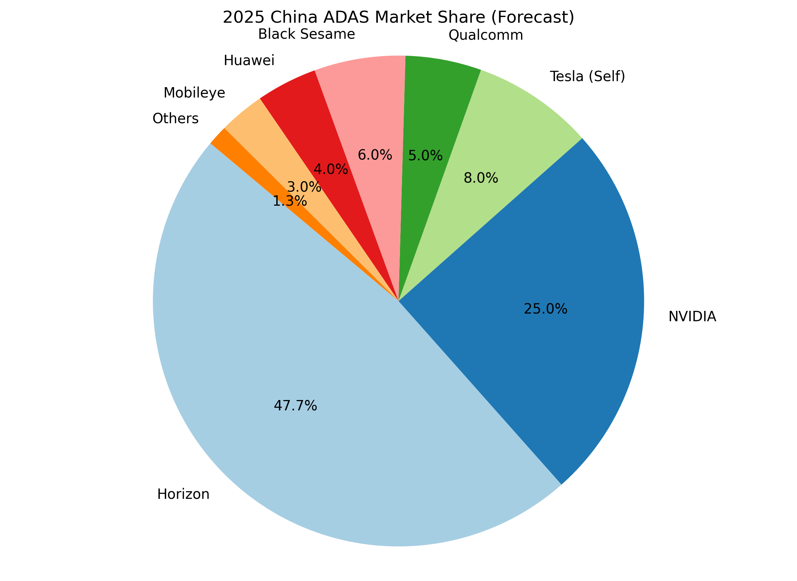
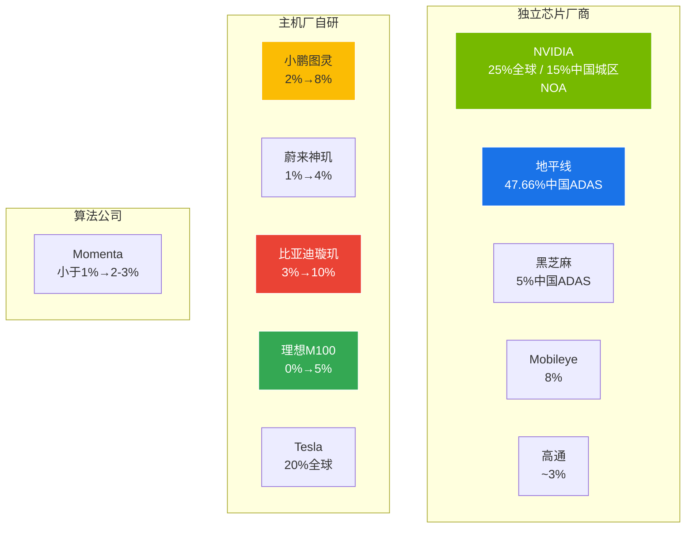
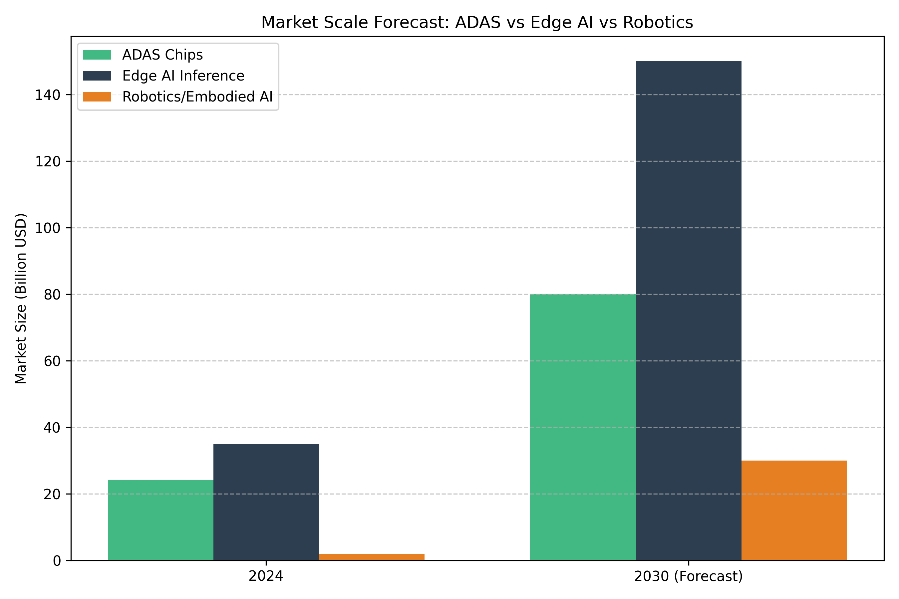
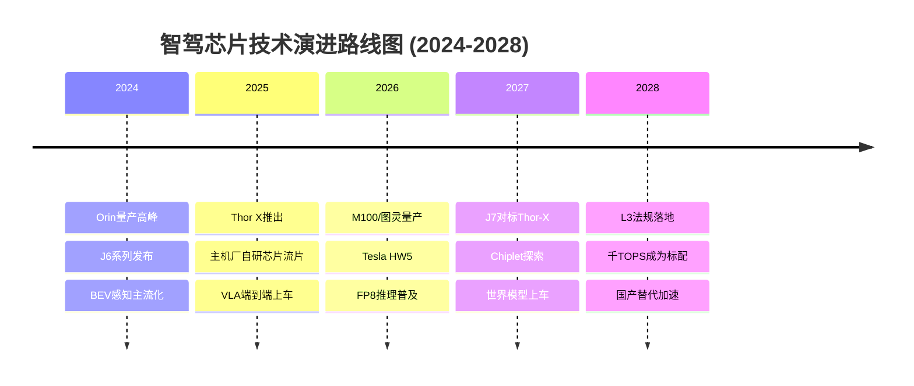
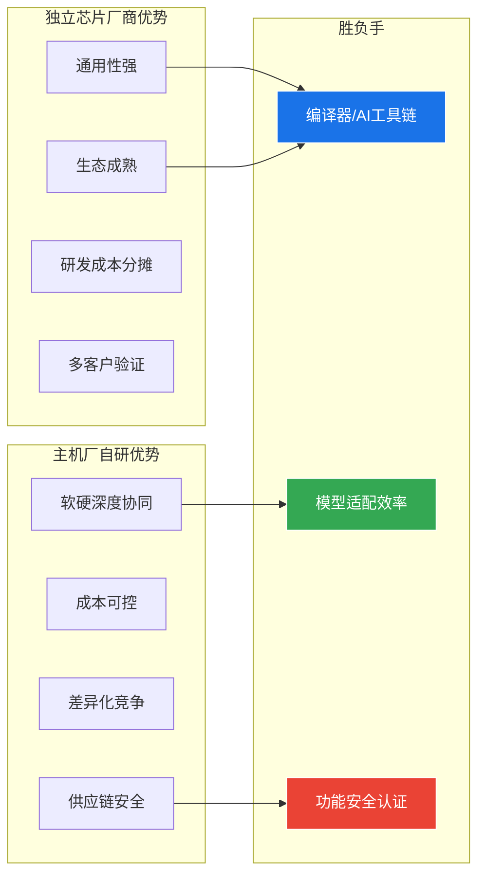

# 第8章：竞争格局与趋势预测

>  本章基于多方数据源，分析 2025-2028 年智驾芯片市场竞争格局与技术趋势演变。

  
  
图：智驾芯片市场份额与竞争格局

---

## 8.1 市场格局（2026 最新）

### 中国 ADAS 芯片市场份额

> 📊 **数据来源说明**：本章市场份额数据综合以下来源：
> - **地平线 47.66%**：来源于高工智能汽车研究院《2025H1 中国ADAS市场份额报告》，统计口径为**ADAS芯片出货量（颗数）**，含L2+级别
> - **NVIDIA 25%（全球）/ ~15%（中国城区NOA）**：基于行业多方数据综合估算
> - **2028年预测**：基于当前趋势的线性外推，受政策法规、技术突破等因素影响，实际结果可能偏差较大
> - ⚠️ 不同机构的统计口径（按金额/颗数/车型配载量）差异可导致排名显著不同，建议交叉参考

### 竞争格局全景

### 详细市场份额数据

| 阵营 | 厂商 | 2025份额 | 2028预测 | 趋势 | 驱动因素 |
|------|------|---------|---------|------|---------|
| **独立厂商** | NVIDIA | 25%(全球)¹ / ~15%(中国)² | 20% | 📉 ↓ | 主机厂自研蚕食，Thor延迟 |
| **独立厂商** | 地平线 | **47.66%(中国ADAS)**¹ | 20% | 📈 ↑ | J6P上量，J7规划2027 |
| **主机厂自研** | Tesla | 20%(全球) | 15% | ➡️ → | 仅自用，HW5/AI5 2026-2027 |
| **独立厂商** | Mobileye | 8% | 4% | 📉 ↓ | 黑盒受挑战 |
| **主机厂自研** | 小鹏图灵 | 2% | **8%** | 📈📈 ↑↑ | 已量产G6/G9，对外供货+大众 |
| **主机厂自研** | 蔚来神玑 | 1% | 4% | 📈 ↑ | 对外授权，独立神玑公司 |
| **主机厂自研** | 比亚迪璇玑 | 3%⚠️ | **10%**⚠️ | 📈📈 ↑↑ | 2026H2全面上量⚠️，规模优势 |
| **主机厂自研** | 理想M100 | 0% | 5% | 📈 ↑ | 流片成功，2026年量产 |
| **独立厂商** | 黑芝麻 | 5% | 4-5% | ➡️ → | A2000(7nm) 2026量产 |
| **算法公司** | Momenta | <1% | 2-3% | 📈 ↑ | 首代272T已路测，二代600T规划中 |

> ¹ 来源：高工智能汽车研究院, 2025H1, 统计口径: ADAS芯片出货量(颗数)
> ² 来源：行业多方数据综合估算
> ⚠️ 标注数据为推测值，待官方确认

**格局判断**：到 2028 年，中国 ADAS 芯片市场将从"一超多强"（地平线独大）演变为"三足鼎立"（地平线 + NVIDIA + 主机厂自研合计 ~27%）。主机厂自研将是最大变量。

> ⚠️ **预测不确定性**：2028年市场份额预测基于当前趋势外推，实际结果受L3法规落地进度、各主机厂芯片量产进度、地缘政治等因素影响，偏差可能较大。

---

## 8.2 市场规模预测

**市场空间**：中国智驾芯片市场 2026 年预计突破 ¥200 亿，2028 年有望达到 ¥400 亿+。驱动力：城市 NOA 普及 + L3 法规落地 + 国产替代加速。

> 📊 市场规模数据综合来源：IHS Markit、中金公司研报、高工智能汽车研究院。不同机构对2028年市场规模的预测区间为 ¥300-500亿，差异主要来自L3渗透率假设不同。

---

## 8.3 技术趋势

### 六大关键技术趋势

| 趋势 | 时间 | 影响程度 | 说明 |
|------|------|---------|------|
| 🧠 **VLA端到端大模型上车** | 2025-2026 | ⭐⭐⭐⭐⭐ | 驱动芯片架构从 CNN 转向 Transformer |
| 🏭 **主机厂自研芯片上量** | 2025-2027 | ⭐⭐⭐⭐⭐ | 动摇独立厂商地位，重构供应链 |
| 🔥 **地平线J7对标Thor-X** | 2027 | ⭐⭐⭐⭐ | 算法定义芯片新范式 |
| ⚡ **Tesla HW5/AI5 (TSMC 3nm)** | 2026-2027 | ⭐⭐⭐⭐ | 算力跃升5-10倍 |
| 🧩 **Chiplet芯粒** | 2027+ | ⭐⭐⭐ | 硬件拓扑多样性增加 |
| 📐 **FP8/FP4低精度推理** | 2026+ | ⭐⭐⭐ | Transformer加速标准 |

### 技术演进路线图

---

## 8.4 竞争态势分析

### 独立芯片厂商 vs 主机厂自研

**️ 关键判断**：独立芯片厂商的"胜负手"在于**编译器和 AI 工具链**。主机厂自研芯片的"胜负手"在于**软硬协同效率**。长期来看，两类玩家将共存，但份额将重新分配。

---

## 8.5 投资回报分析

### 各厂商 ROI 对比

| 厂商 | 芯片研发投入(估) | 量产车型(估) | 单车芯片价值 | ROI评估 |
|------|----------------|-------------|-------------|---------|
| Tesla | $10亿+ | 自有全系 | $1500-2000 | ⭐⭐⭐⭐⭐ |
| 地平线 | ¥50亿+ | 100+ 合作车型 | $200-500 | ⭐⭐⭐⭐ |
| 小鹏 | ¥30亿+ | G6/G9 + 大众 | $300-500 | ⭐⭐⭐ |
| 蔚来 | ¥50亿+ | ET9 + 对外授权 | $500-1000 | ⭐⭐ (待验证) |
| 理想 | ¥40亿+ | 全系2026- | $300-500 | ⭐⭐ (待验证) |
| 比亚迪 | ¥60亿+ | 自有全系(规模) | $200-400 | ⭐⭐⭐⭐ |

---

## 8.6 总结与战略建议

**核心结论**：
1. 地平线 47.66% 市占率证明国产替代可行性，但份额将在 2028 年被稀释
2. 主机厂自研芯片将从 2025 年的 6% 增长到 2028 年的 ~27%
3. NVIDIA 在中国市场份额将持续下滑，但全球仍占主导
4. **编译器和工具链**是独立芯片厂商的最后护城河
5. 算法公司造芯（Momenta）是新变量，值得持续关注

---