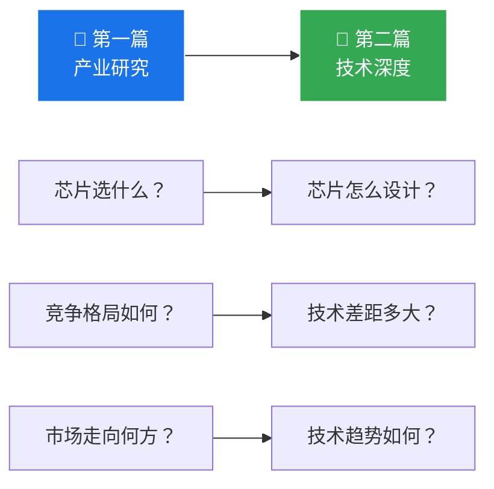

# 第9章：产业研究总结与核心结论

>  本章系统总结第一篇产业研究的核心发现，凝练关键结论，为后续技术深度和商业战略分析奠定基础。

---

## 9.1 十大核心发现

| # | 核心发现 | 影响程度 | 关键证据 |
|---|---------|---------|---------|
| 1 | **主机厂造芯是2025-2026最大变量** | ⭐⭐⭐⭐⭐ | 四大车企同时推出自研芯片，史无前例 |
| 2 | **算力进入千TOPS时代** | ⭐⭐⭐⭐⭐ | M100(1280T)/图灵(750T)/璇玑A3(700T)远超Orin X |
| 3 | **自研芯片能效比显著领先独立厂商** | ⭐⭐⭐⭐ | TOPS/W 14-21 vs 1.7-16，算法硬件协同优势 |
| 4 | **数据流架构+Transformer加速是共识** | ⭐⭐⭐⭐ | Tesla/M100/NX9031都走此路线 |
| 5 | **软硬一体化是终极形态** | ⭐⭐⭐⭐ | 算法刻入硬件，利用率50-100% |
| 6 | **NVIDIA Thor仍是算力天花板** | ⭐⭐⭐ | 2000 TOPS，但面临主机厂自研竞争 |
| 7 | **地平线韧性最强** | ⭐⭐⭐ | J6P能效比16 TOPS/W + 约46%中国ADAS市占率 |
| 8 | **黑芝麻中端市场压力最大** | ⭐⭐⭐ | 主机厂自研向下渗透 + 地平线上压 |
| 9 | **Transformer/大模型支持是分水岭** | ⭐⭐⭐ | 仅CNN的芯片(Tesla HW3)被淘汰 |
| 10 | **开放vs封闭是关键博弈** | ⭐⭐⭐ | 小鹏对外供货 vs 理想/比亚迪封闭 |

---

## 9.2 芯片量产进度全景（2026年6月更新）

| 芯片 | 厂商 | 制程 | 算力 | 功耗 | TOPS/W | 量产状态 | 数据来源 |
|------|------|------|------|------|--------|---------|---------|
| **Thor X** | NVIDIA | 4nm | 2000T(S) | ~100W | ~5.0 | 2025开发板上市，2026车规量产 | [GS]NVIDIA GTC |
| **NX9031** | 蔚来神玑 | 5nm | >1000T | ~50W(估) | ~20(估) | ✅ 已量产（ET9/全系/乐道L90），出货15万+ | [GS]蔚来官方 |
| **图灵** | 小鹏 | 5nm | **750T** | ~40W | ~19 | ✅ 已量产（G7 Ultra/MONA M03 Max），3芯2250T | [GS]小鹏官方 |
| **M100** | 理想 | 5nm | **1280T** | ~60W(估) | ~21(估) | 🔶 Q1已流片，2026 Q2量产上车（改款L9） | [GS]理想官方 |
| **璇玑 A3** | 比亚迪 | **4nm** | **700T+** | ~40W(估) | ~17.5(估) | ✅ 2026.5.28发布，已规模化量产，三芯2100T+ | [GS]比亚迪发布会 |
| **J6P** | 地平线 | 7nm | 560T(D) | ~35W | **16** | ✅ 量产中 | [GS]地平线官方 |
| **Orin X** | NVIDIA | 8nm | 254T(S) | 60-75W | ~1.7 | ✅ 量产中 | [GWP]NVIDIA |
| **A1000 Pro** | 黑芝麻 | 7nm | 196T(D) | 15-20W | 10-13 | ✅ 量产中 | [GWP]黑芝麻 |

>  (S)=稀疏 (D)=稠密。功耗和TOPS/W标注(估)的为非官方确认数据，基于公开信息工程估算。

---

## 9.3 三层市场结构

```
┌──────────────────────────────────────────┐
│  高端市场 (>1000 TOPS)                    │
│  NVIDIA Thor X · 理想M100 · 蔚来神玑       │
│  竞争焦点：算力极限 + 大模型支持            │
├──────────────────────────────────────────┤
│  中端市场 (200-560 TOPS)                   │
│  地平线J6P · Orin X · SA8775 · 璇玑A3     │
│  竞争焦点：能效比 + 生态 + 成本             │
├──────────────────────────────────────────┤
│  入门市场 (50-200 TOPS)                    │
│  J6E/M · A1000 · EyeQ6 · 国产替代         │
│  竞争焦点：价格 + 量产能力                  │
└──────────────────────────────────────────┘
```

---

## 9.4 核心结论

<div class="callout callout-insight">

**行业核心判断**：

1. **主机厂自研芯片已成不可逆趋势** — 小鹏图灵已量产上车型覆盖15-25万元区间，蔚来神玑出货15万+，比亚迪璇玑A3规模化量产，理想M100即将上车
2. **但"自研"不等于"全部替代"** — 多数主机厂采用"自研+外购"双供应商策略，独立芯片厂商仍有广阔市场
3. **编译器和工具链是独立芯片厂商的最后护城河** — NVIDIA凭借CUDA生态仍是最"好用"的平台
4. **能效比(TOPS/W)是比峰值算力更关键的指标** — 主机厂自研芯片凭借算法-硬件深度协同在此指标上全面领先
5. **端到端大模型正在重塑芯片架构需求** — 从CNN转向Transformer，Attention加速和内存带宽成为新的竞争焦点

</div>

---

## 9.5 第一篇到第二篇的衔接



第一篇从产业角度回答了"**智驾芯片行业发生了什么**"。第二篇将从微架构角度回答"**这些芯片内部是怎么设计的**"，包括：

- **NPU 微架构设计原理** — 数据流、MAC阵列、SRAM管理
- **Roofline 性能模型** — 算力上限 vs 内存带宽上限
- **Transformer 硬件加速** — Attention机制如何映射到硬件
- **功能安全与车规** — ISO 26262 对芯片设计的影响
- **Chiplet 与未来** — 芯片封装技术如何改变竞争格局

---

>  **本章小结**：智驾芯片行业正经历从"独立供应商主导"到"主机厂自研+独立供应商并存"的结构性转变。2026年上半年，蔚来神玑、小鹏图灵、比亚迪璇玑三大自研芯片已先后量产落地，标志着主机厂造芯从概念走向规模交付。接下来进入第二篇，从技术层面深入理解这些芯片的设计哲学。