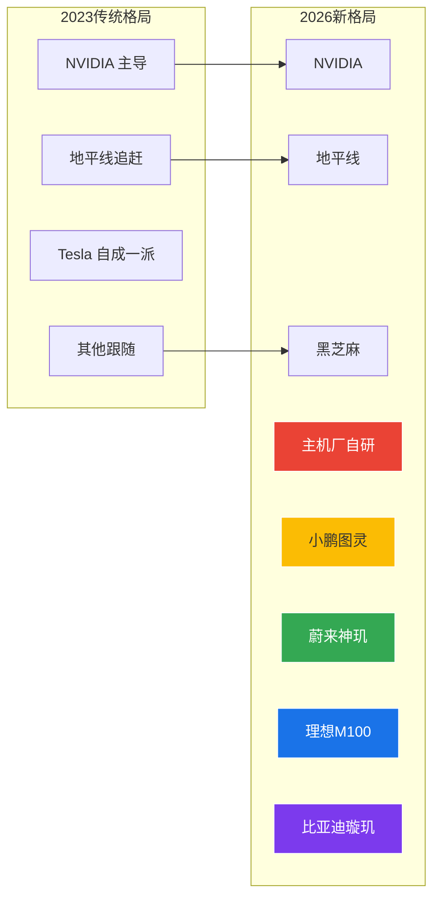

# 执行摘要

>  **核心结论**: 2025-2026 年智驾芯片进入"新战国时代"——独立芯片厂商(NVIDIA/地平线/黑芝麻)面临主机厂自研芯片(小鹏图灵/蔚来神玑/理想马赫M100/比亚迪璇玑)的强势崛起。主机厂造芯已成不可逆趋势，但独立厂商凭借生态和工具链仍有核心竞争力。

---

## 📖 术语与算力口径定义

> ⚠️ **阅读提示**：不同厂商的算力标注口径差异巨大，直接对比具有误导性。请务必理解以下定义。

| 术语 | 定义 | 说明 |
|------|------|------|
| **TOPS (Dense)** | 稠密每秒万亿次操作 | MAC阵列100%利用率的理论峰值，无稀疏优化 |
| **TOPS (Sparse)** | 稀疏每秒万亿次操作 | 利用2:4结构化稀疏后的等效峰值（通常为稠密的2×） |
| **FLOPS** | 每秒浮点操作次数 | 需标注精度：FP32/FP16/FP8/FP4 |
| **TOPS/W** | 每瓦每秒万亿次操作 | ⚠️ 不同厂商功耗统计口径不同（是否包含内存/IO功耗） |
| **OI** | 算力强度（FLOPS/Byte） | Roofline模型核心指标，决定计算/内存瓶颈 |
| **ASIL** | 汽车安全完整性等级 | ISO 26262标准：A(最低)→B→C→D(最高) |

**算力口径标注规范**：
- `(D)` = 稠密(Dense) | `(S)` = 稀疏(Sparse) | `(估)` = 工程估算，非官方确认
- ⚠️ 本报告 TOPS/W 排行统一使用**稠密TOPS**口径，稀疏TOPS单独标注

---

## 行业格局巨变

> ️ 主机厂自研芯片的崛起是 2025-2026 年最大的行业变量。截至2026年6月，蔚来神玑、小鹏图灵、比亚迪璇玑A3三大自研芯片已量产落地，理想M100即将上车。

---

## 核心数据全景（2026年6月更新）

| 芯片 | 厂商 | 制程 | 算力(稠密) | 算力(稀疏) | 功耗 | TOPS/W(D) | 量产状态 |
|------|------|------|-----------|-----------|------|-----------|---------|
| **Thor X** | NVIDIA | 4nm | ~1000T(估) | 2000T | ~100W | ~10(估) | 🔶 2026车规量产 |
| **NX9031** | 蔚来神玑 | 5nm | >1000T(估) | — | ~50W(估) | >20(估) | ✅ 已量产，出货15万+ |
| **M100** | 理想 | 5nm | **1280T**⚠️ | — | ~60W(估) | ~21(估)⚠️ | 🔶 2026 Q2上车 |
| **图灵** | 小鹏 | 5nm | **750T** | — | ~40W | ~19 | ✅ 已量产(G7/MONA M03) |
| **璇玑 A3** | 比亚迪 | **4nm** | **700T+**⚠️ | — | ~40W(估)⚠️ | ~17.5(估)⚠️ | ⚠️ 量产状态待独立验证 |
| **J6P** | 地平线 | 7nm | 560T | — | ~35W | **16** | ✅ 量产中 |
| **Orin X** | NVIDIA | 8nm | ~127T | 254T | 60-75W | **~1.9** | ✅ 量产中 |
| **A1000 Pro** | 黑芝麻 | 7nm | 196T | — | 15-20W | 10-13 | ✅ 量产中 |

> ⚠️ **数据可信度说明**：标记⚠️的数据为行业推测或官方新闻稿数据，未经第三方独立验证。TOPS/W(D)列统一使用**稠密TOPS**口径计算。部分主机厂自研芯片的功耗数据极为激进（如M100 21 TOPS/W），从硅片物理角度需持审慎态度，详见[疑问8分析](/chip-industry-review?id=疑问8理想m100-和小鹏图灵功耗数据存疑-🔴-严重)。

>  (D)=稠密 (S)=稀疏 (估)=工程估算，非官方确认。算力口径定义见上方"术语与算力口径定义"。

### TOPS/W 能效排行（稠密口径）

---

## 五大核心发现

**发现一：算力跃迁已进入千 TOPS 时代**
Thor 2000T、M100 1280T、NX9031 >1000T 标志着行业从百TOPS时代进入千TOPS时代，但**有效算力利用率**才是关键竞争维度。

**发现二：主机厂自研芯片已从概念走向量产交付**
小鹏图灵已量产上车(G7 Ultra/MONA M03 Max)、蔚来神玑出货超15万套、比亚迪璇玑A3规模化量产、理想M100即将上车——主机厂造芯不再是纸面规划。

**发现三：地平线以约46%市占率领跑中国 ADAS**
2025上半年地平线以45.8%市占率蝉联ADAS市场份额第一，J6系列覆盖 L2+到 L3 全场景，J7 规划2027年对标 Thor-X。

**发现四：独立芯片厂商面临结构性压力**
NVIDIA 中国份额被主机厂自研蚕食、Mobileye 黑盒模式受挑战、黑芝麻需在主机厂向下渗透中找到差异化定位。

**发现五：端到端大模型驱动架构变革**
VLA/BEV+Transformer 推动芯片从 CNN 优化转向通用 AI 推理，对 Attention 加速、内存带宽提出全新要求。

---

## 中国 ADAS 芯片市场份额

---

## 报告结构导航

  <a href="#/ch1">
    

    
研究背景与方法论

    
三大变局 · 数据来源标注

  </a>
  <a href="#/ch4">
    

    
芯片架构深度剖析

    
NVIDIA · Tesla · 华为 · 地平线

  </a>
  <a href="#/ch5">
    

    
主机厂自研芯片四强

    
小鹏 · 蔚来 · 理想 · 比亚迪

  </a>
  <a href="#/ch7">
    

    
多维度对比总览

    
算力 · 能效 · 带宽 · 生态

  </a>
  <a href="#/ch8">
    

    
竞争格局与趋势

    
市场份额 · 技术趋势 · ROI

  </a>
  <a href="#/ch9">
    

    
产业研究总结与核心结论

    
十大发现 · 市场结构 · 趋势展望

  </a>

| 篇章 | 内容 | 核心价值 |
|------|------|---------|
| **第一篇** | 智驾芯片产业研究 | 11+ 芯片厂商深度剖析、竞争格局、供应链分析 |
| **第二篇** | 技术深度解析 | NPU 微架构、Roofline 模型、Transformer 加速、功能安全 |
| **第二篇补充** | NPU 微架构深度 | PE级设计、编译器后端、验证方法学 |
| **第三篇** | 商业战略与预测 | ROI 分析、竞争态势、端侧 AI 未来、战略建议 |
| **第四篇** | FlexSoC 创新设计蓝图 | RTL架构、编译器、软硬件协同、商业计划 |
| **第五篇** | 产品方案与评审历程 | FlexSoC产品分析、V3-V6迭代评审 |

---